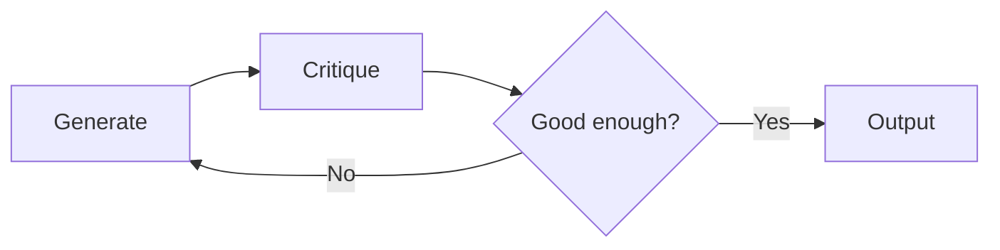
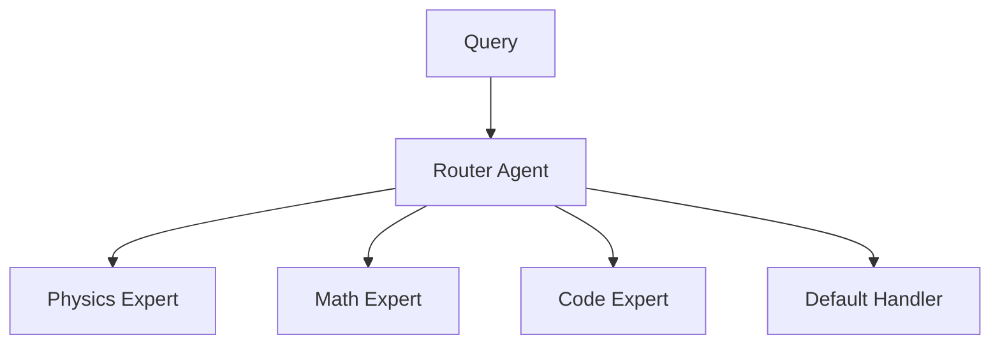

# Agentic Design Patterns

Key design patterns for building effective agentic AI systems, covering iterative improvement, query routing, human oversight, reasoning-action cycles, and multi-agent collaboration.

## Reflect Pattern

The Reflect pattern implements a self-critique loop where an agent generates output, then critiques its own work to iteratively improve the result. Effective for writing, code generation, and problem-solving tasks.



Implementation involves two prompts: a generator creates initial output, and a critic evaluates against criteria and suggests improvements.

## Router Pattern

The Router pattern uses an LLM to classify incoming queries and route them to specialized handlers. This reduces prompt complexity and improves response quality.



Key aspects:
- Router agent uses structured output to select destination
- Each destination has a focused prompt and potentially different tools
- Fallback to default handler for unmatched queries

## Human-in-the-Loop Pattern

Interrupts agent execution to request human approval or input before proceeding with sensitive operations.

Use cases:
- Approval before executing destructive operations
- Human verification of retrieved information
- Clarification requests when agent is uncertain

## ReAct Pattern

Reasoning and Acting (ReAct) alternates between thinking steps and action steps, allowing the agent to plan before acting and learn from observations.

The cycle: **Thought** → **Action** → **Observation** → repeat until done.

```python
prompt = """
Thought: I need to find information about X
Action: search("X")
Observation: [search results]
Thought: Based on these results, I can conclude...
Action: finish(answer)
"""
```

## Multi-Agent Collaboration Pattern

Multiple specialized agents work together, either in sequence or hierarchy, to accomplish complex tasks.

- **Sequential Process**: Agents execute in order, passing results to the next agent
- **Hierarchical Process**: A manager agent delegates tasks to worker agents and synthesizes results

The approach of multiple small agents with dedicated prompts and smaller tool lists is preferred over a single large agent with many tools, as it reduces confusion and enables use of smaller, cheaper LLMs.

## Wiki LLM Pattern

The "Wiki LLM" pattern (from Andrej Karpathy) defines using the LLM as an active librarian. The LLM maintains a structured, evolving "Idea File" or "Knowledge Graph." As it ingests new information, it cross-references it, updates existing entries, and corrects contradictions — what researchers call "Compiled Knowledge."

This pattern is designed for deep research, allowing an AI agent to build a synthetic brain that grows more intelligent and interconnected as it ingests more data.

## Sources
- [Agentic AI](../summaries/agentic.md)

## Related
- [Agentic AI](agentic-ai.md)
- [Agentic Memory Management](agentic-memory-management.md)
- [Small Specialist Agents](small-specialist-agents.md)
- [LangGraph](langgraph.md)