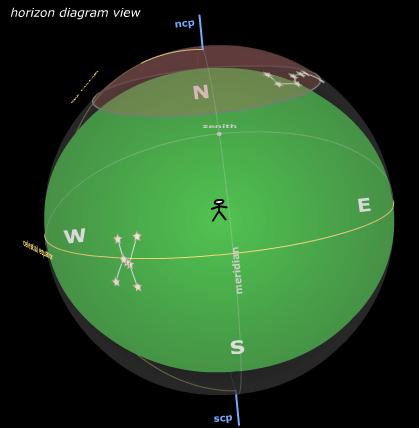
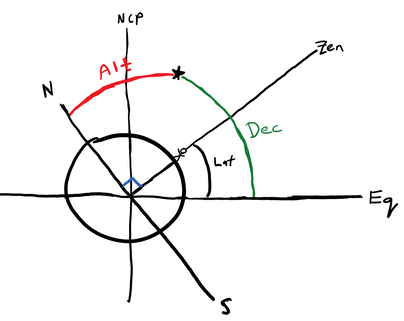
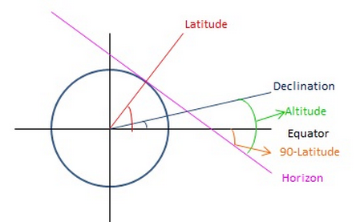
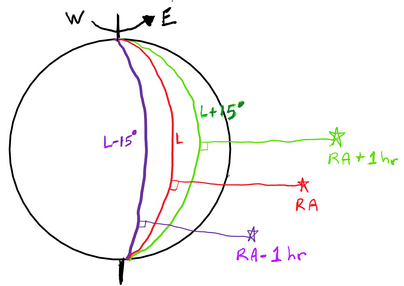
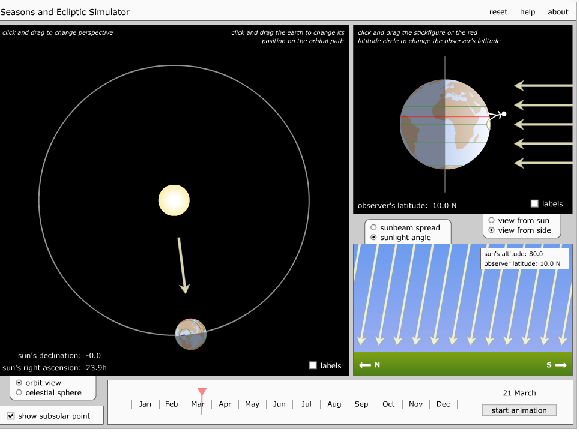
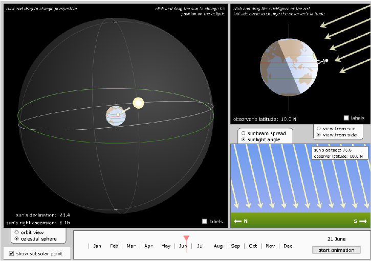

# Coursera Astronomy: Introduction

## Position

There are 88 constellations.
The sky changes with time and season; some constellations are visible only during part of the year.
Relative positions of stars do not change.

## Celestial sphere

*"an imaginary sphere of infinitely large radius enclosing the universe so that all celestial bodies appear to be projected onto its surface"*

**Meridian**: a great circle passing through the two poles of the celestial sphere and the zenith of a given observer.

From Earth's point of view, star positions are fixed on the celestial sphere. The celestial sphere rotates daily about an axis through the poles from east to west. Inside that sphere, Earth rotates from west to east.

On Earth, latitude is the angle from the equator to the observed position. Longitude is the angle from the Greenwich meridian (0°) to that position. Position on Earth determines the visible sky: the horizon is perpendicular to the zenith line. Extending Earth's axis gives the axis of the relative rotation of the celestial sphere.

Projecting Earth's equator onto the celestial sphere yields the celestial equator. The height of a star above this equator is its **declination** (celestial latitude). Declination 0° is the celestial equator, +90° is the north celestial pole, and −90° is the south celestial pole.

**Right ascension** (RA) is celestial longitude, measured in hours instead of degrees. A full circle is 24 h, so 1 h = 15°. Hours are natural here: if Earth turns, it takes 2 hours to see a star that was 30° east earlier.

Zero longitude meets the equator in Pisces: that point is the celestial meridian at 0 h of right ascension.

## Local view

Any celestial body can be identified by altitude *h* and azimuth *α* (horizontal coordinates). Altitude is the angle above the horizon.
The zenith is the point overhead, perpendicular to the horizon.
Zenith angle = 90° − altitude.
Azimuth is the angle between the north direction and the perpendicular projection of the star onto the horizon.

To an observer on Earth, the sky appears to rotate around the celestial pole.
Stars near the north celestial pole never set (for example, the Big Dipper). Stars near the celestial equator rise, move from east to west, and set. Orion is such a constellation.

Reference: [http://www.jgiesen.de/elevaz/basics/index.htm](http://www.jgiesen.de/elevaz/basics/index.htm)

Relation between zenith, star declination, and altitude:

Another view of the relation between declination, altitude, and latitude on Earth:

When a star is at zenith, the observer's latitude equals the star's declination.

Interesting exercise: knowing two stars' declinations and right ascensions, if one star is at zenith for an observer, where on Earth will another observer see the other star at zenith?

Consider two stars, star 1 and star 2, with right ascensions RA1 and RA2 where RA2 > RA1. If star 1 is on your meridian now, star 2 will cross your meridian (RA2 − RA1) hours later.

1 h of right ascension = 15°.

To find latitude and longitude of the second observer: latitude is the declination of the second star (star at zenith). The longitude difference between the two Earth points is RA2 − RA1 (convert minutes to degrees with 60 minutes = 1°). Longitude of point 2 = longitude of point 1 minus that delta, then relate to the 0° meridian.

**Exercise — Aldebaran and Regulus**

If Aldebaran is crossing your local meridian, how long until Regulus crosses? Convert RA to minutes, take the difference, convert back to hours: **5 h 32 min**.

If Aldebaran (δ = 16° 31′) is crossing the local meridian in Saint Petersburg (φ = 59° 56′), Russia, what are its azimuth and altitude in degrees?

- Altitude ≈ declination + 90° − latitude → 16 + 90 − 59 = 46° (convert each value via minutes for precision).
- A star's azimuth is only north (0°) or south (180°) when it crosses the observer's meridian. Off the meridian, azimuth can be any angle.

At São Paulo, latitude is −23°, so the zenith is at −23°. Zenith angle = |declination − latitude|. The star closest to zenith is the one minimizing that angle (e.g. Regulus among the candidates).

Reference: [http://www.jgiesen.de/elevaz/basics/index.htm](http://www.jgiesen.de/elevaz/basics/index.htm)

## Sidereal time

Sidereal time is when the celestial meridian coincides with the local meridian.
24 sidereal hours = one full rotation of Earth relative to the stars. It changes with longitude: 1 h = 15°.
One sidereal day ≈ 23 h 56 min (one rotation relative to the stars).
One solar day = 24 h (one rotation relative to the Sun).

**Exercise — early evening sky, 21 September, São Paulo**

On 21 September (autumnal equinox), sidereal time = local time.

Zero RA is defined where the celestial equator meets the ecliptic (twice a year). At the vernal equinox, the Sun is on the celestial equator at 0 RA at local noon, so sidereal time = LT + 12 h. Six months later at the autumnal equinox, the Sun is at 12 RA at noon, so LT = ST.

In early evening, LT = 18:00 = ST. Local time "lies" on the zero meridian. At the eastern horizon (azimuth 90°), RA ≈ 18 + 6 = 24 h; at the western horizon (azimuth −90°), RA ≈ 18 − 6 = 12 h. An observer sees stars with RA between 12 h and 24 h, plus circumpolar stars that never set.

## Tilt and seasons

Earth is tilted 23.5° from the ecliptic plane (Earth's orbital plane around the Sun). From an Earth-centric view, the Sun follows a path tilted 23.5° relative to the celestial equator.

The ecliptic meets the equator at the vernal (21 March) and autumnal (21 September) equinoxes, conventionally 0 h and 12 h RA. At equinox the Earth's tilt is perpendicular to the Sun's direction; the day/night terminator passes through the poles, so day and night are equal everywhere.

The Sun's declination changes from +23.5° max (21 June) to −23.5° (21 December).

Animation: [http://astro.unl.edu/naap/motion1/animations/seasons_ecliptic.html](http://astro.unl.edu/naap/motion1/animations/seasons_ecliptic.html)

## Moon

The Moon moves around the celestial sphere as it orbits Earth west to east in 27.32 days. RA increases by about 52 min per day. Spin is locked to orbit, so we see the same face.

The Moon rises about 48 min later each day.
The synodic month is 29.52 days (full cycle relative to the Sun). Moon position controls phases and rise/set times. Full moon when the Moon rises 12 h after the Sun.

The Moon's orbit is near the ecliptic but tilted by 5°. Intersections of the Moon's orbit with the ecliptic are the **nodes**. When both Moon and Sun are at the nodes, there is an **eclipse**. Eclipse seasons occur roughly every 173.3 days (cycle ≈ 346.6 days): new moon → solar eclipse; full moon → lunar eclipse.

At new moon, elongation is 0° (**conjunction**). At full moon, elongation is 180° (**opposition**).
The lunar equator is inclined to its orbital plane by a constant 6.688°.

Moon and Sun have nearly the same angular size. Perfect alignment yields a total solar eclipse with a ~250 km umbral shadow on Earth. When the Moon is slightly farther, the eclipse is annular.
The reddish color of the Moon during a lunar eclipse comes from Earth's atmosphere.
Near the start of a crescent Moon, the shadowed part can be faintly visible from Earthshine (light reflected from Earth).

Animation: [http://astro.unl.edu/naap/lps/animations/lps.html](http://astro.unl.edu/naap/lps/animations/lps.html)

## Mathematical recall

- 1 arcsecond = 1/3600 degree
- 1 arcminute = 1/60 degree
- tan = sin / cos = opposite / adjacent
- radians ↔ degrees: 180° = π radians
- arcseconds → radians: *n* arcseconds ≈ *n* / 206265 radians
