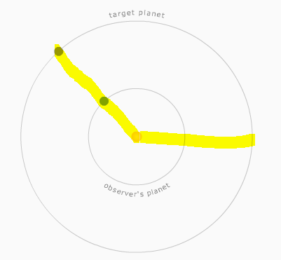
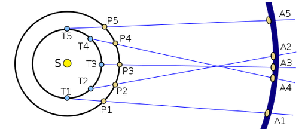
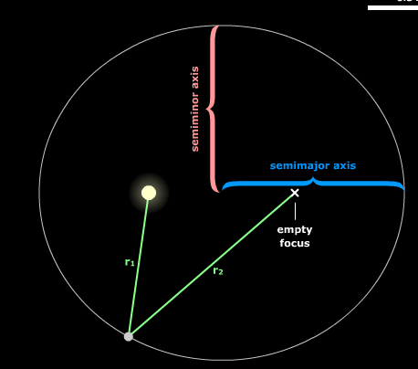
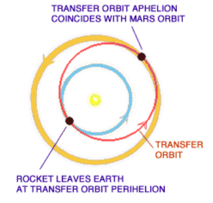
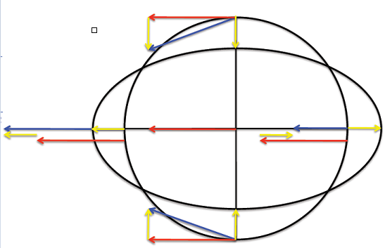

# Newton’s universe

Planets orbit the Sun. From Earth, their apparent speed changes; outer planets such as Mars can show retrograde motion. Copernicus’s heliocentric model:

[http://astro.unl.edu/naap/ssm/heliocentric.html](http://astro.unl.edu/naap/ssm/heliocentric.html)

- Planet orbits the Sun in time *P* — **sidereal period**
- Earth orbits the Sun in time *E* — sidereal year

As Earth passes Mars, Jupiter, or Saturn at opposition, those planets appear to undergo retrograde motion.

The **synodic period** *S* is the time between two conjunctions (alignment) for inferior planets. For superior planets it is the time between two oppositions.

Simulator: [http://astro.unl.edu/naap/ssm/animations/configurationsSimulator.html](http://astro.unl.edu/naap/ssm/animations/configurationsSimulator.html)

Relation between synodic and sidereal periods:

\[
\frac{S}{P_2} = \frac{S}{P_1} - 1 \quad\Leftrightarrow\quad S = \frac{P_1 P_2}{P_2 - P_1}
\]

Example: if *P₁* = 3 years and *P₂* = 5 years, then *S*/5 = *S*/3 − 1 ⇒ (5 − 3)*S* = 15 ⇒ *S* = 7.5 years.

Mars and other outer planets display retrograde motion. At opposition to the Sun, Mars rises at sunset and sets at sunrise, and is visible for much of the night.

The configuration that produces retrograde motion repeats periodically. Given that Mars orbits the Sun once every 1.88 Earth years, the synodic period is 779.772 days, from *Cₘ Cₑ / (Cₘ − Cₑ)* in Earth days.

## Kepler's laws

1. The orbit of a planet is an ellipse with the Sun at one focus. *r₁ + r₂ = 2a*, where *a* is the semi-major axis.

Animation: [http://astro.unl.edu/naap/pos/animations/kepler.html](http://astro.unl.edu/naap/pos/animations/kepler.html)

Orbital eccentricity measures how much an orbit around another body deviates from a circle: 0 = circle; (0, 1) = ellipse; 1 = parabolic escape; greater than 1 = hyperbola.

2. The line from Sun to planet sweeps out equal areas in equal times. Planets move faster near **perihelion** (closest to the Sun) and slower near **aphelion**.

3. The square of the sidereal period is proportional to the cube of the semi-major axis: *P² = K a³*. *K* is the same for all planets.

For circular motion: *P = 2π R / V* ⇔ *V = π a / P* (order-of-magnitude form as in the notes).

**Example — comet ISON**

Observation suggested an elliptical orbit with period 581,480 years. To find distance at aphelion (farthest from the Sun): with *K* = 1 in AU and years, *P² = a³*, so *a = P⅔*. Aphelion + perihelion = 2*a*; if perihelion ≪ aphelion, aphelion ≈ 2*a* ≈ 13,933.274 AU.

Speed at perihelion from energy conservation: *PEₚ + KEₚ = PEₐ + KEₐ*. Gravitational potential energy depends on mass and distance from the other body's center of mass. Assume perihelion at 1.86×10⁶ km from the Sun's center, and neglect kinetic energy at aphelion (speed ≈ 0):

- *PEₚ = −GMm / R*
- *KEₚ = ½ m v²*

\[
v = \sqrt{2 G M \frac{R_a - R_p}{R_a R_p}}
\]

Speed is independent of the object's mass.

Useful constants:

- *G* = 6.67×10⁻¹¹
- *M☉* = 1.99×10³⁰ kg
- 1 AU = 1.50×10⁸ km

For a hyperbolic (unbound) orbit, speed at perihelion must satisfy kinetic energy equal to |potential energy|: *v = √(2 |PEₚ|/m)* (escape at that radius).

## Principle of inertia

An object retains its state of motion unless disturbed externally.

- Velocity vector *v*: speed and direction (m/s)
- Rate of change of *v*: acceleration *a* (m·s⁻²)
- In uniform circular motion, *a* points to the center with constant magnitude
- Force *F = m a*. Unit: newton, N = kg·m/s²
- If A applies force *F* on B, then B applies *−F* on A
- Weight is the gravitational force on an object
- On Earth: *F = m g* with *g* ≈ 9.8 m/s²

## Conservation laws

**Momentum:** *p = m v*. Force is the rate of change of *p*. If A and B act on each other, *p_A + p_B* is unchanged: they exchange momentum but neither create nor destroy it.

In circular motion, angular momentum *L = m v R* is conserved.

**Energy:** when gravity is the only force (free fall), total energy is constant. Near Earth's surface:

\[
E = \frac{1}{2} m v^2 + m g h
\]

in joules (kg·m²/s²). 1 cal ≈ 4200 J.

Even when other forces act, total energy (including work/heat forms) is conserved in closed systems.

## Gravity

If mass *m* moves in a circle of radius *R* at uniform speed *v*, a centripetal force of magnitude *F = m v² / R* must act toward the center.

The Sun applies to a planet of mass *m* orbiting at radius *R* with speed *v* a force *F = m v² / R*. From Kepler, *v² = 4π² / (K R)*, so:

\[
F = \frac{4\pi^2}{K} \frac{m}{R^2} = \frac{G M_\odot m}{R^2}
\]

with *G* = 6.67×10⁻¹¹ and *K = 4π² / (G M_total)*.

Potential energy at radius *R* is *−G M m / R*.
Total energy = potential + kinetic, and is constant along the orbit.

**Example — Earth to Mars transfer**

Assume both planetary orbits are circular.

The spacecraft follows an ellipse touching Earth's and Mars's orbits. Semi-major axis *a = (Rₑ + Rₘ) / 2*. Period for a full ellipse *P = √(a³)* (AU, years). Time to reach Mars is half that period.

With Mars period *P* = 1.88 years: *Rₘ = (P²)⅓* ≈ 1.523 AU. Earth radius = 1 AU, so spacecraft *a* ≈ 1.26 AU and *P* ≈ 0.7 year (one-way ≈ 0.35 year).

## Tidal force

Earth is in free fall under the Sun's gravity, so the Sun's gravity has almost no net effect on the Earth as a whole. Gravitational acceleration differs at different points on Earth. The difference in free-fall acceleration *a_t* acts as a tidal force *F_t = m a_t*.

Earth's acceleration toward the Sun (center to center): *a_t = G M☉ / D☉²*.

Closer face: *a_t′ = G M☉ / (D☉ − R⊕)²* ≈ *a_t (1 + 2 R⊕ / D)* (Newtonian approximation).

Farther face: *a_t″ = G M☉ / (D☉ + R⊕)²* ≈ *a_t (1 − 2 R⊕ / D)*.

The Moon has a stronger tidal effect on Earth. It deforms the oceans so a bulge faces the Moon; as Earth rotates, the bulge moves and tides repeat about every 24 h 48 min.

When lunar and solar tidal forces align, tides are higher (spring tides).

Simulator: [http://astro.unl.edu/classaction/animations/lunarcycles/tidesim.html](http://astro.unl.edu/classaction/animations/lunarcycles/tidesim.html)

**Exercise — tidal force on a rock on the Moon**

Moon at center-to-center distance *D* from Earth. Magnitude of the tidal force on a rock of mass *m* at the near surface (difference between center-to-center gravity and gravity at the surface):

- *F₁ = G Mₑ m / D²* (center to center)
- *F₂ = G Mₑ m / (D − Rₘ)²* (at near surface)

\[
F_t = F_2 - F_1 = m G M_e \left( \frac{1}{(D - R_m)^2} - \frac{1}{D^2} \right)
\]

Distance at which Earth can lift a rock off the lunar surface (order-of-magnitude Roche-like estimate from the notes):

\[
D = \left( \frac{2 M_e R_m^3}{M_m} \right)^{1/3} \approx 9483\ \mathrm{km}
\]

(current Moon–Earth distance ≈ 384,400 km).
