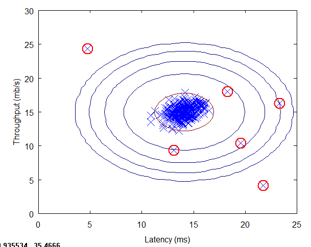

# Anomaly detection

The goal for anomaly detection is, given a dataset `{x(1), ... x(m)}`
and a Xtest dataset, the goal is to compute the probability that a X is anomalous: `P(X test) < epsilon`.

It is used in user behavioral, like fraud detection, or manufactoring test, or computer monitoring in data center, but it can be also used by data scientist when doing data analysis to verify the data quality and to understand why there are some outliers.

In anomaly detection, we fit a model `P(X)` to a set of negative (y=0) examples, without using any positive examples we may have collected of previously observed anomalies. There is a large number of normal examples, and a relatively small number of anomalous examples.

`P(X)` is following a gaussian distribution. On the dataset we will fit a Gaussian distribution and then find values that have very low probability and hence can be considered anomalies. The red circles in the figure below are anomalies or outliers.

!!! note
        Remember that the gaussian distribution is giving the probability of X using the mean and the variance sigma. The area under the bell curve is always equals to 1

## Standard deviation

A simple approach, on a unique numberical feature is to use the standard deviation:  In statistical data distribution is approximately normal then about 68% of the data values lie within one standard deviation of the mean and about 95% are within two standard deviations, and about 99.7% lie within three standard deviations. See the code in [ml-python/anomaly-detection/StdDeviation.py].

When choosing features for an anomaly detection system, it is a good idea to look for features that take on unusually large or small values for (mainly the) anomalous examples.

## Box plot

Box plots are a graphical depiction of numerical data through their quantiles. It is a very simple but effective way to visualize outliers.

## When to use it?

use anomaly detection:

* When there is a very small number of positive example (y=1)
* Many different types of anomalies, it is hard for any algorithm to learn from positive examples what the anomalies look like
* Future anomalies may look nothing like any of the anomalous examples we've seen so far
* Fraud detection, monitoring machines in a data center, manufacturing

use supervised learning

* When both positive and negative examples are large
* Enough positive examples for algorithm to get a sense of what positive examples are like
* Future positive examples likely to be similar to ones in training set
* Spam, weather prediction, cancer classification

### What feature to use for anomaly detection?

* historical data plot shows a bell curve like gaussian
* it is possible to transform a non-gaussian feature to a gaussian using square root, log, 