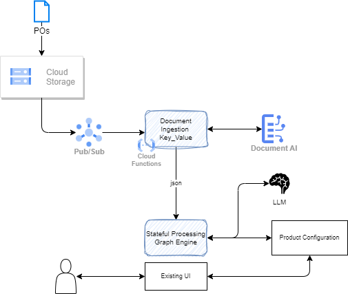

# Purchase Order Processing with AI and Hybrid Cloud

This example is a, scope reduced, purchase order processing for a manufacturing company working in complex pipes, pumps and valves, product production. The existing solution includes a web application and a product configurator, based on rule based software. The idea is to improve the process by automating content extraction and interpretation from the unstructured document 

{ width=900 }

The application flow looks like:

1. POs are uploaded to cloud storage in buckets organized with some business dimension, like geography, or customer name. 

    * **Google Cloud Storage** is a highly scalable and durable object storage service. 11 9s availability.
    * It offers different storage classes to meet various performance and cost requirements.
    * Replicated between locations, high availability and low latency access from anywhere in the world.
    * Secured with server-side encryption, IAM-based access control.
    * Support object versioning, and restore to previous version.

1. Once a file is uploaded, and event can be propagated to a Pub/Sub service responsible to keep the event for some time and authorize asynchronous event processing. It helps to scale but also to use function execution, really paying for what resources are consumed. Adding a pub/sub topic helps to add more subscriber than just a function.

    * **Google Pub/Sub** is a fully managed service, highly scalable, distributed messaging system that can handle high volumes of data with low latency. It processes millions of messages per second.
    * It provides at-most-once, at-least-once delivery and guaranteed message ordering.
    * Asynchronous, topic based pub/sub mechanism with long term persistence, replicated for no data lost. Topics help categorize messages and send them to specific subscribers.
    * Designed for real-time event ingestion.
    * Automatically scales to handle changes in message traffic, to handle sudden spikes in data without any manual intervention.
    * Secured with IAM-based access control, encryption encryption at rest and in transit, and different authentication methods.
    * Pay-as-you-go pricing model.

1. The subscriber to the new-file-upload event is a function doing the document parsing, splitting, and encoding to extract key values in a more structure way. It uses API to call a first AI service for Document understanding

    **Google Cloud Functions:**

    * Cloud Functions allows to run code without having to manage any servers or infrastructure.
    * Automatic scaling up and down to zero.
    * May be triggered by various events, such as HTTP requests, Cloud Storage events, Pub/Sub messages. 
    * Supports different programming languages: Node.js, Python, Go, Java, and .NET .
    * Priced based on the number of invocations, the duration of each invocation, and the amount of memory used.
    * Integrated with monitoring ang logging services.

    **Google [Document AI](../techno/gcp/index.md/#document-ai)** is used to process and understand documents:

    * Extracts and understands structured information from a wide variety of document types, including PDFs, images, and scanned documents.
    * It leverages advanced natural language processing (NLP) and computer vision technologies to deliver high-accuracy document extraction and understanding. 
    * Trained to extract data from invoices, receipts, and contracts.
    * It allows to create custom document models to extract information from specialized or domain-specific documents.
    * Different natural languages are supported.
    * Scale up and down ensuring high throughput and low latency.
    * No-code tools to let developers quickly set up and configure document processing pipelines without writing any code.
    * Integrated with monitoring and logging services.
    * It is possible to combine with custom MM models to do better entity extraction.

1. Custom development for product configuration flow automation. This will be a [LangGraph](https://langchain-ai.github.io/langgraph/) implementation to support conversation management, integration with Large Language Model, like Gemini, and doing function calling to interact with the expert system.

    * The approach is to define a configuration tree, to search for the next data to extract from the parsed purchase order, and drive the interactions with the expert system.

1. If we need to process unstructured user's requests we can add [Google Gemini](https://ai.google.dev/gemini-api/docs/api-key) to support entity extraction, and agentic application. 

    * **Gemini** offers multi-modal capabilities: it is designed to understand, operate, and combine different types of information, including text, images, audio, video, and code.
    * Code assistant
    * Available in three sizes: Nano, Pro, and Ultra - each optimized for different user needs.
    * Excellent performance: 90.0% score on the Massive Multitask Language Understanding (MMLU) benchmark
    * Gemini API enables developers to adjust safety settings on the following 4 dimensions to quickly assess if the application requires more or less restrictive configuration: 1/ Harassment, 2/ Hate speech, 3/ Sexually explicit, 4/ Dangerous
    * [Pay-as-you-go](https://ai.google.dev/pricing)
    * Gemini Pro demonstrates improved capabilities in understanding complex concepts and solving logical problems. This makes it suitable for tasks that require critical thinking.
    * Still under development and continuous improvement.

