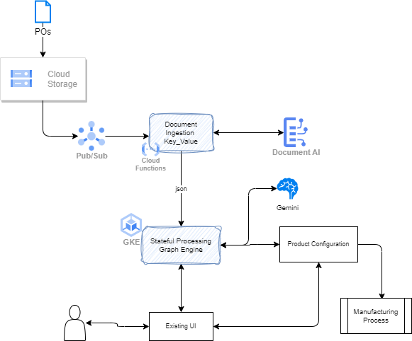

# AI deployment solution designs

This section presents examples of solution design using Gen AI, Hybrid AI, Agentic AI, with links to external demonstrations when available

## 1- Basic private chatbot deployed on a cloud provider

### Needs

* End users are deployed world wide and are part of a B2B partnership, so not a consumer app
* Access via login and Single Sign On
* Highly available
* Trace the conversation in lake house to be able to do quality assurance and AI accuracy enhancement

### Solution

A solution need to address the following subjects:

* User authentication and authorization
* DNS record - DNS Routing to Load Balancers in each AZ and even in different regions
* Web socket connection to API server and conversation server
* May be API Gateway
* Static content on S3 with cloudfront
* Auto-scaling of conversation server
* Avoid single point of failure for each components
* Address backup/ restore
* Failover and recovery for DR
* GitOps

At the system context level, we have the following high-level components, as seen by an end-user.

### Deeper dive

#### ChatBot client app

The application may be a mobile app or a modern single page reactive webapp. As the user interface should be simple wth login/authentication mechanism then a chatbot interface, it will be easy to support it with a reactive HTML/ javascript webapp. The most important decision is how to maintain the communication with the conversation server.

#### 

Amazon Route 53 is Domain Name System (DNS) web service for DNS routing. It is used to route internet traffic to a website or web application. It is highly available, scalable, and fully managed, global service. It is used to load balance between regions, and then between AZs. 

When using an EC2 auto-scaling group to host the conversation server, we need to add elastic load balancers to manage load balancing and routing within the region and cross AZs.

Route 53 uses the concept of `hosted zone` which is a "container" that holds information about how to route traffic for a domain or subdomain. The zone can be **public** (internet facing) or **private** (inside a VPC). All resource record sets within a hosted zone must have the hosted zone’s domain name as a suffix.

EC2 DNS name could not be a target of DNS alias. Routing policies helps to define how Route 53 responds to DNS queries. 

When using API Gateway, you create a Route 53 alias record that routes traffic to the regional API endpoint. The API Gateway routes traffic to the Lambda function backend, to SQS, or to Fargate tasks running in ECS as illustrated in the following figure:

[See this nice repository for terraform definitions for a microservice deployment on Fargate with API Gateway, VPC private endpoints, and NLB](https://github.com/duberton/aws-api-gateway-vpc-ecs-rds).

## 2- RAG solution HA and scalable

RAG solution adds document management and vector store management on top of the ChatBot solution. Most likely those chatbot will be for internal staff to the enterprise but could be for B2B and even some B2C (even as of mid 2024 it is very risky to expose LLM to consumer for enterprises running in regulated business).

The basic RAG high level architecture 

## 3- ML Flow

## 4- Stateful Agentic application

## 5- Purchase Order Processing

An neuro-symbolic solution to partially automate purchase order processing and manufactured product configuration. [See dedicated note.](./po-processing.md)