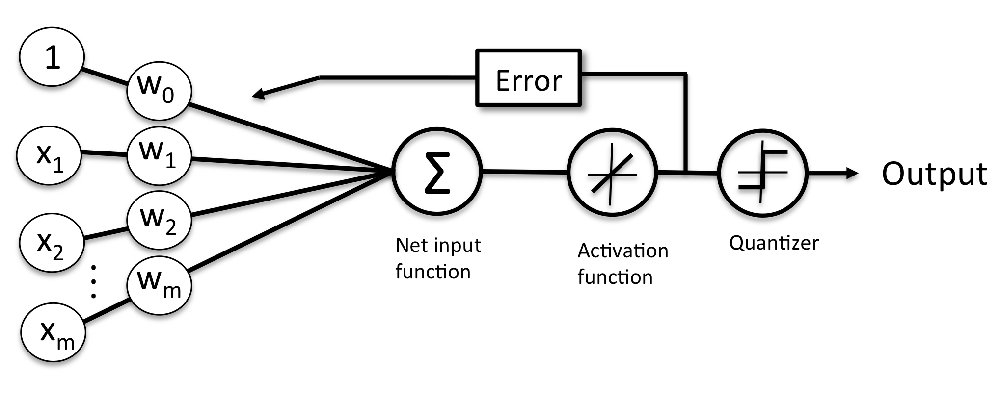

# Classifiers

All the examples execute from the python environment in docker

## Perceptron

Based on the human neuron model, Frank Rosenblatt proposed an algorithm that would 
automatically learn the optimal weight coefficients that are then multiplied with the input
 features in order to make the decision of whether a neuron fires or not. 
 In the context of supervised learning and classification, such an algorithm could then be
 used to predict if a sample belonged to one class or the other.
The problem is reduced to a binary classification (-1,1), and an activation function 
that takes a linear combination of input X, with corresponding weights vector W, 
to compute the net input z = sum(w(i) * x(i)) i from 1 to n
If the value is greater than a threshold the output is 1, -1 otherwise.
The function is called unit step function. 
If w0 is set to be -threshold and x0=1 then the equation becomes:

=\sum_{i} \theta_{i} * x_{i}= \theta^{T}*x)

The following python code uses numpy as np to compute the matrix dot product wT*x:

```python
def netInput(self,X):
     return np.dot(X,self.weights[1:]) + self.weights[0]
   
def predict(self,X):
   return np.where(self.netInput(X)>=0.0,1,-1)
```

The weights are computed using the training set. The value of weight delta, which is used to update the weight , is calculated by the perceptron learning rule:

= \eta*(y_{i} - mean(y_{i}))* x_{i}^j)

eta is the learning rate, Y(i) is the known answer or target for i th sample. The weight update is proportional to the value of X(i)
 
It is important to note that the convergence of the perceptron is only guaranteed if the two classes are linearly separable and the learning rate is sufficiently small.


The fit function implements the update to the weight.

Execute the python implementation with:

```sh
#under ml-python/classifiers folder
python TestPerceptron.py
```

## Adaline

In ADALINE the weights are updated based on a linear activation function
(the identity function) rather than a unit step function like in the perceptron.



```sh
#under ml-python/classifiers folder
python TestAdaline.py
```

When the features are standardized (each feature value is reduced by the mean and divided by the standard deviation) the ADALine algorithm converges more quickly.


```python
X_std = np.copy(X)
X_std[:,0]=(X[:,0]-np.mean(X[:,0]))/np.std(X[:,0])
X_std[:,1]=(X[:,1]-np.mean(X[:,1]))/np.std(X[:,1])
```
 
The previous approach can take a lot of time when the dataset includes millions of records. A more efficient approach is to take the stochastic gradient descent. It is used with online training, where the algorithm is trained on-the-fly, while new training set arrives.
The weights are computed with: 

```python
def updateWeights(self,xi,target):
        output = self.netInput( xi)
        error = (target - output)
        self.weights[1:] += self.eta * xi.dot( error)
        self.weights[0] += self.eta * error
        cost = (error** 2)/ 2.0
        return cost
```
To obtain accurate results via stochastic gradient descent, it is important to present it with data in a random order, which is why we want to shuffle the training set for every epoch to prevent cycles.
 

