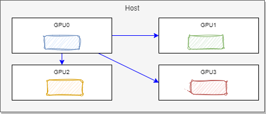

# DDP and 

## Distributed Data Parallel with PyTorch

???- info "Updates"
    Created 01/2024

The goal of Distributed Data Parallel is to train model in distributed computers but keep model integrity. PyTorch offers a [DDP library (`torch.distributed`)](https://pytorch.org/tutorials/beginner/dist_overview.html) to facilitate this complex processing on multiple GPU hosts or using multiple machines.

On one host, the model is trained on CPU/GPU, from the complete data set. It processes the forward pass to compute weights, computes the lost, performs the backward propagation for the gradients, then optimizes the gradients. 

Using more hosts, we can split the dataset and send those data to different hosts, which have the same initial model and optimizer function.


Sending different data set to train the different models, leads to different gradients, so different models.

DDP adds a synchronization step before optimizing the gradients so each model has the same weights:


Each gradients from all the replicas are aggregated between model using the bucketed [Ring AllReduce algorithm](https://towardsdatascience.com/visual-intuition-on-ring-allreduce-for-distributed-deep-learning-d1f34b4911da). DDP overlaps gradient computation with communication to synch them between models. The synchronization step does not need to wait for all gradient within one model to be computed, it can start communication along the ring while the backward pass is still running, this ensures the GPUs are always working.

On a computer with multiple GPUs, each GPU will run on process, which communicates between each other. A process group helps to discover those processes and manage the communication. One host is the master to coordinate the processes across GPUs and machines. 



The backend is [Nvidia communication library](https://docs.nvidia.com/deeplearning/nccl/install-guide/index.html#overview), `nccl`. On a single machine with one GPU, it is not needed to use DDP, but to test the code, we can use the `gloo` backend.

```python
def ddp_setup(rank, world_size):
    """
    Args:
        rank: Unique identifier of each process
        world_size: Total number of processes
    """
    os.environ["MASTER_ADDR"] = "localhost"
    os.environ["MASTER_PORT"] = "12355"
    init_process_group(backend="nccl", rank=rank, world_size=world_size)
    torch.cuda.set_device(rank)
```

A model in the trainer is now a DDP using the gpu_id

```python
 self.model = DDP(model, device_ids=[gpu_id])
```

Each process has its own instance of the trainer class. Only one process will perform the checkpoint save:

```python
 if self.gpu_id == 0 and epoch % self.save
```

The `torch.multiprocessing` is responsible to take a function and spawns it to all processes in the distributed group. The rank, for each trainer, is assigned by multiprocessing.

```python
mp.spawn(main, args=(world_size, args.save_every, args.total_epochs, args.batch_size), nprocs=world_size)
```

### Multi-GPUs with [torchrun](https://pytorch.org/docs/stable/elastic/run.html)

`torchrun` provides a superset of the functionality as torch.distributed.launch to manage worker failures by restarting all workers from last snapshots, and continue training. The number of nodes may change overtime.

A snapshot includes the model states, and any other parameters like, state of the optimizer, the epoch...

`torchrun` manages the environment for us. LOCAL_RANK for example is used to identify the GPU id. The code is then a little bit simpler as illustrated in [multi_gpu_torchrun.py](https://github.com/jbcodeforce/ML-studies/tree/master/pytorch/ddp/multi_gpu_torchrun.py).

Example of execution for testing

```sh
torchrun --standalone --nproc_per_node=gpu multi_gpu_torchrun.py 50 10
```

When using multiple machines we can use `torchrun` on each machine, with one master machine to coordinate the communication. LOCAL_RANK is used at the machine level, in case there are multiple GPUs on this machine, the GPU will be indexed from 0. A global rank is needed, cross machine. For the backend coordinator, select a machine with high level bandwidth. On AWS be sure to set the network security policy to let nodes communicating over tcp. 

Below is the command to run on each machine, with different node_rank on each machine:

```sh
export NCCL_DEBUG=INFO
export NCCL_SOCKET_INAME=eth0
torchrun --nproc_per_node=gpu --nnodes=3 --node_rank=0 --rdzv_id=345 --rdzv_backend=c10d --rdzv_endpoint=1720.30.23.101:29603 multi_gpu_torchrun.py 50 10
```

Each machine will have their own snapshot. 

Recall that splitting data processing between machine over network is less efficient, than on  ane machine is more GPUs. So prefer bigger machine. The constraint, then, becomes the memory.

### Slurm as orchestrator


### Code sample

* [multi_gpu_ddp.py](https://github.com/jbcodeforce/ML-studies/tree/master/pytorch/ddp/multi_gpu_ddp.py) demonstrates the basic DDP code to train a model using multiple GPUs machine, and the `from torch.utils.data.distributed import DistributedSampler` the `torch.nn.parallel.DistributedDataParallel` and `torch.distributed` modules. 

```python
def prepare_dataloader(dataset: Dataset, batch_size: int):
    return DataLoader(
        dataset,
        batch_size=batch_size,
        pin_memory=True,
        shuffle=False,
        sampler=DistributedSampler(dataset)
    )

```

To run this example with 50 epochs saved every 10 epochs: `python multi_gpu_ddp.py 50 10 `

* [multi_gpu_torchrun.py](https://github.com/jbcodeforce/ML-studies/tree/master/pytorch/ddp/multi_gpu_torchrun.py) to run a training on multiple GPUs on the same machine with `torchrun`
* [multinode.py](https://github.com/jbcodeforce/ML-studies/tree/master/pytorch/ddp/multinode.py) to demonstrate global rank.


### Source of information

* [DDP Tutorial Series code repository.](https://github.com/pytorch/examples/tree/main/distributed/ddp-tutorial-series) and [YouTube videos by Suraj Subramanian.](https://www.youtube.com/playlist?list=PL_lsbAsL_o2CSuhUhJIiW0IkdT5C2wGWj)
* [See minGPT git repository](https://github.com/subramen/minGPT-ddp) for a chatGPT model and trainer to do a fine tuning.