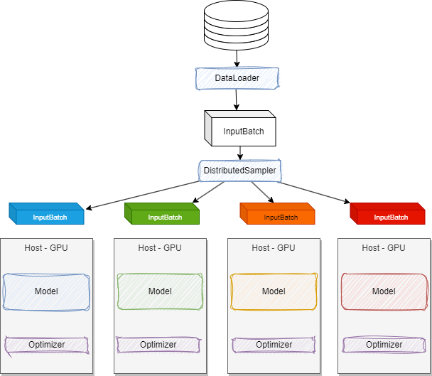

# Distributed Data Parallel with PyTorch

???- info "Updates"
    Created 01/2024

The goal of Distributed Data Parallel is to train model in distributed computers but keep model integrity. PyTorch offers a [DDP library (`torch.distributed`)](https://pytorch.org/tutorials/beginner/dist_overview.html) to facilitate this complex processing.

On one host, the model is trained on CPU/GPU, from the complete data set. It processes the forward pass to compute weights, computes the lost, performs the backward propagation for the gradients, then optimizes the gradients. 

Using more hosts, we can split the dataset and send those data to different hosts, which have the same initial model and optimizer function.

Sending different data set to train the different models, leads to different gradients, so different models.

DDP adds a synchronization step before optimizing the gradients so each model has the same weights:

Each gradients from all the replicas are aggregated between model using the bucketed [Ring AllReduce algorithm](https://towardsdatascience.com/visual-intuition-on-ring-allreduce-for-distributed-deep-learning-d1f34b4911da). DDP overlaps gradient computation with communication to synch them between models. The synchronization step does not need to wait for all gradient within one model to be computed, it can start communication along the ring while the backward pass is still running, this ensures the GPUs are always working.

* [See minGPT gir repository](https://github.com/subramen/minGPT-ddp)