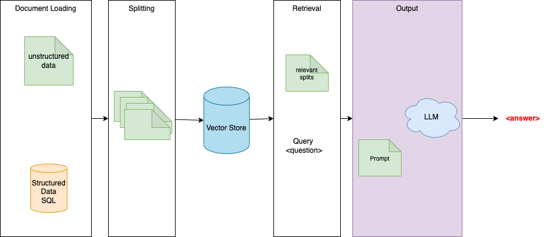
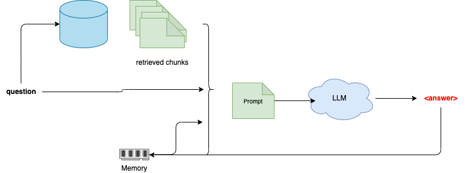
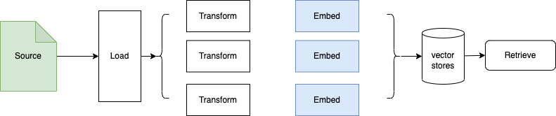
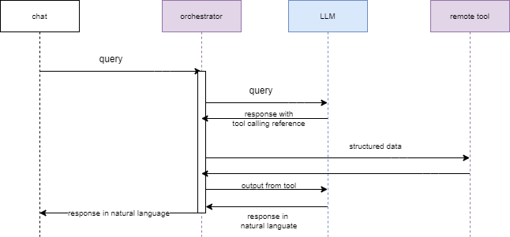

# LangChain Study

In LLM application there are a lot of steps to do, trying different prompting, integrating different LLMs, implementing conversation history, at the end there is a lot of glue code to implement.

[LangChain](https://python.langchain.com/docs/get_started/introduction) is a open-source framework for developing applications powered by large language models, connecting them to external data sources, and manage conversation with human. 

## Value propositions

Develop apps with context awareness, and that can reason using LLMs.
It includes Python and Typescript packages, and a Java one under construction.

It focuses on composition and modularity. The components defined by the framework can be combined to address specific use cases, and developers can add new components.

* **LangChain**: Python and Javascript libraries
* **LangServe:** a library for deploying LangChain chains as a REST API.
* **LangSmith:** a platform that lets developers debug, test, evaluate, and monitor chains
* Predefined prompt template from langChain Hub.

They are adding new products to their portfolio quickly like LangSmith (get visibility on LLMs execution), and LangServe (server API for LangChain apps).

### Sources

The content comes from different sources:

* [Excellent product documentation](https://python.langchain.com/docs/), should be the go to place.
* [deeplearning.ai LangChain introduction by Harisson Chase and Andrew Ng](https://learn.deeplearning.ai)
* [LLM Powered Autonomous Agents](https://lilianweng.github.io/posts/2023-06-23-agent/)
* [Retrieval and RAG blog.](https://blog.langchain.dev/retrieval/)

##  LangChain libraries

The core building block of LangChain applications is the LLMChain:

* A LLM
* Prompt templates
* Output parsers

[PromptTemplate](https://python.langchain.com/docs/modules/model_io/prompts) helps to structure the prompt and facilitate reuse by creating model agnostic templates. The library includes output parsers to get content extracted from the keyword defined in the prompt. Example is the chain of thought keywords of **Thought, Action, Observation.**

### Getting started

The [LangChain documentation](https://python.langchain.com/docs/get_started/quickstart/) is excellent so no need to write more. All my study codes with LangChain and LLM are in different folders of this repo:

| Backend | Type of chains |
| --- | --- |
| [openAI](https://github.com/jbcodeforce/ML-studies/tree/master/llm-langchain/openAI) | The implementation of the quickstart examples, RAG, chatbot, agent  |
| [Ollama](https://github.com/jbcodeforce/ML-studies/tree/master/llm-langchain/ollama)| run a simple query to Ollama (running Llama 2 locally|
| [Anthropic Claude](https://github.com/jbcodeforce/ML-studies/tree/master/llm-langchain/anthropic) | |
| [Mistral LLM](https://github.com/jbcodeforce/ML-studies/tree/master/llm-langchain/mistral) | |
| [IBM WatsonX](https://github.com/jbcodeforce/ML-studies/tree/master/llm-langchain/watsonX) | | 
| [AWS Bedrock](https://github.com/jbcodeforce/ML-studies/tree/master/llm-langchain/bedrock) | zero_shot generation | 

Each code needs to define only the needed LangChain modules to keep the executable size low. 

## Main Concepts

### Model I/O

[Model I/O](https://python.langchain.com/docs/modules/model_io/) are building blocks to interface with any language model. It facilitates the interface of model input (prompts) with the LLM model to produce the model output.

* LangChain supports two types of language: LLM (for pure text completion models) or ChatModel (conversation on top of LLM using constructs of AIMessage, HumanMessage)
* LangChain uses [Prompt templates](https://python.langchain.com/docs/modules/model_io/prompts/prompt_templates/) to control LLM behavior.

    * Two common prompt templates: [string prompt](https://api.python.langchain.com/en/latest/prompts/langchain.prompts.base.StringPromptTemplate.html) templates and [chat prompt](https://api.python.langchain.com/en/latest/prompts/langchain.prompts.chat.ChatPromptTemplate.html) templates.
    * We can build custom prompt by extending existing default templates. An example is a 'few-shot-examples' in a chat prompt using [FewShotChatMessagePromptTemplate](https://python.langchain.com/docs/modules/model_io/prompts/prompt_templates/few_shot_examples_chat).
    * LangChain offers a [prompt hub](https://smith.langchain.com/hub) to get predefined prompts easily loadable:

    ```python
    from langchain import hub
    prompt = hub.pull("hwchase17/openai-functions-agent")
    ```

* [Chains](https://python.langchain.com/docs/modules/chains/) allow developers to combine multiple components together (or to combine other chains) to create a single, coherent application.

    ```python
    # a chain definition using Langchain expression language
    chain = prompt | model | output_parser
    ```    

    * [LangChain Expression Language](https://python.langchain.com/docs/expression_language/) is a declarative way to define chains.

* [LLMChain](https://api.python.langchain.com/en/latest/chains/langchain.chains.llm.LLMChain.html) class is the basic chain to integrate with any LLM.


* **OutputParsers** convert the raw output of a language model into a format that can be used downstream


*Feature stores, like [Feast](https://github.com/feast-dev/feast), can be a great way to keep information about the user conversation or query, and LangChain provides an easy way to combine data from Feast with LLMs.*

### Q&A app

For **Q&A** the pipeline will most likely integrate with existing documents as illustrated in the figure below:

{width=700}

**Embeddings** capture the semantic meaning of the text, which helps to do similarity search. **Vector store** supports storage and searching of these embeddings. Retrievers use [different algorithms](https://python.langchain.com/docs/modules/data_connection/retrievers/) for the semantic search to load vectors. 


???- code "Use RAG with Q&A"
    [chains.RetrievalQA]()

    ```python
    from langchain.chains import RetrievalQA
    from langchain.prompts import PromptTemplate

    prompt_template = """Human: Use the following pieces of context to provide a concise answer to the question at the end. If you don't know the answer, just say that you don't know, don't try to make up an answer.

    {context}

    Question: {question}
    Assistant:"""

    PROMPT = PromptTemplate(
        template=prompt_template, input_variables=["context", "question"]
    )

    qa = RetrievalQA.from_chain_type(
        llm=llm,
        chain_type="stuff",
        retriever=vectorstore_faiss.as_retriever(
            search_type="similarity", search_kwargs={"k": 3}
        ),
        return_source_documents=True,
        chain_type_kwargs={"prompt": PROMPT}
    )
    query = "Is it possible that I get sentenced to jail due to failure in filings?"
    result = qa({"query": query})
    print_ww(result['result'])
    ```

### ChatBot

**[Chatbots](https://python.langchain.com/docs/use_cases/chatbots/)** is the most common app for LLM: Aside from basic prompting and LLMs call, chatbots have **memory** and retrievers:




### Text Generation Examples

* [Basic query with unknown content to generate hallucination: 1st_openAI_lc.py ](ttps://github.com/jbcodeforce/ML-studies/tree/master/llm-langchain/openAI/1st_openAI_lc.py)
* [Simple test to call Bedrock with Langchain](https://github.com/jbcodeforce/ML-studies/tree/master/llm-langchain/bedrock/TestBedrockWithLangchain.py) using on zero_shot generation.
* Response to an email of unhappy customer using Claude 2 and PromptTemplate. `PromptTemplates` allow us to create generic shells which can be populated with information later and get model outputs based on different scenarios. [text_generation/ResponseToUnhappyCustomer](https://github.com/jbcodeforce/ML-studies/tree/master/llm-langchain/text_generation/ResponseToUnhappyCustomer.py)


### Summarization chain

Always assess the size of the content to send, as the approach can be different: for big doc we need to split the doc in chunks.

* Small text summary with OpenAI. 
* Small text to summarize, with [bedrock client](https://github.com/jbcodeforce/ML-studies/blob/master/llm-langchain/bedrock/utils/bedrock.py) and the invoke_model on the client see the code in [llm-langchain/summarization/SmallTextSummarization.py](https://github.com/jbcodeforce/ML-studies/blob/master/llm-langchain/summarization/SmallTextSummarization.py)
* For big document, langchain provides the load_summarize_chain to summarize by chunks and get the summary of the summaries. See code with 'manual' extraction of the summaries as insights and then creating a summary of insights in [summarization/long-text-summarization.py](https://github.com/jbcodeforce/ML-studies/blob/master/llm-langchain/bedrock/summarization/long-text-summarization.py) or using a LangChain summarization with map-reduce in [summarization/long-text-summarization-mr.py](https://github.com/jbcodeforce/ML-studies/blob/master/llm-langchain/bedrock/summarization/long-text-summarization-mr.py).

???- code "Using langchain summarize chain"
    ```python
    from langchain.text_splitter import RecursiveCharacterTextSplitter
    from langchain.llms.bedrock import Bedrock
    from langchain.chains.summarize import load_summarize_chain

    llm = Bedrock(
        model_id=modelId,
        model_kwargs={
            "max_tokens_to_sample": 1000,
        },
        client=boto3_bedrock,
    ) 

    text_splitter = RecursiveCharacterTextSplitter(
        separators=["\n\n", "\n"], chunk_size=4000, chunk_overlap=100
    )
    docs = text_splitter.create_documents([letter])

    summary_chain = load_summarize_chain(llm=llm, chain_type="map_reduce", verbose=True)
    output = summary_chain.run(docs)
    ```

### Retrieval Augmented Generation

The goal is to add custom dataset not already part of a  trained model and use the dataset as input into the prompt sent to the LLM. This is the Retrieval Augmented Generation or RAG and illustrated in figure below:



The code to do the above processing is in [prepareVectorStore.py](https://github.com/jbcodeforce/ML-studies/blob/master/llm-langchain/Q&A/prepareVectorStore.py).

To load PDF documents Langchain offers a loader. 

???- code "Split docs and save in vector store"
    ```python
    # ...
    from langchain.vectorstores import FAISS
    from langchain.indexes.vectorstore import VectorStoreIndexWrapper

    loader = PyPDFDirectoryLoader("./data/")
    documents = loader.load()
    text_splitter = RecursiveCharacterTextSplitter(
        chunk_size = 1000,
        chunk_overlap  = 100,
    )
    docs = text_splitter.split_documents(documents)

    vectorstore_faiss = FAISS.from_documents(
        docs,
        bedrock_embeddings,
    )
    vectorstore_faiss.save_local("faiss_index")
    ```

Creating chunks is necessary because language models generally have a limit to the amount of token they can deal with.

???- code "Search similarity in vector DB"
    [OpenAIEmbeddings](https://python.langchain.com/docs/integrations/text_embedding/openai/)
    ```python
    embeddings = OpenAIEmbeddings(model="text-embedding-3-large", dimensions=1024)
    query = """Is it possible that ...?"""
    query_embedding = embeddings.embed_query(query)
    relevant_documents = vectorstore_faiss.similarity_search_by_vector(query_embedding)
    ```

During the interaction with the end-user, the system (a chain in LangChain) retrieves the most relevant data to the question asked, and passes it to LLM in the generation step.

* Embeddings capture the semantic meaning of the text to help do similarity search
* Persist the embeddings into a Vector store. Faiss and ChromaDB are common vector stores to use, but OpenSearch, Postgresql can also being used.
* Retriever includes semantic search and efficient algorithm to prepare the prompt. To improve on vector similarity search we can generate variants of the input question.

See [Q&A with FAISS store qa-faiss-store.py](https://github.com/jbcodeforce/ML-studies/blob/master/llm-langchain/Q&A/qa-faiss-store.py).


* [Another example of LLM Chain with AWS Bedrock llm and Feast as feature store](https://github.com/jbcodeforce/ML-studies/tree/master/llm-langchain/feast/feast-prompt.py)

* **[Web scraping](https://python.langchain.com/docs/use_cases/web_scraping)** for LLM based web research. It uses the same process: document/page loading, transformation with tool like BeautifulSoup, to HTML2Text.


???- info "Getting started with Feast"
    Use `pip install feast` then the `feast` CLI with `feast init my_feature_repo` to create a Feature Store then `feast apply` to create entity, feature views, and services. Then `feast ui` + [http://localhost:8888](http://localhost:8888) to act on the store. See [my summary on Feast](../data/features.md#feast-open-source)

???- info "LLM and FeatureForm"
    See [FeatureForm](https://docs.featureform.com/) as another open-source feature store solution and the LangChain sample with [Claude LLM](https://github.com/jbcodeforce/ML-studies/tree/master/llm-langchain/featureform/ff-langchain-prompt.py)

### Tool Calling

With Tool Calling we can define function or tool to be referenced as part of the LLM response, and LLM will prepare the arguments for the function. It is used to generate tool invocations, not to execute it. LangChain has a lot of [predefined tool definitions already](https://python.langchain.com/docs/integrations/tools/).

We can use tool calling in chain (to use tools in sequence) or [agent](https://python.langchain.com/docs/modules/agents/agent_types/tool_calling/) (to use tools in loop).

LangChain offers an API to the LLM called `bind_tools` to pass the definition of the tool in as part of each call to the model, so that the model can invoke the tool when appropriate.

The following [prompt](https://smith.langchain.com/hub/hwchase17/openai-tools-agent) is the simplest prompt for OpenAI. It uses `agent_scratchpad` variable, which is a `MessagesPlaceholder`. Intermediate agent actions and tool output messages will be passed in here.

## Agent

[Agent](https://python.langchain.com/docs/get_started/quickstart#agent) is an orchestrator pattern where the LLM decides what actions to take from the current query and context. With chain, developer code the sequence of tasks, with agent the LLM decides. 

There are [different types](https://python.langchain.com/docs/modules/agents/agent_types/) of agent: Intended Model, Supports Chat, Supports Multi-Input Tools, Supports Parallel Function Calling, Required Model Params.

### Core concepts

LangChain uses a specific [Schema model](https://python.langchain.com/docs/modules/agents/concepts/#schema) to define: AgentAction, with tool and tool_input and AgentFinish.

**Chains** let create a pre-defined sequence of tool usage(s), while **Agents** let the model use tools in a loop, so that it can decide how many times to use tools.

* The **Agent** loops on user input until it returns AgentFinish action. If the Agent returns an AgentAction, then use that to call a tool and get an Observation. Agent has input and output and intermediate steps. AgentAction is a response that consists of action and action_input.

* **Tools** are functions that an agent can invoke. It defines the input schema for the tool and the function to run. Parameters of the tool should be sensibly named and described.

* [AgentExecutor](https://api.python.langchain.com/en/latest/agents/langchain.agents.agent.AgentExecutor.html) is the runtime for an agent.

* See the existing [agent types](https://python.langchain.com/docs/modules/agents/agent_types/).

Tool calling allows a model to detect when one or more tools should be called and respond with the inputs that should be passed to those tools. The inputs match a defined schema. 

```
```

A schema is defined, we need to create custom parsing logic. The model response includes the arguments to a tool. 

Below is the classical application flow when using tool, for example with a remote microservice.



It is conveniant to use embeddings to do tool selection before calling LLM.

When developing a solution based on agent, consider the tools, the services, the agent needs to access. See a code example [openAI_agent.py](https://github.com/jbcodeforce/ML-studies/tree/master/llm-langchain/openAI/openAI_agent.py).

The approach is to define tools, and prompt linked to the tool. Retriever from a vector database is a tool. 

A common tool integrated in agent, is the [Tavily](https://tavily.com/) search API, used to get the last trusted News, so most recent information than the cutoff data of the LLM.

```python
retriever_tool = create_retriever_tool(
    retriever,
    "langsmith_search",
    "Search for information about LangSmith. For any questions about LangSmith, you must use this tool!",
)
search = TavilySearchResults()
tools = [retriever_tool, search]
```

Chat models supporting tool calling features implement a `.bind_tools` method, which receives a list of LangChain tool objects and binds them to the chat model in its expected forma

???- info "Tavily"
    [Tavily](https://docs.tavily.com/) is the leading search engine optimized for LLMs. It provides factual, explicit and objective answers. It is a GPT researcher which queries, filters and aggregates over 20+ web sources per a single research task. It focuses on optimizing search for AI developers and autonomous AI agents. See [this git repo](https://github.com/assafelovic/gpt-researcher.git)

* Many LLM providers support tool calling, including Anthropic, Cohere, Google, Mistral, OpenAI, see the [existing LangChain tools](https://python.langchain.com/docs/integrations/tools/).
* [Define custom tool](https://python.langchain.com/docs/modules/tools/custom_tools/) using the `@tool` annotation on a function to expose it as a tool. It uses the function name as the tool name and the function’s docstring as the tool’s description. The second approach is to subclass the langchain.`pydantic_v1.BaseModel` class. Finally the last possible approach is to use `StructuredTool` dataclass. 

When doing agent we need to manage exception and implement handle_tool_error. 

To map the tools to OpenAI function call there is a module called: `from langchain_core.utils.function_calling import convert_to_openai_function`.

### How to

???- question "Defining an agent with tool calling, and the concept of scratchpad"
    Define  an agent with 1/ a user input, 2/ a component for formatting intermediate steps (agent action, tool output pairs) (`format_to_openai_tool_messages`: convert (AgentAction, tool output) tuples into FunctionMessages), and 3/ a component for converting the output message into an agent action/agent finish:

    ```python
    # x is the response from LLM 
    agent = (
            {
                "input": lambda x: x["input"],
                "agent_scratchpad": lambda x: format_to_openai_tool_messages(
                    x["intermediate_steps"]
                ),
                 "chat_history": lambda x: x["chat_history"],
            }
            | prompt
            | llm_with_tools
            | OpenAIToolsAgentOutputParser()
        )
    ```

    [OpenAIToolsAgentOutputParser](https://api.python.langchain.com/en/latest/_modules/langchain/agents/output_parsers/openai_tools.html) used with OpenAI models, as it relies on the specific
    tool_calls parameter from OpenAI to convey what tools to use.


???- question "Example of Intended Model"


???- question "Example of Supports Multi-Input Tools"


???- question "Use a vector store to keep the list of agent and description"
    As we cannot put the description of all the tools in the prompt (because of context length issues) 
    so instead we dynamically select the N tools we do want to consider using, at run time.
    See the code in [agent_wt_tool_retrieval.py](https://github.com/jbcodeforce/ML-studies/blob/master/llm-langchain/openAI/agent_wt_tool_retrieval.py). 

## [LangChain Expression Language (LCEL)](https://python.langchain.com/docs/expression_language)

LCEL to support streaming te LLM results, use async communication, run in parallel, retries and fallbacks, access intermediate results. define schemas.

## Deeper dive


???- code "Chatbot with LangChain"
    ```python
    from langchain.chains import ConversationChain
    from langchain.llms.bedrock import Bedrock
    from langchain.memory import ConversationBufferMemory

    titan_llm = Bedrock(model_id="amazon.titan-tg1-large", client=boto3_bedrock)
    memory = ConversationBufferMemory()
    conversation = ConversationChain(
        llm=titan_llm, verbose=True, memory=memory
    )

    print_ww(conversation.predict(input="Hi there!"))
    ```


