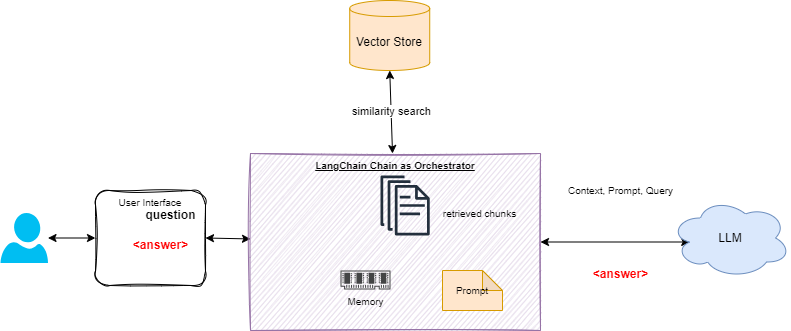

# LangChain notes

[LangChain](https://python.langchain.com/docs/get_started/introduction) is a framework for developing applications powered by large language models, connecting them to external data sources. They are adding new products to their portfolio quickly like LangSmith (get visibility on LLMs execution), and LangServe (server API for LangChain apps).

## Value propositions

Develop apps with context awareness, and that can reason using LLMs. 

* **LangChain**: Python and Javascript libraries
* **LangServe:** a library for deploying LangChain chains as a REST API.
* **LangSmith:** a platform that lets developers debug, test, evaluate, and monitor chains
* Predefined prompt template fomr langChain Hub.

##  LangChain libraries

The core building block of LangChain applications is the LLMChain:

* A LLM
* Prompt templates
* Output parsers

The standard interface that LangChain provides has two methods:

* `predict`: Takes in a string, returns a string
* `predict_messages`: Takes in a list of messages, returns a message.

Modules are extendable interfaces to LangChain.

## Getting started

All codes for OpenAI LLM are in 

| Backend | Type of chains |
| --- | --- |
| [openAI](https://github.com/jbcodeforce/ML-studies/tree/master/llm-langchain/openAI) | The implementation of the quickstart examples siple, RAG, chatbot, agent  |
| [Ollama](https://github.com/jbcodeforce/ML-studies/tree/master/llm-langchain/ollama)| run a simple query to lollama |
| [Anthropic Claude](https://github.com/jbcodeforce/ML-studies/tree/master/llm-langchain/anthropic) | |
| [Mistral LLM](https://github.com/jbcodeforce/ML-studies/tree/master/llm-langchain/mistral) | |
| [IBM WatsonX](https://github.com/jbcodeforce/ML-studies/tree/master/llm-langchain/watsonX) | | 
| [AWS Bedrock](https://github.com/jbcodeforce/ML-studies/tree/master/llm-langchain/bedrock) | zero_shot generation | 

Each project needs to specify the LangChain module needed to keep the executable size low. 

## Main Concepts

### Model I/O

* Model I/O are building blocks to interface with any language model. It facilitates the interface of model input (prompts) with the LLM model to produce the model output.
* LangChain uses [Prompt templates](https://python.langchain.com/docs/modules/model_io/prompts/prompt_templates/).
* Two prompt templates: [string prompt](https://api.python.langchain.com/en/latest/prompts/langchain.prompts.base.StringPromptTemplate.html) templates and [chat prompt](https://api.python.langchain.com/en/latest/prompts/langchain.prompts.chat.ChatPromptTemplate.html) templates.
* We can build custom prompt by extending existing default templates. An example is a 'few-shot-examples' in a chat prompt using [FewShotChatMessagePromptTemplate](https://python.langchain.com/docs/modules/model_io/prompts/prompt_templates/few_shot_examples_chat).
* Feature stores, like [Feast](https://github.com/feast-dev/feast), can be a great way to keep information about the user conversation or query, and LangChain provides an easy way to combine that data with LLMs. 

### Typical chains

Chains allow developers to combine multiple components together to create a single, coherent application, or to  also combine chains.

* **Q&A**: The pipeline to build the Q&A over existing documents is illustrated in the figure below:

    {width=700}

    **Embeddings** capture the semantic meaning of the text, which helps to do similarity search. **Vector store** supports storage and searching of these embeddings. Retrievers use [different algorithms](https://python.langchain.com/docs/modules/data_connection/retrievers/) for the semantic search to load vectors. 


???- code "Use RAG with Q&A"
    ```python
    from langchain.chains import RetrievalQA
    from langchain.prompts import PromptTemplate

    prompt_template = """Human: Use the following pieces of context to provide a concise answer to the question at the end. If you don't know the answer, just say that you don't know, don't try to make up an answer.

    {context}

    Question: {question}
    Assistant:"""

    PROMPT = PromptTemplate(
        template=prompt_template, input_variables=["context", "question"]
    )

    qa = RetrievalQA.from_chain_type(
        llm=llm,
        chain_type="stuff",
        retriever=vectorstore_faiss.as_retriever(
            search_type="similarity", search_kwargs={"k": 3}
        ),
        return_source_documents=True,
        chain_type_kwargs={"prompt": PROMPT}
    )
    query = "Is it possible that I get sentenced to jail due to failure in filings?"
    result = qa({"query": query})
    print_ww(result['result'])
    ```

* **Chatbots**: Aside from basic prompting and LLMs, memory and retrieval are the core components of a chatbot. 

    

    The retriever needs to take into account the history of the conversation.

* **[Web scraping](https://python.langchain.com/docs/use_cases/web_scraping)** for LLM based web research. It uses the same process: document/page loading, transformation with tool like BeautifulSoup, to HTML2Text.

* [LLMChain](https://api.python.langchain.com/en/latest/chains/langchain.chains.llm.LLMChain.html) class is the basic chain to integrate with a LLM.

### Text Generation Examples

* [Simple test to call Bedrock with Langchain](https://github.com/jbcodeforce/ML-studies/tree/master/llm-langchain/bedrock/TestBedrockWithLangchain.py) using on zero_shot generation.
* Response to an email of unhappy customer using Claude 2 and PromptTemplate. `PromptTemplates` allow us to create generic shells which can be populated with information later and get model outputs based on different scenarios. [text_generation/ResponseToUnhappyCustomer](https://github.com/jbcodeforce/ML-studies/tree/master/llm-langchain/text_generation/ResponseToUnhappyCustomer.py)


### Summarization chain

Always assess the size of the content to send, as the approach can be different: for big doc we need to split the doc in chunks.

* Small text to summarize, with [bedrock client](https://github.com/jbcodeforce/ML-studies/blob/master/llm-langchain/bedrock/utils/bedrock.py) and the invoke_model on the client see the code in [llm-langchain/summarization/SmallTextSummarization.py](https://github.com/jbcodeforce/ML-studies/blob/master/llm-langchain/summarization/SmallTextSummarization.py)
* For big document, langchain provides the load_summarize_chain to summarize by chunks and get the summary of the summaries. See code with 'manual' extraction of the summaries as insights and then creating a summary of insights in [summarization/long-text-summarization.py](https://github.com/jbcodeforce/ML-studies/blob/master/llm-langchain/summarization/long-text-summarization.py) or using a LangChain summarization with map-reduce in [summarization/long-text-summarization-mr.py](https://github.com/jbcodeforce/ML-studies/blob/master/llm-langchain/summarization/long-text-summarization-mr.py).

???- code "Using langchain summarize chain"
    ```python
    from langchain.text_splitter import RecursiveCharacterTextSplitter
    from langchain.llms.bedrock import Bedrock
    from langchain.chains.summarize import load_summarize_chain

    llm = Bedrock(
        model_id=modelId,
        model_kwargs={
            "max_tokens_to_sample": 1000,
        },
        client=boto3_bedrock,
    ) 

    text_splitter = RecursiveCharacterTextSplitter(
        separators=["\n\n", "\n"], chunk_size=4000, chunk_overlap=100
    )
    docs = text_splitter.create_documents([letter])

    summary_chain = load_summarize_chain(llm=llm, chain_type="map_reduce", verbose=True)
    output = summary_chain.run(docs)
    ```

### Retrieval Augmented Generation

The goal is to add custom dataset not already part of a  trained model and use the dataset as input into the prompt sent to the LLM. This is the Retrieval Augmented Generation or RAG and illustrated in figure below:


The code to do the above processing is in [prepareVectorStore.py](https://github.com/jbcodeforce/ML-studies/blob/master/llm-langchain/Q&A/prepareVectorStore.py).

To load PDF documents Langchain offers a loader. 

???- code "Split docs and save in vector store"
    ```python
    # ...
    from langchain.vectorstores import FAISS
    from langchain.indexes.vectorstore import VectorStoreIndexWrapper

    loader = PyPDFDirectoryLoader("./data/")
    documents = loader.load()
    text_splitter = RecursiveCharacterTextSplitter(
        chunk_size = 1000,
        chunk_overlap  = 100,
    )
    docs = text_splitter.split_documents(documents)

    vectorstore_faiss = FAISS.from_documents(
        docs,
        bedrock_embeddings,
    )
    vectorstore_faiss.save_local("faiss_index")
    ```

Creating chunks is necessary because language models generally have a limit to the amount of token they can deal with.

???- code "Search similarity in vector DB"
        ```python
        bedrock_embeddings = BedrockEmbeddings(model_id="amazon.titan-embed-text-v1", client=bedrock_runtime)
        query = """Is it possible that ...?"""
        query_embedding =bedrock_embeddings.embed_query(query)
        relevant_documents = vectorstore_faiss.similarity_search_by_vector(query_embedding)
        ```

During the interaction with the end-user, the system (a chain in LangChain) retrieves the data most relevant to the question asked, and passes it to LLM in the generation step.

* Embeddings capture the semantic meaning of the text to help do similarity search
* Persist the embeddings into a Vector store. Faiss and ChromaDB are common, but OpenSearch, Postgresql can also being used.
* Retriever includes semantic search and efficient algorithm to prepare the prompt. To improve on vector similarity search we can generate variants of the input question.

See [Q&A with FAISS store qa-faiss-store.py](https://github.com/jbcodeforce/ML-studies/blob/master/llm-langchain/Q&A/qa-faiss-store.py).


* [Another example of LLM Chain with AWS Bedrock llm and Feast as feature store](https://github.com/jbcodeforce/ML-studies/tree/master/llm-langchain/feast/feast-prompt.py)


???- info "Getting started with Feast"
    Use `pip install feast` then the `feast` CLI with `feast init my_feature_repo` to create a Feature Store then `feast apply` to create entity, feature views, and services. Then `feast ui` + [http://localhost:8888](http://localhost:8888) to act on the store. See [my summary on Feast](../data/features.md#feast-open-source)

???- info "LLM and FeatureForm"
    See [FeatureForm](https://docs.featureform.com/) as another open-source feature store solution and the LangChain sample with [Claude LLM](https://github.com/jbcodeforce/ML-studies/tree/master/llm-langchain/featureform/ff-langchain-prompt.py)

## Agent

[Agent](https://python.langchain.com/docs/get_started/quickstart#agent) is an orchestrator pattern where the LLM decides what actions to take from the current query and context. With chain, developer code the sequence of tasks, with agent the LLM decides. 

There are [different types](https://python.langchain.com/docs/modules/agents/agent_types/) of agent: Intended Model, Supports Chat, Supports Multi-Input Tools, Supports Parallel Function Calling, Required Model Params.

When developing a solution based on agent, consider the tools, services, the agent needs to access. See a code example [openAI_agent.py](https://github.com/jbcodeforce/ML-studies/tree/master/llm-langchain/openAI/openAI_agent.py).

The approach is to define tools, and prompt linked to the tool. Retriever from a vector data base is a tool, and [Tavily](https://tavily.com/) is a search API to get the last trusted news.

```python
retriever_tool = create_retriever_tool(
    retriever,
    "langsmith_search",
    "Search for information about LangSmith. For any questions about LangSmith, you must use this tool!",
)
search = TavilySearchResults()
tools = [retriever_tool, search]
```

???- info "Tavily"
    [Tavily](https://docs.tavily.com/) is the leading search engine optimized for LLMs. It provides factual, explicit and objective answers. It is a GPT researcher which queries, filters and aggregates over 20+ web sources per a single research task. It focuses on optimizing search for AI developers and autonomous AI agents. See [this git repo](https://github.com/assafelovic/gpt-researcher.git)

* [Existing LangChain tools](https://python.langchain.com/docs/integrations/tools/)
* [Define custom tool](https://python.langchain.com/docs/modules/tools/custom_tools/) using the @tool annotation on a function to expose it as a tool. It uses the function name as the tool name and the function’s docstring as the tool’s description. The second approach is to subclass the langchain.pydantic_v1.BaseModel class. Finally the approach is to use `StructuredTool` dataclass. 

When doing agent we need to manage exception and implement handle_tool_error. 

To map the tools to OpenAI function call there is a module called: `from langchain_core.utils.function_calling import convert_to_openai_function`.

## [LangChain Expression Language (LCEL)](https://python.langchain.com/docs/expression_language)

LCEL to support streaming te LLM results, use async communication, run in parallel, retries and fallbacks, access intermediate results. define schemas.

## Deeper dive

* [LLM Powered Autonomous Agents](https://lilianweng.github.io/posts/2023-06-23-agent/)
* [Retrieval and RAG blog.](https://blog.langchain.dev/retrieval/)
    
    ???- code "Chatbot with LangChain"
        ```python
        from langchain.chains import ConversationChain
        from langchain.llms.bedrock import Bedrock
        from langchain.memory import ConversationBufferMemory

        titan_llm = Bedrock(model_id="amazon.titan-tg1-large", client=boto3_bedrock)
        memory = ConversationBufferMemory()
        conversation = ConversationChain(
            llm=titan_llm, verbose=True, memory=memory
        )

        print_ww(conversation.predict(input="Hi there!"))
        ```


