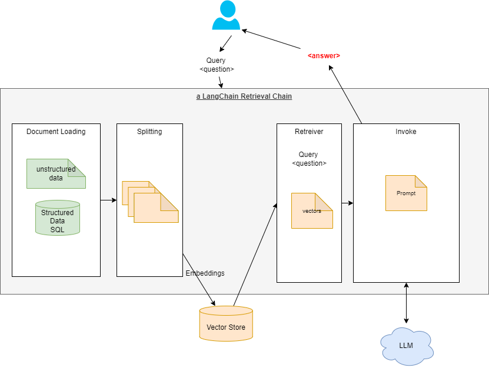

# LangChain notes

[LangChain](https://python.langchain.com/docs/get_started/introduction) is a framework for developing applications powered by language models, connecting them to external data sources.

The core building block of LangChain applications is the LLMChain:

* A LLM
* Prompt templates
* Output parsers

The standard interface that LangChain provides has two methods:

* `predict`: Takes in a string, returns a string
* `predict_messages`: Takes in a list of messages, returns a message.

Modules are extendable interfaces to Langchain.

### Environment to test LangChain code with Amazon Bedrock

1. [Optional] To use the image generation of Stability Diffusion, start Xquarts on Mac, be sure in the security settings that 'Allow connections from network clients' is enabled.
1. Start the docker image with python 3.11: `startPythonDocker.sh`
1. Goes under /app/llm-langchain/bedrock and do a `pip install -r requirements.txt`

## Use cases

* **Text generation**: from a prompt like an email, and generate a response taking into account some variables.
* **Summarization**: summarize call transcripts, meetings transcripts, books, articles, blog posts, and other relevant content.
* **Q&A**: ask questions on a knowledge corpus, LLM helps understanding the text and the questions. Here the LLM is enriched, trained on proprietary corpus:

    

    The pipeline to build the Q&A over existing documents is illustrated in the figure below:

    

* **Chatbots**: Aside from basic prompting and LLMs, memory and retrieval are the core components of a chatbot. ChatModels do not need LLM, as they are conversational. 

    

* **Code Understanding**
* Extraction

* **[Web scraping](https://python.langchain.com/docs/use_cases/web_scraping)** for LLM based web research. It uses the same process: document/page loading, transformation with tool like BeautifulSoup, to HTML2Text.

## Chains

Chains allow us to combine multiple components together to create a single, coherent application, and also  combine chains.

[LLMChain](https://api.python.langchain.com/en/latest/chains/langchain.chains.llm.LLMChain.html) is the basic chain to integrate with a LLM.


## Model I/O

* Model I/O are building blocks to interface with any language model. It facilitates the interface of model input (prompts) with the LLM model to produce the model output.
* A **prompt** for a language model is a set of instructions or input provided by a user to guide the model's response, helping it understand the context and generate relevant and coherent language-based output. See the[Prompt templates](https://python.langchain.com/docs/modules/model_io/prompts/prompt_templates/).
* Two prompt templates: [string prompt](https://api.python.langchain.com/en/latest/prompts/langchain.prompts.base.StringPromptTemplate.html) templates and [chat prompt](https://api.python.langchain.com/en/latest/prompts/langchain.prompts.chat.ChatPromptTemplate.html) templates.
* We can build custom prompt by extending existing default templates. An example is a 'few-shot-examples' in a chat prompt usine [FewShotChatMessagePromptTemplate](https://python.langchain.com/docs/modules/model_io/prompts/prompt_templates/few_shot_examples_chat).
* Feature stores, like [Feast](https://github.com/feast-dev/feast), can be a great way to keep information abount the user fresh, and LangChain provides an easy way to combine that data with LLMs. Below is [an example](https://github.com/jbcodeforce/ML-studies/tree/master/llm-langchain/feast/feast-prompt.py) of getting a LLM api using AWS Bedrock service, build a prompt using Feast feature stores, a chain using Langchain and call it with the value of one of the driver_id.

```python
titan_llm = Bedrock(model_id="amazon.titan-tg1-large", client=bedrock_client)
prompt_template = FeastPromptTemplate(input_variables=["driver_id"])

chain = LLMChain(llm=titan_llm, prompt=prompt_template)
# run has positional arguments or keyword arguments, 
print(chain.run(1001))
```

## Text Generation Examples

Getting started with LangChain, the [following code (llm-langchain/langchain-1.py)](https://github.com/jbcodeforce/ML-studies/tree/master/llm-langchain/langchain-1.py) regroups the getting started examples from LangChain docs to illustrate calls to LLM Bedrock Claude2 and text generation.

* [Simple test to call Bedrock with Langchain](https://github.com/jbcodeforce/ML-studies/tree/master/llm-langchain/bedrock/TestBedrockWithLangchain.py) using on zero_shot generation.
* Response to an email of unhappy customer using Claude 2 and PromptTemplate. `PromptTemplates` allow us to create generic shells which can be populated with information later and get model outputs based on different scenarios. [text_generation/ResponseToUnhappyCustomer](https://github.com/jbcodeforce/ML-studies/tree/master/llm-langchain/text_generation/ResponseToUnhappyCustomer.py)


## Summarization chain

Always assess the size of the content to send, as the approach can be different: for big doc we need to split the doc in chunks.

* Small text to summarize, with [bedrock client](https://github.com/jbcodeforce/ML-studies/blob/master/llm-langchain/bedrock/utils/bedrock.py) and the invoke_model on the client see the code in [llm-langchain/summarization/SmallTextSummarization.py](https://github.com/jbcodeforce/ML-studies/blob/master/llm-langchain/summarization/SmallTextSummarization.py)
* For big document, langchain provides the load_summarize_chain to summarize by chunks and get the summary of the summaries. See code with 'manual' extraction of the summaries as insights and then creating a summary of insights in [summarization/long-text-summarization.py](https://github.com/jbcodeforce/ML-studies/blob/master/llm-langchain/summarization/long-text-summarization.py) or using a LangChain summarization with map-reduce in [summarization/long-text-summarization-mr.py](https://github.com/jbcodeforce/ML-studies/blob/master/llm-langchain/summarization/long-text-summarization-mr.py).

???- code "Using langchain summarize chain"
    ```python
    from langchain.text_splitter import RecursiveCharacterTextSplitter
    from langchain.llms.bedrock import Bedrock
    from langchain.chains.summarize import load_summarize_chain

    llm = Bedrock(
        model_id=modelId,
        model_kwargs={
            "max_tokens_to_sample": 1000,
        },
        client=boto3_bedrock,
    ) 

    text_splitter = RecursiveCharacterTextSplitter(
        separators=["\n\n", "\n"], chunk_size=4000, chunk_overlap=100
    )
    docs = text_splitter.create_documents([letter])

    summary_chain = load_summarize_chain(llm=llm, chain_type="map_reduce", verbose=True)
    output = summary_chain.run(docs)
    ```

## Retrieval Augmented Generation

The goal is to add custom dataset not already part of a  trained model and use the dataset as input into the prompt sent to the LLM. This is the Retrieval Augmented Generation or RAG and illustrated in figure below:


Before being able to answer the questions, the documents must be processed and a stored in a document store index:

* Load the documents
* Process and split them into smaller chunks
* Create a numerical vector representation of each chunk using Embeddings model
* Create an index using the chunks and the corresponding embeddings

The code to do the above processing is in [prepareVectorStore.py](https://github.com/jbcodeforce/ML-studies/blob/master/llm-langchain/Q&A/prepareVectorStore.py).

To load PDF documents Langchain offers a loader. 

???- code "Split docs and save in vector store"
    ```python
    # ...
    from langchain.vectorstores import FAISS
    from langchain.indexes.vectorstore import VectorStoreIndexWrapper

    loader = PyPDFDirectoryLoader("./data/")
    documents = loader.load()
    text_splitter = RecursiveCharacterTextSplitter(
        chunk_size = 1000,
        chunk_overlap  = 100,
    )
    docs = text_splitter.split_documents(documents)

    vectorstore_faiss = FAISS.from_documents(
        docs,
        bedrock_embeddings,
    )
    vectorstore_faiss.save_local("faiss_index")
    ```

Creating chunks is necessary because language models generally have a limit to the amount of token they can deal with.

???- code "Search similarity in vector DB"
        ```python
        bedrock_embeddings = BedrockEmbeddings(model_id="amazon.titan-embed-text-v1", client=bedrock_runtime)
        query = """Is it possible that ...?"""
        query_embedding =bedrock_embeddings.embed_query(query)
        relevant_documents = vectorstore_faiss.similarity_search_by_vector(query_embedding)
        ```

During the interaction with the end-user, the system (a chain in LangChain) retrieves the data most relevant to the question asked, and passes it to LLM in the generation step.

* Embeddings capture the semantic meaning of the text to help do similarity search
* Persist the embeddings into a Vector store. Faiss and ChromaDB are common, but OpenSearch, Postgresql can also being used.
* Retriever includes semantic search and efficient algorithm to prepare the prompt. To improve on vector similarity search we can generate variants of the input question.

See [Q&A with FAISS store qa-faiss-store.py](https://github.com/jbcodeforce/ML-studies/blob/master/llm-langchain/Q&A/qa-faiss-store.py).


* [Another example of LLM Chain with AWS Bedrock llm and Feast as feature store](https://github.com/jbcodeforce/ML-studies/tree/master/llm-langchain/feast/feast-prompt.py)


???- info "Getting started with Feast"
    Use `pip install feast` then the `feast` CLI with `feast init my_feature_repo` to create a Feature Store then `feast apply` to create entity, feature views, and services. Then `feast ui` + [http://localhost:8888](http://localhost:8888) to act on the store. See [my summary on Feast](../data/features.md#feast-open-source)

???- info "LLM and FeatureForm"
    See [FeatureForm](https://docs.featureform.com/) as another open-source feature store solution and the LangChain sample with [Claude LLM](https://github.com/jbcodeforce/ML-studies/tree/master/llm-langchain/featureform/ff-langchain-prompt.py)

## Q&A chain


???- code "Use RAG with Q&A"
        ```python
        from langchain.chains import RetrievalQA
        from langchain.prompts import PromptTemplate

        prompt_template = """Human: Use the following pieces of context to provide a concise answer to the question at the end. If you don't know the answer, just say that you don't know, don't try to make up an answer.

        {context}

        Question: {question}
        Assistant:"""

        PROMPT = PromptTemplate(
            template=prompt_template, input_variables=["context", "question"]
        )

        qa = RetrievalQA.from_chain_type(
            llm=llm,
            chain_type="stuff",
            retriever=vectorstore_faiss.as_retriever(
                search_type="similarity", search_kwargs={"k": 3}
            ),
            return_source_documents=True,
            chain_type_kwargs={"prompt": PROMPT}
        )
        query = "Is it possible that I get sentenced to jail due to failure in filings?"
        result = qa({"query": query})
        print_ww(result['result'])
        ```

## Chat chain


Combine chat history with new question to ask follow up questions.

## Deeper dive

* [LLM Powered Autonomous Agents](https://lilianweng.github.io/posts/2023-06-23-agent/)
* [Retrieval and RAG blog.](https://blog.langchain.dev/retrieval/)
    
    ???- code "Chatbot with LangChain"
        ```python
        from langchain.chains import ConversationChain
        from langchain.llms.bedrock import Bedrock
        from langchain.memory import ConversationBufferMemory

        titan_llm = Bedrock(model_id="amazon.titan-tg1-large", client=boto3_bedrock)
        memory = ConversationBufferMemory()
        conversation = ConversationChain(
            llm=titan_llm, verbose=True, memory=memory
        )

        print_ww(conversation.predict(input="Hi there!"))
        ```


