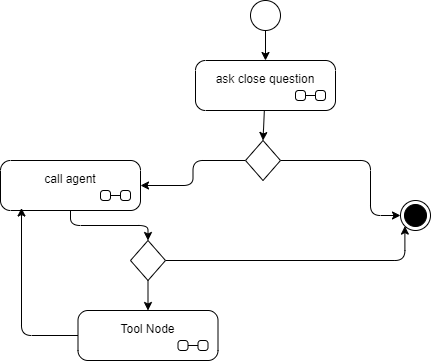
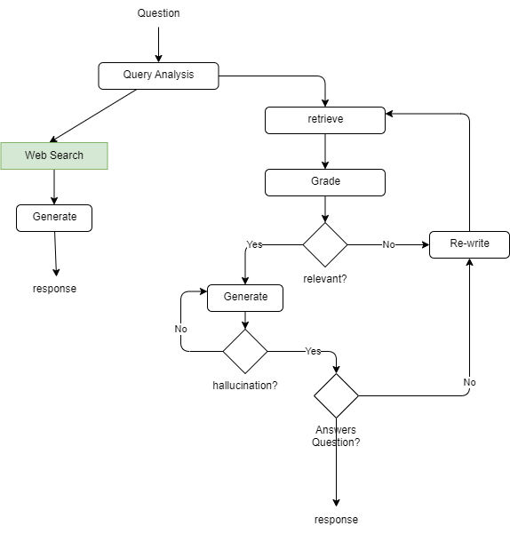

# LangGraph

!!!- info "Updates"
    Created 04/2024 - Update 08/27/2024

[LangGraph](https://python.langchain.com/docs/langgraph) is a library for building stateful, **multi-actor** applications, and being able to add cycles to LLM app. It is not a DAG. 

Single and multi-agent flows are described and represented as graphs.

## Value propositions 

* Build stateful, multi-actor applications with LLMs
* Coordinate multiple chains or actors across multiple steps of computation in a cyclic manner
* Build plan of the actions to take
* Take the actions
* Observe the effects
* Support persistence to save state after each step in the graph. This allows human in the loop pattern
* Support Streaming agent tokens and node transitions

## [Concepts](https://langchain-ai.github.io/langgraph/concepts/)

[States](https://python.langchain.com/docs/langgraph/#stategraph) may be a collection of messages or custom states as defined by a TypedDict schema. States are passed between nodes of the graph.  MessageState is a predefined state to include the list of messages.

`Nodes` represent units of work.  It can be either a function or a runnable. Each node updates the internal graph state and returns it after execution.

`Graph` defines the organization of the node workflow. Graphs are immutable so are compiled once defined:

```python title="A simple call LLM graph"
graph = MessageGraph()

graph.add_node("chatbot", chatbot_func)  # (1)
graph.add_edge("chatbot", END)

graph.set_entry_point("chatbot")

runnable = graph.compile()
```

1. chatbot_func is a function to call a LLM.  `add_node()` takes a **function or runnable**, with the input is the entire current state:

```python
def call_tool(state):  # (1)
    messages = state["messages"]
    last_message = messages[-1]
```

1. The State of the graph, in this case, includes a list of messages

**Conditional edge** between nodes, helps to build more flexible workflow: based on the output of a node, one of several paths may be taken. Conditional edge use function to decide where to route according to the last message content.

```py
workflow.add_conditional_edges(
                "agent",
                self.should_continue,
                {
                    "continue": "action",
                    "end": END,
                },
            )
```

### Agents

Graphs helps implementing Agents as AgentExecutor is a deprecated API. They most likely use tools. The graph development approach is:

1. Define the tools to be used
1. Define the state and what needs to be persisted
1. Define the workflow as a graph, and the persistence mechanism to use when needed, compile the graph into a LangChain Runnable. Once the graph is compiled, the application can interact with the graph via stream or invoke methods.

    ```python
    app = workflow.compile(checkpointer=checkpointer)
    ```

1. invoke the graph as part of an API, an integrated ChatBot, ...

Graphs such as StateGraph's naturally can be composed. Creating subgraphs lets developers build things like multi-agent teams, where each team can track its own separate state.

LangGraph comes with built-in persistence, allowing developers to save the state of the graph at a given point and resume from there.

```python
memory = SqliteSaver.from_conn_string(":memory:")
app = workflow.compile(checkpointer=memory, interrupt_before=["action"])
```

When using checkpointing the invoke method needs to get a configuration parameter with a unique thread_id to group messages and checkpoints in the context of this thread_id:

```py
thread = {"configurable": {"thread_id": "2"}}
for event in app.stream({"messages": inputs}, thread, stream_mode="values"):  # (1)
```

1. Call the graph using streaming do event are yielded.

See [other checkpointer ways to persist state](https://langchain-ai.github.io/langgraph/reference/checkpoints/#implementations), [AsyncSqliteSaver](https://langchain-ai.github.io/langgraph/reference/checkpoints/#asyncsqlitesaver) is an asynchronous checkpoint saver that stores checkpoints in a SQLite database or [SqliteSaver](https://langchain-ai.github.io/langgraph/reference/checkpoints/#sqlitesaver) for synchronous storage is SQLlite.

```python
memory = AsyncSqliteSaver.from_conn_string("checkpoints.sqlite")
```

* See [first basic program](https://github.com/jbcodeforce/ML-studies/tree/master/llm-langchain/langgraph/FirstGraph.py) to call Tavily tool for searching recent information about the weather in San Francisco using OpenAI LLM. (it is based on the [tutorial](https://langchain-ai.github.io/langgraph/#example)). It does not use any prompt, and the call_method function invokes OpenAI model directly.
* See [A hello world graph without any LLM](https://github.com/jbcodeforce/ML-studies/tree/master/llm-langchain/langgraph/graph_without_llm.py) as an interesting base code to do stateful graph.


#### Invocation and chat history

The LangGraph's `MessageState` keeps an array of messages. So the input is a dict with the "messages" key and then a HumanMessage, ToolMessage or AIMessage. As graphs are stateful, it is important to pass a thread_id, which should be unique per user's chat conversation.

```python
app.invoke(
    {"messages": [HumanMessage(content="what is the weather in sf")]},
    config={"configurable": {"thread_id": 42}}, debug=True
)
```

Some code using chat_history:

* [Close Question with a node creating a close question and then processes the outcome with llm](https://github.com/jbcodeforce/ML-studies/tree/master/llm-langchain/langgraph/close_question.py).



The LLM execution trace presents the following content:

```json
 Entering LLM run with input:
{
  "prompts": [
    "Human: what is the weather in sf"
  ]
}
```

The LLM is generating some statements that tool calling is needed by matching to the tool name specified (e.g. `tavily_search_results_json`) during LLM creation (with the args coming from the function signature or for a schema definition as part of the tool definition). Below is an example of OpenAI tool_calls response. Most LLMs support this schema:

```json
"generations": [
    [
      {
        "text": "",
        "generation_info": {
          "finish_reason": "tool_calls",
          ...
        "tool_calls": [
            {
            "name": "tavily_search_results_json",
            "args": {
                "query": "weather in San Francisco"
            },
            "id": "call_Vg6JRaaz8d06OXbG5Gv7Ea5J"
            }
```

Graph cycles the steps until there are no more `tool_calls` within the AIMessage: 1/ If AIMessage has tool_calls, "tools" node executes the matching function, 2/ the "agent" node executes again and returns AIMessage. Execution progresses to the special `END` value and outputs the final state

Adding a "chat memory" to the graph with LangGraph's checkpointer to retain the chat context between interactions.

### Tool Calling

Graph may include `ToolNode` to call function or tool which can be called via conditions on edge. The following declaration uses the predefined langchain tool definition of TavilySearch. The `TavilySearchResults` has function name, argument schema and tool definition so the prompt sent to LLM has information about the tool like: "name": "tavily_search_results_json"

```python
from langchain_community.tools.tavily_search import TavilySearchResults
tools = [TavilySearchResults(max_results=1)]
tool_node = ToolNode(tools)
```

#### Tool calling with Mistral

See [this product documentation](https://docs.mistral.ai/capabilities/function_calling/) adapted to langgraph in [this code](https://github.com/jbcodeforce/ML-studies/blob/master/llm-langchain/mistral/mistral_tool_calling_lg.py) and [this new LangGraph API with ToolNode, and ChatMistral with bind_tools](https://github.com/jbcodeforce/ML-studies/tree/master/llm-langchain/langgraph/mistral_lg_tool.py).

## Use cases

The interesting use cases for LangGraph are:

- workflow with cycles and conditional output
- planning agent for plan and execute pattern
- using reflection and self critique
- multi agent collaboration, with or without supervisor
- human in the loop (by adding an "interrupt" before a node is executed.)
- controlled tool calling with or without LLM output

### Reasoning and Acting (ReAct) implementation

See [this paper: A simple Python implementation of the ReAct pattern for LLMs](https://til.simonwillison.net/llms/python-react-pattern) from Simon Willison, and the raw code implementation using openAI API [code: ReAct.py](https://github.com/jbcodeforce/ML-studies/tree/master/llm-langchain/langgraph/ReAct.py). LangGraph uses a [prebuilt implementation of ReAct](https://langchain-ai.github.io/langgraph/reference/prebuilt/#create_react_agent) that can be tested by [PreBuilt_ReAct_lg.py](https://github.com/jbcodeforce/ML-studies/tree/master/llm-langchain/langgraph/PreBuilt_ReAct_lg.py) 
or the [implementation of ReAct pattern using LangGraph](https://github.com/jbcodeforce/ML-studies/tree/master/llm-langchain/langgraph/ReAct_lg.py).

An interesting prompt to use in the ReAct implementation is [hwchase17/react](https://smith.langchain.com/hub/hwchase17/react).

It is possible to interrupt before or after a node.

```py
graph = create_react_agent(model, tools=tools, interrupt_before=["tools"],  checkpointer=memory)
print_stream(graph, inputs, thread)
# the graph ended because of the interrupt
snapshot = graph.get_state(thread)  # got where it was stopped
```

See [The most simple ReAct with Mistral Model](https://github.com/jbcodeforce/ML-studies/tree/master/llm-langchain/langgraph/mistral_lg_tool.py)

### Adaptive RAG

The code [adaptive_rag.py](https://github.com/jbcodeforce/ML-studies/tree/master/llm-langchain/langgraph/adaptive_rag.py) is implementing the following graph as documented in [this sample from product documentation](https://langchain-ai.github.io/langgraph/tutorials/rag/langgraph_adaptive_rag/): 



The documents processing and vector store creation is done in separate function outside of the graph.

Some interesting patterns from this sample:

* One Agent to route the query, with dedicated prompt 
* retriever from vector store with an agent to grade the retrieved documents
* graph state includes question, retrieved documents 

### Human in the loop

The human is the loop can be implemented in different ways:

* Add a confirmation before invoking a tool, using the the interrupt_before the names of the tool.
* Implementing node with close questions


See [Taipy UI with a langgraph graph](https://github.com/jbcodeforce/ML-studies/tree/master/llm-langchain/langgraph/chatbot_graph_ui.py)

## Other Code 

See [Langgraph code samples](https://github.com/langchain-ai/langgraph/tree/main/examples) with interesting patterns, but with some code not following the last updates in the APIs and my [own sample folder](https://github.com/jbcodeforce/ML-studies/tree/master/llm-langchain/langgraph). 

See the [owl agent framework open source project](https://athenadecisionsystems.github.io/athena-owl-core/) to manage assistant, agents, tools, prompts..

## Code FAQ

???- question "prompt variables to be integrated in LangGraph"
    The graph state should include variables used in the prompts used in the agents.
        
???- question "Streaming the output?"
    Each node with LLM agent needs to call an async function.

    ```py
    async def call_agent(state: State)
      # ... process the state
      response = await model.ainvoke(messages)
    ```

    Once the graph is created, the application needs to invoke it with an `async for`

    ```py
    async def text_chat(graph):
    config = {"configurable": {"thread_id": 1}}
    
    while True:
        user_msg = input("User (q/Q to quit): ")
        if user_msg in {"q", "Q"}:
            print("AI: Byebye")
            break
        async for event in graph.astream_events({"messages": [HumanMessage(content=user_msg)]}, version="v1"):
            ... process the event payload
    ```

    See [stream_agent_node.py](https://github.com/jbcodeforce/ML-studies/tree/master/llm-langchain/langgraph/stream_agent_node.py) and the one with a simple UI [with websocket and langgraph](https://github.com/jbcodeforce/ML-studies/tree/master/e2e-demos/streaming-demo/main_lg.py)


???- question "How to do close question?"


???- question "How to do classification of intent?"
    Use a system prompt with possible classification values, and one agent in one node of the graph. Then in the conditional edge function, test to the different value to branch in different paths.

## Deeper dive

* [LangGraph product reference documentation.](https://langchain-ai.github.io/langgraph/reference/prebuilt/)
* [LangGraph git repository](https://github.com/langchain-ai/langgraph)
* [LangGraph API reference guide](https://langchain-ai.github.io/langgraph/reference/graphs/)
* [Deeplearning.ai AI Agents in LangGraph](https://learn.deeplearning.ai/courses/ai-agents-in-langgraph) with matching code 
* [A simple Python implementation of the ReAct pattern for LLMs](https://til.simonwillison.net/llms/python-react-pattern)