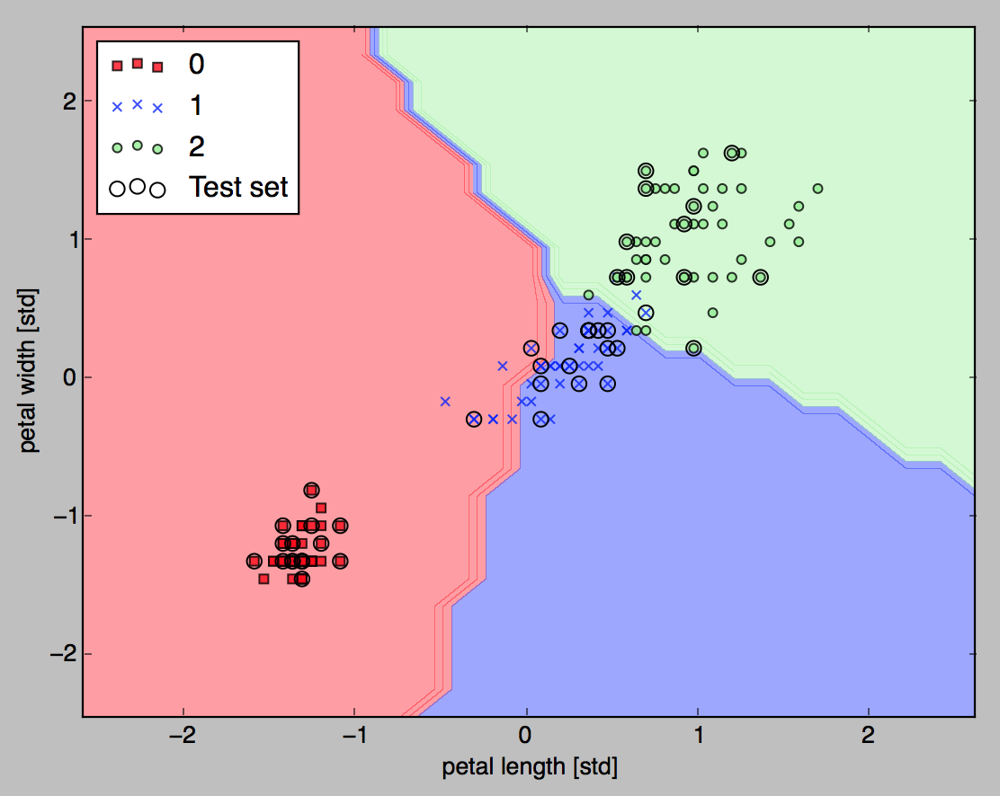

# [Scikit-learn library](https://scikit-learn.org/stable/)

Choosing an appropriate classification algorithm for a particular problem task requires practice: each algorithm has its own quirks and is based on certain assumptions.The performance of a classifier, its computational power as well as predictive power, depend heavily on the underlying data that are available for learning.

The five main steps that are involved in training a machine learning algorithm can be summarized as follows:

1. Selection of features.
1. Choosing a performance metric.
1. Choosing a classifier and optimization algorithm.
1. Tune parameters
1. Evaluating the performance 

## Installation

```sh
pip3 install pandas scikit-learn
```

## Getting started

The sklearn APIs offer a lot of classifier algorithms and utilities to support those steps. See [classifier note](../ml/classifier.md) for examples.

For example the code below loads the predefined IRIS flower dataset, and select the feature 2 and 3, the petals length and width. 

```python
from sklearn import datasets
iris=datasets.load_iris()
X=iris.data[:,[2,3]]
y=iris.target
```

The size of `X` is typically (n_samples, n_features). The target values `y` which are real numbers for regression tasks, or integers for classification. Both variables are numpy arrays.

Using numpy unique function to assess the potential classes we got 3 integers representing each class.

```python
print(np.unique(y))
>>[0,1,2]
```

## Splitting data

To evaluate how well a trained model performs on unseen data, we will further split the dataset into separate training and test datasets.

```python
from sklearn.model_selection import train_test_split
# Randomly split X and y arrays into 30% test data and 70% training set 
X_train, X_test, y_train, y_test = train_test_split( X, y, test_size = 0.3, random_state = 0)
```

## Scale data

Many machine learning and optimization algorithms also require feature scaling for optimal performance. `StandardScaler` estimated the parameters `mu` (sample mean) and `delta` (standard deviation) for each feature dimension from the training data. The `transform` method helps to standardize the training data using those estimated parameters: `mu` and `delta`.  

```python
from sklearn.preprocessing import StandardScaler
# standardize the features for optimal performance of gradient descent
sc=StandardScaler()
# compute mean and std deviation for each feature using fit
sc.fit(X_train)
# transform the features
X_train_std=sc.transform(X_train)
# Note that we used the same scaling parameters to standardize the test set so 
# that both the values in the training and test dataset are comparable to each other.
X_test_std=sc.transform(X_test)
```

Using the training data set, create a [Multi-layer Perceptron (MLP)](https://scikit-learn.org/stable/modules/neural_networks_supervised.html#multi-layer-perceptron) with 40 iterations and eta = 0.1

```python
from sklearn.linear_model import Perceptron
ppn=Perceptron(n_iter=40,eta0=0.1,random_state=0)
ppn.fit(X_train_std,y_train)
```

Having trained the model now we can run predictions.

```python
from sklearn.metrics import accuracy_score
y_pred=ppn.predict(X_test_std)
print('Misclassified samples: %d' % (y_test != y_pred).sum())
print(' Accuracy: %.2f' % accuracy_score( y_test, y_pred))
```

Scikit-learn also implements a large variety of different performance metrics that are available via the metrics module. For example, we can calculate the classification accuracy of the perceptron on the test set. 

{ width=500 }

The Perceptron biggest disadvantage is that it never converges if the classes are not perfectly linearly separable.

## Pipeline

Transformers and estimators (predictors) can be combined together into a single unifying object: a Pipeline.

```python
from sklearn.preprocessing import StandardScaler
from sklearn.linear_model import LogisticRegression
from sklearn.pipeline import make_pipeline
from sklearn.datasets import load_iris
from sklearn.model_selection import train_test_split
from sklearn.metrics import accuracy_score


pipe = make_pipeline(StandardScaler(), LogisticRegression())
X, y = load_iris(return_X_y=True)
X_train, X_test, y_train, y_test = train_test_split(X, y, random_state=0)
pipe.fit(X_train, y_train)
print(
    "Accuracy with Logistic regression is: "
    + str(accuracy_score(pipe.predict(X_test), y_test))
)
```