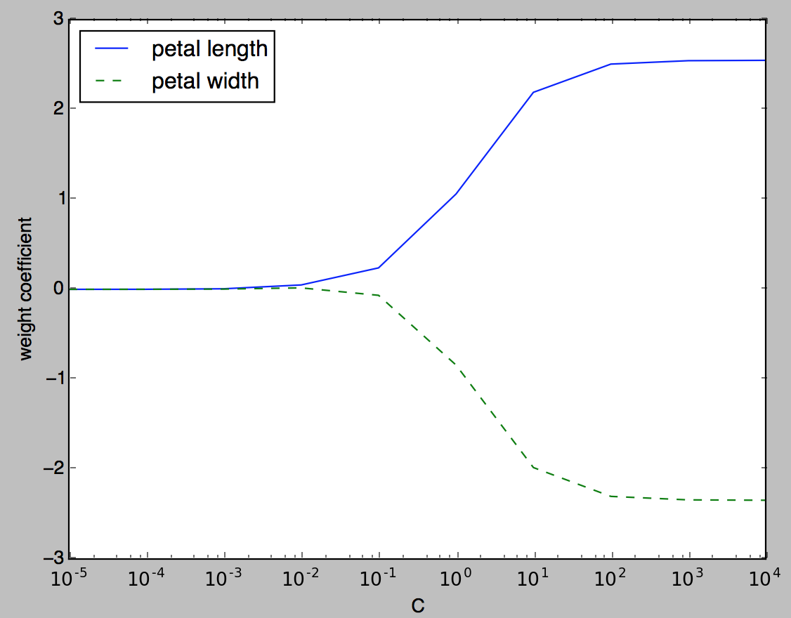
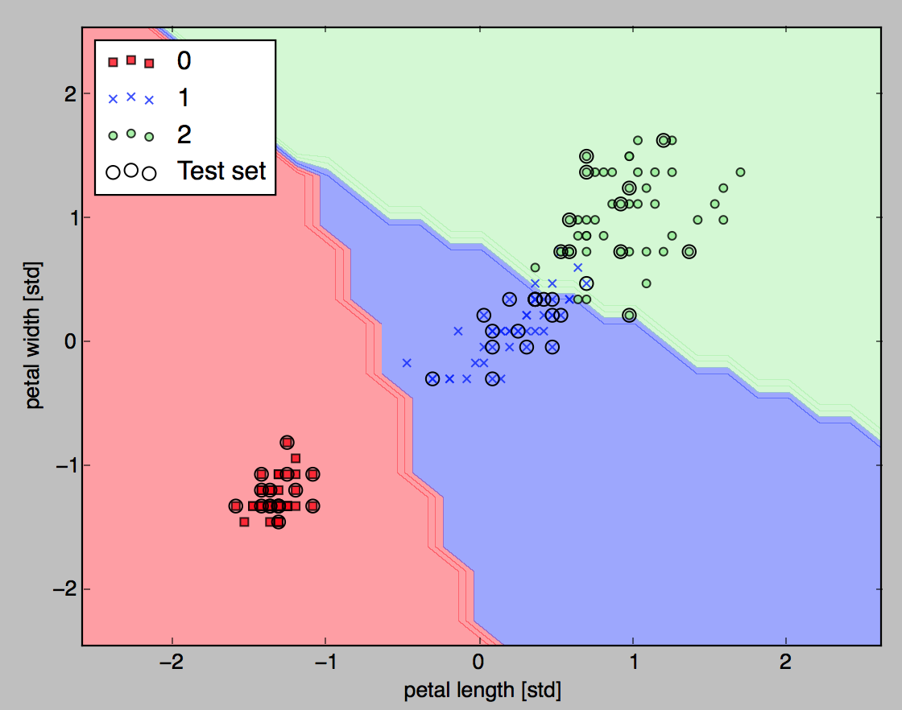

# Important ML concepts

## Fitting

**Overfitting** is a common problem in machine learning, where a model performs well on training data but does not generalize well to unseen data. If a model suffers from overfitting, we also say that the model has a **high variance**, which can be caused by having too many parameters that lead to a model that is too complex given the underlying data.

### How to deal with overfitting?

A common technique of preventing overfitting is known as regularization.

**Regularization** is a very useful method to handle collinearity (high correlation among features), filter out noise from data, and eventually prevent overfitting. For regularization to work properly, we need to ensure that all our features are on comparable scales.

| Method to prevent overfitting | What is it? |
| --- | --- |
| Simplify the model | If the current model is overfitting the training data, it may be too complicated. This means it's learning the patterns of the data too well and isn't able to generalize well to unseen data. One way to simplify a model is to reduce the number of layers it uses or to reduce the number of hidden units in each layer. |
| Use data augmentation | Data augmentation manipulates the training data in a way so that's harder for the model to learn as it artificially adds more variety to the data. If a model is able to learn patterns in augmented data, the model may be able to generalize better to unseen data. |
| Use transfer learning	| Transfer learning involves leveraging the pre-trained weights one model has learned to use as the foundation for the next task. We could use one computer vision model pre-trained on a large variety of images and then tweak it slightly to be more specialized for specific images. |
| Use dropout layers | Dropout layers randomly remove connections between hidden layers in neural networks, effectively simplifying a model but also making the remaining connections better. See [torch.nn.Dropout()](https://pytorch.org/docs/stable/generated/torch.nn.Dropout.html). |
| Use learning rate decay | Slowly decrease the learning rate as a model trains. The closer it gets, the smaller the steps. The same with the learning rate, the closer it gets to convergence, the smaller are weight updates. |
| Use early stopping | Early stopping stops model training before it begins to over-fit. The model's loss has stopped decreasing for the past n epochs, we may want to stop the model training here and go with the model weights that had the lowest loss (y epochs prior)|

### Dealing with under-fitting

Model is under-fitting when it generates poor predictive ability because the model hasn't fully captured the complexity of the training data. To increase model's predictive power, we may look at different techniques:

| Method | Description |
| --- | --- |
| Add more layers/units to the model | Model may not have enough capability to learn the required patterns/weights/representations of the data to be predictive. Increase the number of hidden layers/units within those layers.|
| Tweak the learning rate| Perhaps the model's learning rate is too high. Trying to update its weights each epoch too much, in turn not learning anything.Try lowering the learning rate. |
| Use transfer learning	| Transfer learning may also help preventing under-fitting. It involves using the patterns from a previously working model and adjusting them to our own problem. |
| Train for longer time | Train for a more epochs may result in better performance.|
| Use less regularization | By preventing over-fitting too much, it may to under-fit. Holding back on regularization techniques can help your model fit the data better.|

Preventing overfitting and under-fitting is still an active area of machine learning research.

## Variance

**Variance** measures the consistency (or variability) of the model prediction for a particular sample instance if we would retrain the model multiple times: if the training set is splitted in multiple subsets, the model can be trained with those subsets and each time the sample instance prediction is run, the variance is computed. If the variability is big, then the model is sensitive to randomness.

**Bias** measures how far off the predictions are from the correct values in general. One way of finding a good bias-variance tradeoff is to tune the complexity of the model via regularization. 

The decision boundary is the hypothesis that separate clearly the training set.

Decreasing the factor of control of overfitting, C, means the weight coefficients are shrinking so leading to overfitting. Around C=100 the coefficient values stabilize leading to good decision boundaries:

{ width=600 }

For C=100 we have now

{ width=600 }
