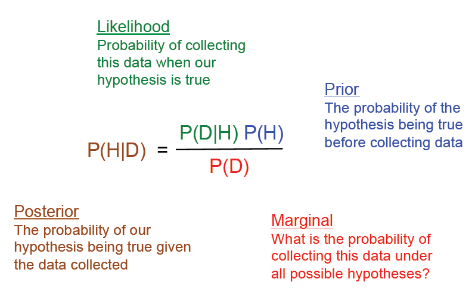

# Mathematical foundations

## Covariance

=\sum_{i}^{} (x_{i} - u_{x})(y_{i} - u_{y}))

## Correlation

=\frac{cov(x,y)}{\sqrt {\sum_{i}^{} (x_{i} - u_{x})^2} * \sqrt {\sum_{i}^{} (y_{i} - u_{y})^2 }) 

## Probability

* the probability of two independent events happening at the same time: 

 = P(A) * P(B))

* the probability of two dependent events happening at the same time:

 = P(B|A) * P(A))

* the probability of disjoint events A and B (they are mutually exclusive) is:

 = P(A) + P(B))

* if A and B are not mutually exclusive:

 = P(A) + P(B) - P(A \wedge B))

*What is the probability that a card chosen from a standard deck will be a Jack or a heart?* becomes P(Jack or Heart) = P(Jack) + P(heart) - P( jack of Hearts) = 16/52

## Bayesian

In machine learning, there are two main approaches: the **Bayesian** approach and the **frequentist** approach. The Bayesian approach is based on probability theory and uses Bayes' theorem to update probabilities based on new data. The frequentist approach, on the other hand, is based on statistical inference and uses methods such as hypothesis testing and confidence intervals to make decisions.

**Bayes theorem**:

The theorem works by taking into account the probability of events on their own as well as two events occurring in conjunction with each other. It helps to assess what causes events to occur and why. It then helps to predict future.

The Bayes formula for the probability of having event A occuring knowing B occured:

 = P(B|A) P(A) / P(B))

The numerator is the probability of event B given event A multiplied by the probability of event A occurring on its own. Denominator is probability of event B occuring on its own.

{ width=500 }

The Bayesian approach is often used in situations where there is uncertainty and the data is complex, while the frequentist approach is often used in situations where there is a large amount of data and the relationships between the variables are well-defined.

Bayesian analysis allows you to compare false negative and false positive rates against the likelihood of obtaining a true negative or true positive result.

[See the conditional probability notebook](https://github.com/jbcodeforce/ML-studies/blob/master/notebooks/ConditionalProbabilityExercise.ipynb) exercise to simulate the probability of buying thing knowing the age and previous buying data: `totals` contains the total number of people in each age group and `purchases` contains the total number of things purchased by people in each age group.

## Data distributions

[See this notebook presenting](https://github.com/jbcodeforce/ML-studies/blob/master/notebooks/Distributions.ipynb) some python code on different data distributions like Uniform, Gaussian, Poisson. It can be executed in VScode using the pytorch kernel.

## Normalization

Normalization of ratings means adjusting values measured on different scales to a notionally common scale, often prior to averaging.

In statistics, normalization refers to the creation of shifted and scaled versions of statistics,
where the intention is that these normalized values allow the comparison of corresponding normalized values for different
 datasets in a way that eliminates the effects of certain gross influences, as in an anomaly time series.

Feature scaling used to bring all values into the range [0,1]. This is also called unity-based normalization.

/(Xmax-Xmin))

## Sigmoid function

[The Sigmoid function](https://en.wikipedia.org/wiki/Sigmoid_function) has a S shaped curve, one of them being the logistic function, to change a real to a value between 0 and 1.

=\frac{1}{(1+e^{-z})}){ width=200 }

It is used as an activation function of artificial neuron. The logistic sigmoid function is invertible, and its inverse is the [logit function](https://en.wikipedia.org/wiki/Logit):

=\log_{e}{\frac{p}{1-p}}){ width=200 }

P being a probability,  is the corresponding odds.