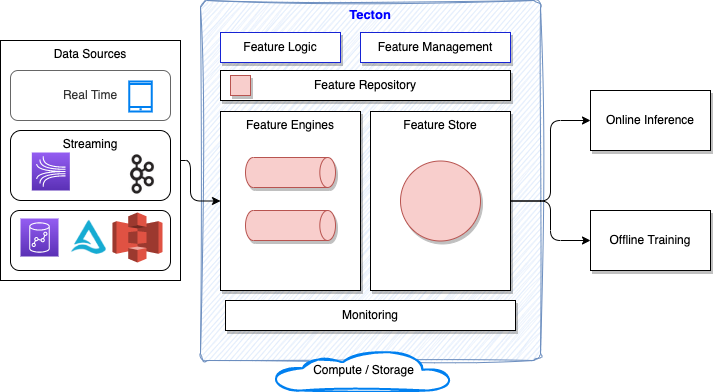
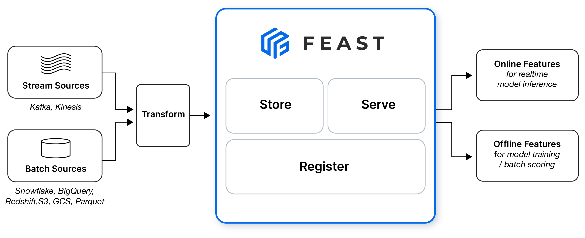
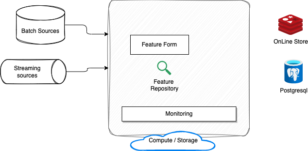

# Feature Engineering

The goal of feature engineering is to make the data better suited to the problem at hand. **Features** are the measurable data points that a model uses to predict an outcome.

We might perform feature engineering to:

* Improve a model's predictive performance.
* Reduce computational or data needs.
* Improve interpretability of the results.

For a feature to be useful, it must have a relationship to the target that our model is able to learn.
Linear models, for instance, are only able to learn linear relationships. 
So, when using a linear model, our goal is to transform the features to make their relationship to the target linear.

See [the Kaggle's concrete compressive strength example](https://www.kaggle.com/sinamhd9/concrete-comprehensive-strength) with some related notebooks on feature engineering.

Feature engineering includes tasks like:

* Locating features with the most potential.
* Creating new features.
* Assessing potential clusters to discover complex spatial relationship.
* Analyzing variations to discover new features.
* Defining encoding.

### Missing values

Remove rows with missing target:

```python
X_full.dropna(axis=0, subset=['SalePrice'], inplace=True)
# To keep things simple, we'll use only numerical predictors
X = X_full.select_dtypes(exclude=['object'])
```

Assess number of missing values in each column:

```python
missing_val_count_by_column = (X_train.isnull().sum())
print(missing_val_count_by_column[missing_val_count_by_column > 0])
```

Avoid dropping a column when there are some missing values, except if the column has a lot of them
and it does not seem to bring much more impact to the result.

```python
# Get names of columns with missing values
cols_with_missing = [col for col in X_train.columns
                     if X_train[col].isnull().any()]

# Drop columns in training and validation data
reduced_X_train = X_train.drop(cols_with_missing, axis=1)
reduced_X_valid = X_valid.drop(cols_with_missing, axis=1)
```

Use **'imputation'** by assigning the mean value of the column values into the unset cells.
 
```python
from sklearn.impute import SimpleImputer
my_imputer = SimpleImputer(strategy='median')
imputed_X_train = pd.DataFrame(my_imputer.fit_transform(X_train))
imputed_X_valid = pd.DataFrame(my_imputer.transform(X_valid))

# Imputation removed column names; put them back
imputed_X_train.columns = X_train.columns
imputed_X_valid.columns = X_valid.columns
```

We can add a boolean column which will have cell set to true when a mean was assigned 
to a missing value. In some cases, this will meaningfully improve results.


```python
cols_with_missing = [col for col in X_train.columns
                     if X_train[col].isnull().any()]
# Make copy to avoid changing original data (when imputing)
X_train_plus = X_train.copy()
X_valid_plus = X_valid.copy()

# Make new boolean columns indicating what will be imputed
for col in cols_with_missing:
    X_train_plus[col + '_was_missing'] = X_train_plus[col].isnull()
    X_valid_plus[col + '_was_missing'] = X_valid_plus[col].isnull()

# Imputation
my_imputer = SimpleImputer()
imputed_X_train_plus = pd.DataFrame(my_imputer.fit_transform(X_train_plus))
imputed_X_valid_plus = pd.DataFrame(my_imputer.transform(X_valid_plus))
```

### Categorical variables

A categorical variable takes only a limited number of values. We need to preprocess them to numerical values.


```python
# Get list of categorical variables
s = (X_train.dtypes == 'object')
object_cols = list(s[s].index)
# drop categorial variable columns
drop_X_train = X_train.select_dtypes(exclude=['object'])
drop_X_valid = X_valid.select_dtypes(exclude=['object'])
```

**Ordinal encoding** assigns each unique value to a different integer.

```python
from sklearn.preprocessing import OrdinalEncoder
ordinal_encoder = OrdinalEncoder()
label_X_train[object_cols] = ordinal_encoder.fit_transform(X_train[object_cols])
label_X_valid[object_cols] = ordinal_encoder.transform(X_valid[object_cols])
```

When there are some categorical value in test set that are not in the training set, then 
a solution is to write a custom ordinal encoder to deal with new categories, or drop the column.

```python
# first get all categorical columns
object_cols = [col for col in X_train.columns if X_train[col].dtype == "object"]

# Columns that can be safely ordinal encoded
good_label_cols = [col for col in object_cols if 
                   set(X_valid[col]).issubset(set(X_train[col]))]
        
# Problematic columns that will be dropped from the dataset
bad_label_cols = list(set(object_cols)-set(good_label_cols))
```

**One-hot encoding** creates new columns indicating the presence (or absence) of each possible value in the original data.
One-hot encoding does not assume an ordering of the categories:

```python
from sklearn.preprocessing import OneHotEncoder

# Apply one-hot encoder to each column with categorical data
OH_encoder = OneHotEncoder(handle_unknown='ignore', sparse=False)
OH_cols_train = pd.DataFrame(OH_encoder.fit_transform(X_train[object_cols]))
OH_cols_valid = pd.DataFrame(OH_encoder.transform(X_valid[object_cols]))

# One-hot encoding removed index; put it back
OH_cols_train.index = X_train.index
OH_cols_valid.index = X_valid.index

# Remove categorical columns (will replace with one-hot encoding)
num_X_train = X_train.drop(object_cols, axis=1)
num_X_valid = X_valid.drop(object_cols, axis=1)

# Add one-hot encoded columns to existing numerical features
OH_X_train = pd.concat([num_X_train, OH_cols_train], axis=1)
OH_X_valid = pd.concat([num_X_valid, OH_cols_valid], axis=1)
```

For large datasets with many rows, one-hot encoding can greatly expand the size of the dataset.  
For this reason, we typically will only one-hot encode columns with relatively low cardinality. 
Then, high cardinality columns can either be dropped from the dataset, or we can use ordinal encoding.

```python
# code to get low cardinality
low_cardinality_cols = [col for col in object_cols if X_train[col].nunique() < 10]
```

Remarks that Pandas offers built-in features to do encoding

```python
# One-hot encode the data (to shorten the code, we use pandas)
X_train = pd.get_dummies(X_train)
X_valid = pd.get_dummies(X_valid)
X_test = pd.get_dummies(X_test)
X_train, X_valid = X_train.align(X_valid, join='left', axis=1)
X_train, X_test = X_train.align(X_test, join='left', axis=1)
```

### Mutual information

The first step is to construct a ranking with a feature utility metric, a function 
measuring associations between a feature and the target. Then we can select a smaller 
set of the most useful features to develop initially.
Mutual information is a lot like correlation in that it measures a relationship between 
two quantities. 
The advantage of mutual information is that it can detect any kind of relationship, 
while correlation only detects linear relationships.

The least possible mutual information between quantities is 0.0. When MI is zero, 
the quantities are independent: neither can tell us anything about the other.

It's possible for a feature to be very informative when interacting with other features, 
but not so informative all alone. MI can't detect interactions between features. 
It is a univariate metric.

We may need to transform the feature first to expose the association.

The scikit-learn algorithm for MI treats discrete features differently from continuous features. 
Consequently, we need to tell it which are which. Anything that must have a float dtype is not discrete.
Categoricals (object or categorial dtype) can be treated as discrete by giving them a label encoding.

See example of mutual information in [ml-python/kaggle-training/car-price/PredictCarPrice.py](https://github.com/jbcodeforce/ml-basics/blob/master/ml-python/kaggle-training/car-price/PredictCarPrice.py).

### Discovering new features

* Understand the features. Refer to the dataset's data documentation.
* Research the problem domain to acquire domain knowledge: Research fields a variety of formulas for creating potentially useful new features. 
* Study [Kaggle's winning solutions](https://www.kaggle.com/sudalairajkumar/winning-solutions-of-kaggle-competitions)
* Use data visualization. Visualization can reveal pathologies in the distribution of a feature or 
complicated relationships that could be simplified

The more complicated a combination is, the more difficult it will be for a model to learn.

Data visualization can suggest transformations, often a "reshaping" of a feature through powers or 
logarithms.

Features describing the presence or absence of something often come in sets. We can aggregate 
such features by creating a count. 

```python
# creating a feature that describes how many kinds of outdoor areas a dwelling has
X_3 = pd.DataFrame()
X_3["PorchTypes"] = df[[
    "WoodDeckSF",
    "OpenPorchSF",
    "EnclosedPorch",
    "Threeseasonporch",
    "ScreenPorch",
]].gt(0.0).sum(axis=1)
```

Here is an example on how to extract roadway features from the car accidents and compute the number
of such roadway in each accident. 

```python
roadway_features = ["Amenity", "Bump", "Crossing", "GiveWay",
    "Junction", "NoExit", "Railway", "Roundabout", "Station", "Stop",
    "TrafficCalming", "TrafficSignal"]
accidents["RoadwayFeatures"] = accidents[roadway_features].sum(axis=1)
```

Extract Category from a column with string like: `One_Story_1946_and_Newer_All_Styles`

```python
X_4['MSClass'] = df.MSSubClass.str.split('_',n=1,expand=True)[0]
```

**Group transforms** aggregates information across multiple rows grouped by some category. 
With a group transform we can create features like: 

* "the average income of a person's state of residence,"
* "the proportion of movies released on a weekday, by genre."

Using an aggregation function, a group transform combines two features: a categorical feature 
that provides the grouping and another feature whose values we wish to aggregate.
Handy methods include `mean, max, min, median, var, std, count`.

```python
customer["AverageIncome"] = (
    customer.groupby("State")  # for each state
    ["Income"]                 # select the income
    .transform("mean")         # and compute its mean
)
```

If we're using training and validation splits, to preserve their independence, 
it's best to create a grouped feature using only the training set and then join it 
to the validation set. 

```python
# Create splits
df_train = customer.sample(frac=0.5)
df_valid = customer.drop(df_train.index)

# Create the average claim amount by coverage type, on the training set
df_train["AverageClaim"] = df_train.groupby("Coverage")["ClaimAmount"].transform("mean")

# Merge the values into the validation set
df_valid = df_valid.merge(
    df_train[["Coverage", "AverageClaim"]].drop_duplicates(),
    on="Coverage",
    how="left",
)
```


## Tecton and Feature store

The following diagram illustrates the high level architecture of [Tecton.ai](https://www.tecton.ai/) feature platform.



The feature engines are the components to inject feature data to the Store. The second important element is the API to access those feature for offline training in classical Data Scientist notebook and online inference, think about model as a service. 

Feature pipelines are done in simple declarative language which looks like SQL, but it is also built in Python so can be integrated in any Python code. The feature engine can orchestrate batch, streaming, and real-time transformations, and re-uses existing processing infrastructure like AWS EME, Databricks, Spark and Snowflake to process the data.

The feature repository is an abstraction layer on top of storage like Amazon S3. Feature can be saved in source control and rollout to production with CI/CD tool. A Tecton Repository is a collection of Python files containing Tecton Object Definitions, which define feature pipelines and other dataflows within Tecton's framework. 

The source for the data can be mobile events and data, streaming events from Kafka, MSK, Kinesis data streams, or data at rest like in S3, Delta lake, DynamoDB, EMR, Athena, Redshift.


## Feast Open Source

[Feast](https://feast.dev/) (Feature Store) is an operational data system for managing and serving machine learning features to models in production. Feast is able to serve feature data to models from a low-latency online store (for real-time prediction) or from an offline store  



Tecton is the hosted SaaS feature platform. It includes a fork of the Feast feature store.

### Value propopositions

* Feature reuse via central respository, feature metadata, searchable.
* The ML systems built is coupled with data sources, so any change in data infrastructure impact those systems. Decoupling via a Feature store brings stability with a single data access layer. 
* Facilitate deployment of ML feature into production, with a centralized registry and a service layer to server the feature.
* Avoid data leakage by providing point-in-time correct feature retrieval when exporting feature datasets for model training

* Feast is not a ETL or ELT.

## [FeatureForm](https://www.featureform.com/product)

Featureform is another [open-source Feature Store](https://github.com/featureform/featureform) that transforms our existing infrastructure into a feature store, it is an abstraction on top of infrastructure. It can work on top of Spark.

A data scientist working in a notebook can push transformation, feature, and training set definitions to a centralized, local repository. Register a PySpark transformations and let Featureform orchestrate the data infrastructure from Spark to Redis, and monitor both the infrastructure and the data.

Native embeddings support. It supports vector databases as both inference and training stores. Featureform on Kubernetes can be used to connect to your existing cloud infrastructure and can also be run locally on Minikube. 

The figure below presents an integration with a LLM with prompt enrichment with Feature in online store



## Feature Store Deeper dive

* [Feast quickstart](https://docs.feast.dev/getting-started/quickstart)
* [Feature Stores Explained: The Three Common Architectures](https://www.featureform.com/post/feature-stores-explained-the-three-common-architectures)
* [Simple use of Feast with LLM]()
* [Learning Feast by examples.](https://docs.feast.dev/v/v0.21-branch/getting-started/feast-workshop)