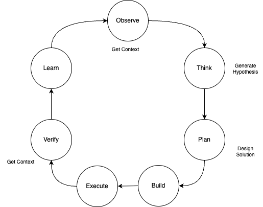
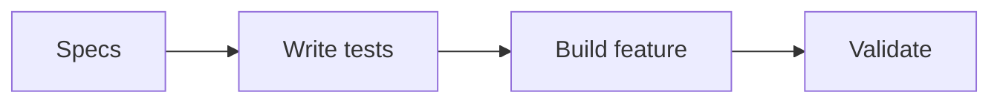
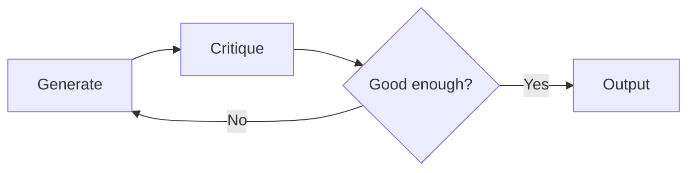
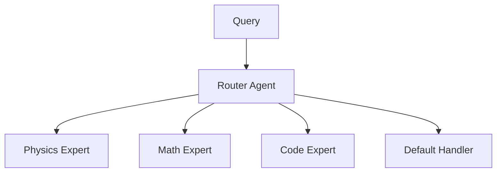

# Agentic AI

[Agent](https://lilianweng.github.io/posts/2023-06-23-agent/) is an orchestrator pattern where the LLM decides what actions to take from the current query and context. 

## Introduction

The agentic reference architecture was introduced by Lilian Weng which can be summarized in the following figure (light adaptation):

<figure markdown=span>

</figure>

The **planning** phase includes techniques like Chain of Thought ("think step by step"), Tree of thoughts (explores multiple reasoning paths) or LLM+P (used external long-horizon planner).

**Short term memory** is the context, and limited by the LLM context window size. **Long term memory** is the vector store supporting the maximum inner product search, it is also used to self improve agents. **Entity memory** is a third type of memory to keep information of the subjects of the interactions or work to be done. Short term memory helps exchanging data between agents too. 

Tools are used to call external services or other LLMs. Neuro-symbolic architecture can be built with expert system modules combined with general-purpose LLM. LLM routes to the best tool.

In general an agentic solution implementation may look at the classical scientific method and support iterations over the 7 phases:

<figure markdown=span>

</figure>

Verification is key in this process to build learning lessons, and assess if the solution is a success or not.

I believe AI agent applications at scale will not only be triggered by users, but by systems using asynchronous events. ([Flink](https://jbcodeforce.github.io/flink-studies/)'s event capabilities in real-time distributed event processing, state management and exact-once consistency fault tolerance make it well-suited as a framework for building such system-triggered agents)

## Agentic Frameworks

There are some well established python libraries to build agentic, like Langgraph, Langchain, Pydantic AI, CrewAI, AutoGen, Lamaindex...

End 2025, OpenAI SDK is supported by a lot of different LLM vendors, so using this lower level api works fine.

After 2 years of playing with agentic implementations, I prefer a pure Python implementation to avoid blackbox library like Langchain.

Also Agent results quality is only linked to LLM for 20-30%, the remainig 80% is due to the quality of the [scaffolding](https://youtu.be/Le0DLrn7ta0?t=517). So prefer to have code to implement the deterministic results of a problem. 

Agentic components and systems (tools, prompts, context, instructions) are more important than the AI model to use. Start by using code to solve lower level problem, and integrate later as tool for model. When using prompts, adop a consistent, templatize approach. 

An efficient software development process is to define project specifications, write tests, do the code with the AI assistant and validate. Validation can be done using LLM as judge, with prompt variations.



Make tools composable. Use CLI, text interface. Each MCP server is a single capability. Each prompt solves one problem.

The approach is to create the goal for the agent, try to code it as function, and may be as cli. 
Design agentic solution with production in mind: be sure to have logs, version management, release management, automated deployment, monitoring and documentation.


### Small Specialist Agents

Small Specialist Agents (SSAs) is an agentic approach to perform planning and reasoning to enhance AI capabilities for complex problem using domain-specific knowledge. It may implement the OODA loop: Observe, Orient, Decide, and Act, with Hierarchical Task Planning to cut bigger tasks in smaller ones. Planning can use up to date data to define future actions. Agentic AI can respond swiftly and effectively to changing environments. SSAs predict maintenance needs, adjust operational parameters to prevent downtime, and ensure that energy production meets demand without excess waste. In healthcare, SSAs may analyzing genetic data, medical histories, and real-time responses to various treatments.

[See OpenSSA project](https://github.com/aitomatic/openssa)

## Use cases

### CrewAI Examples

* **Article Writing Pipeline**: Agents to plan, write, and review articles. See [research-agent.py](https://github.com/jbcodeforce/ML-studies/blob/master/techno/crew-ai/research-agent.py).
* **Support Representative**: Two agents collaborate with QA to address customer inquiries. Uses memory and web scraping. See [support_crew.py](https://github.com/jbcodeforce/ML-studies/tree/master/techno/crew-ai/support_crew.py).
* **Customer Outreach**: Sales lead analysis with Google search tools. See [customer_outreach.py](https://github.com/jbcodeforce/ML-studies/tree/master/techno/crew-ai/customer_outreach.py).
* **Job Application**: Multi-agent resume tailoring for job postings. See [job_application.py](https://github.com/jbcodeforce/ML-studies/tree/master/techno/crew-ai/job_application.py).
* **Financial Trading**: 4-agent hierarchical system with data analyst, strategist, executor, and risk manager. See [financial_analysis.py](https://github.com/jbcodeforce/ML-studies/tree/master/techno/crew-ai/financial_analysis.py).

### LangGraph Examples

* **Adaptive RAG**: Query routing between vector store and web search with document grading and hallucination detection. See [adaptive_rag.py](https://github.com/jbcodeforce/ML-studies/tree/master/examples/llm-langchain/langgraph/adaptive_rag.py).
* **ReAct Agent**: Reason and Act pattern with tool calling. See [react_lg.py](https://github.com/jbcodeforce/ML-studies/tree/master/examples/llm-langchain/langgraph/react_lg.py).
* **Human-in-the-Loop**: Agent with interrupt for human approval. See [human_in_loop.py](https://github.com/jbcodeforce/ML-studies/tree/master/examples/llm-langchain/langgraph/human_in_loop.py).
* **Streaming Chat**: WebSocket streaming with LangGraph. See [main_lg.py](https://github.com/jbcodeforce/ML-studies/tree/master/e2e-demos/streaming-demo/main_lg.py).

### OpenAI/LangChain Agent Examples

* **Basic Agent**: Agent with retriever and search tools. See [openai_agent.py](https://github.com/jbcodeforce/ML-studies/tree/master/examples/llm-langchain/openai/openai_agent.py).
* **JSON Agent**: ReAct agent with JSON output parsing. See [json_agent.py](https://github.com/jbcodeforce/ML-studies/tree/master/examples/llm-langchain/openai/json_agent.py).
* **Agent with Memory**: Conversation history tracking. See [agent_memory.py](https://github.com/jbcodeforce/ML-studies/tree/master/examples/llm-langchain/openai/agent_memory.py).

### End-to-End Demos

* **Resume Tuning**: Multi-agent pipeline for tailoring resumes to job postings. See [resume_tuning demo](https://github.com/jbcodeforce/ML-studies/tree/master/e2e-demos/resume_tuning).
* **Streaming Demo**: Real-time streaming with human-in-the-loop. See [streaming-demo](https://github.com/jbcodeforce/ML-studies/tree/master/e2e-demos/streaming-demo).

## Challenges

The current adoption of Agents since mid 2023 has highlighted the following challenges:

* Existing demonstrations of agent in action are for very specific use cases and are giving too much freedom to Agents without enough controls.
* The cost of running open-loop agent is high.
* Pure LLM plannification, reason and act is not optimized and the path to reach a response may be long. Tasks may be defined more than once.
* Get good results for reasoning is achieved on the last (mid 2024), most expensive, LLM.
* New model released recently demonstrates that existing agent workflow implementations become unstable. 
* This is not ready for production usages as responses can reach a hole in the workflow or continuous iterations (reaching a max number of iterations)
* Big prompt for agent with a lot of tools (Multi-Action-Agent) deliver poor results in tool selection. 
* Even with larger context window, they are still issue with the "in-the-middle" problem, where context instructions in the middle of the system prompt is ignored  by the LLM during generation.
* Even same LLMs used in the agent are loosing their efficiency over time. 

Developers need to address the level of freedom given to the LLMs.

| Type | Decide output | Decide steps to take | Determine step sequences |
| --- | --- | --- | --- |
| Code| Code | Code | Code |
| LLM Call | On step of LLM | Code | Code |
| Chain | Multiple calls to LLM | Code | Code |
| Router | LLM | LLM without cycle | Code |
| State Machine | LLM | LLM with cycle | Code |
| Agent (Autonomous) | LLM | LLM | LLM |

Multiple agents, with more dedicated prompt, smaller list of tools, event Single Action Agent, and orchestration seems to be a viable solution for agentic solutions. This new approach adds complexity in designing, implementing and then tuning the solution, but authorizes the usage of smaller LLM, local code / MCP server and specific prompts. Current research looks after integrating agent with reinforcement learning as tools to do trial and error learning.

[LangGraph](../coding/langgraph.md) helps to better support the Router, State Machine and chain implementations.

## Guidelines

Agents perform better if we define a role to play, instruct them with a specific prompt to help them to focus on a goal, add tools to access external systems, combine them with other agents to cooperate and chain content between agents. 

Focus is becoming important as the context windows are becoming larger. With too many information LLM can lose the important points and goals. Try to think about multiple agents to split the work and generate better results together.

Too much tools adds confusion for the agents, as they have hard time to select tool, or distinguish what is a tool, a context or an history. Be sure to give them tools for what they need to do. 

For task definition, think about process, actors and tasks. Have a clear definition for each task, with expectation and context. Task may use tools, should be able to run asynchronously, output in different format like json, xml, ...

## Memory Management

Memory is critical for agents to maintain context, learn from interactions, and improve over time. There are three types of memory:

### Short-Term Memory

Short-term memory holds the current conversation context within the LLM's context window. It includes:

- Current user query and conversation history
- Intermediate results from tool calls
- Agent scratchpad for reasoning steps

```python
# LangGraph message-based state
class State(TypedDict):
    messages: Annotated[list, add_messages]  # Accumulates conversation
```

Implementation with LangGraph checkpointing enables persistence across requests:

```python
from langgraph.checkpoint.memory import MemorySaver

memory = MemorySaver()
app = workflow.compile(checkpointer=memory)

# Thread-based conversation tracking
config = {"configurable": {"thread_id": "user-123"}}
app.invoke({"messages": [HumanMessage(content="Hi")]}, config)
```

See [first_graph_with_tool_and_memory.py](https://github.com/jbcodeforce/ML-studies/tree/master/examples/llm-langchain/langgraph/first_graph_with_tool_and_memory.py) for a complete example.

### Long-Term Memory

Long-term memory persists beyond the context window using vector stores. It enables:

- Retrieval of relevant past interactions
- Knowledge base queries
- Learning from historical data

```python
# Store important information in vector store
vectorstore = Chroma.from_documents(documents, embeddings)
retriever = vectorstore.as_retriever()

# Retrieve relevant context during agent execution
relevant_docs = retriever.invoke(user_query)
```

For agent memory implementations, see [agent_memory.py](https://github.com/jbcodeforce/ML-studies/tree/master/examples/llm-langchain/openai/agent_memory.py).

### Entity Memory

Entity memory tracks information about specific subjects (people, organizations, locations) mentioned in conversations. CrewAI implements this as short-term memory extracted via NLP:

- Person names and attributes
- Organization details
- Location references

This enables agents to maintain coherent understanding of entities across the conversation without re-extracting information.

## Streaming and Real-Time

For production applications, streaming agent responses improves user experience and enables real-time feedback.

### Token Streaming

Stream tokens as they are generated by the LLM:

```python
async for event in graph.astream_events(
    {"messages": [HumanMessage(content=user_msg)]}, 
    config,
    version="v1"
):
    # Process streaming tokens
    yield event["data"]["chunk"]
```

### WebSocket Integration

For web applications, combine LangGraph with WebSocket for real-time chat:

```python
@app.websocket("/ws")
async def websocket_endpoint(websocket: WebSocket):
    await websocket.accept()
    while True:
        message = await websocket.receive_text()
        async for text in get_ai_response(message):
            await websocket.send_text(text)
```

See [main_lg.py](https://github.com/jbcodeforce/ML-studies/tree/master/e2e-demos/streaming-demo/main_lg.py) for a complete streaming demo with FastAPI and LangGraph.

### Event-Driven Agents

For system-triggered agents responding to events (not user input), consider:

- Message queue integration (Kafka, RabbitMQ)
- [Apache Flink](https://jbcodeforce.github.io/flink-studies/) for real-time event processing with state management
- Webhook-triggered agent execution

Stream processing frameworks provide exactly-once semantics and fault tolerance for production agent deployments.

## Design Patterns

### The Reflect Pattern

The Reflect pattern implements a self-critique loop where an agent generates output, then critiques its own work to iteratively improve the result. This pattern is effective for writing, code generation, and problem-solving tasks.



Implementation involves two prompts:

1. **Generator prompt**: Creates the initial output based on the task
2. **Critic prompt**: Evaluates the output against criteria and suggests improvements
    ```python
    # Simplified reflection loop
    def reflect_loop(task: str, max_iterations: int = 3) -> str:
        output = generator_agent.invoke(task)
        for _ in range(max_iterations):
            critique = critic_agent.invoke({"task": task, "output": output})
            if critique.is_satisfactory:
                break
            output = generator_agent.invoke({"task": task, "previous": output, "feedback": critique})
        return output
    ```

See the [multi_chains.py](https://github.com/jbcodeforce/ML-studies/tree/master/examples/llm-langchain/openai/multi_chains.py) example that demonstrates chaining with sequential improvement.

### The Router Pattern

The Router pattern uses an LLM to classify incoming queries and route them to specialized handlers. This reduces prompt complexity and improves response quality.



Key implementation aspects:

- Router agent uses structured output to select destination
- Each destination has a focused prompt and potentially different tools
- Fallback to default handler for unmatched queries

See [adaptive_rag.py](https://github.com/jbcodeforce/ML-studies/tree/master/examples/llm-langchain/langgraph/adaptive_rag.py) for a LangGraph implementation that routes between vector store and web search.

### Human-in-the-Loop Pattern

This pattern interrupts agent execution to request human approval or input before proceeding with sensitive operations.

```python
# LangGraph implementation with interrupt
app = workflow.compile(
    checkpointer=memory, 
    interrupt_before=["tools"]  # Pause before tool execution
)
```

Use cases:

- Approval before executing destructive operations
- Human verification of retrieved information
- Clarification requests when agent is uncertain

See [human_in_loop.py](https://github.com/jbcodeforce/ML-studies/tree/master/examples/llm-langchain/langgraph/human_in_loop.py) and [ask_human_graph.py](https://github.com/jbcodeforce/ML-studies/tree/master/examples/llm-langchain/langgraph/ask_human_graph.py) for implementations.

### ReAct Pattern

Reasoning and Acting (ReAct) alternates between thinking steps and action steps, allowing the agent to plan before acting and learn from observations.

The cycle: **Thought** -> **Action** -> **Observation** -> repeat until done.

```python
# ReAct prompt structure
prompt = """
Thought: I need to find information about X
Action: search("X")
Observation: [search results]
Thought: Based on these results, I can conclude...
Action: finish(answer)
"""
```

Implementations:

- [react_lg.py](https://github.com/jbcodeforce/ML-studies/tree/master/examples/llm-langchain/langgraph/react_lg.py) - Manual ReAct with LangGraph
- [prebuilt_react_lg.py](https://github.com/jbcodeforce/ML-studies/tree/master/examples/llm-langchain/langgraph/prebuilt_react_lg.py) - Using LangGraph's prebuilt `create_react_agent`
- [json_agent.py](https://github.com/jbcodeforce/ML-studies/tree/master/examples/llm-langchain/openai/json_agent.py) - JSON-based ReAct agent

### Multi-Agent Collaboration Pattern

Multiple specialized agents work together, either in sequence or hierarchy, to accomplish complex tasks.

**Sequential Process**: Agents execute in order, passing results to the next agent.

**Hierarchical Process**: A manager agent delegates tasks to worker agents and synthesizes results.

```python
# CrewAI hierarchical example
crew = Crew(
    agents=[analyst, strategist, executor],
    tasks=[analysis_task, strategy_task, execution_task],
    manager_llm=ChatOpenAI(model="gpt-4o"),
    process=Process.hierarchical
)
```

See [financial_analysis.py](https://github.com/jbcodeforce/ML-studies/tree/master/techno/crew-ai/financial_analysis.py) for a 4-agent trading system with hierarchical coordination.

## Technologies

### Claude Code

[Anthropic’s agentic coding tool](https://code.claude.com/docs/en/overview) as a specific, very efficient, agentic solution for software development. It runs in terminal.

### Cursor and AI IDEs

[Cursor AI](https://cursor.com/features) is a amazing IDE with agents capability to develop software. I use it on daily basis.

[IBM's Bob IDE](https://www.ibm.com/products/bob)

### [LangChain Agent module](https://python.langchain.com/v0.1/docs/modules/agents/)

In Agents, a language model is used as a reasoning engine to determine which actions to take and in which order. 

[LangChain agents package API doc.](https://api.python.langchain.com/en/latest/_modules/langchain_core/agents.html)

### LangGraph

[LangGraph](../coding/langgraph.md) is a library for building stateful, multi-actor applications with cycles. It supports the Router, State Machine, and Chain patterns effectively.

Key features for agents:

- **StateGraph**: Define nodes (agents) and edges (transitions) with conditional routing
- **Checkpointing**: Persist state for human-in-the-loop and recovery
- **Streaming**: Real-time token and event streaming
- **Prebuilt agents**: `create_react_agent` for quick ReAct implementations

```python
from langgraph.graph import StateGraph, END
from langgraph.prebuilt import ToolNode, tools_condition
from langgraph.checkpoint.memory import MemorySaver

workflow = StateGraph(State)
workflow.add_node("agent", call_model)
workflow.add_node("tools", ToolNode(tools))
workflow.add_conditional_edges("agent", tools_condition)
workflow.add_edge("tools", "agent")
app = workflow.compile(checkpointer=MemorySaver())
```

See the [LangGraph documentation](../coding/langgraph.md) for detailed examples and the [langgraph examples folder](https://github.com/jbcodeforce/ML-studies/tree/master/examples/llm-langchain/langgraph).

### OpenAI SDK

The OpenAI SDK has become a de-facto standard for tool calling, supported by multiple LLM vendors (Anthropic, Mistral, Groq, etc.). Using this lower-level API provides more control and avoids framework lock-in.

```python
from openai import OpenAI

client = OpenAI()
response = client.chat.completions.create(
    model="gpt-4o",
    messages=[{"role": "user", "content": "What's the weather?"}],
    tools=[{
        "type": "function",
        "function": {
            "name": "get_weather",
            "description": "Get current weather",
            "parameters": {"type": "object", "properties": {"location": {"type": "string"}}}
        }
    }]
)
```

For agent implementations using OpenAI, see:

- [openai_agent.py](https://github.com/jbcodeforce/ML-studies/tree/master/examples/llm-langchain/openai/openai_agent.py) - Agent with retriever and search tools
- [agent_memory.py](https://github.com/jbcodeforce/ML-studies/tree/master/examples/llm-langchain/openai/agent_memory.py) - Agent with conversation memory

### Pydantic AI

[Pydantic AI](../techno/pydantic.ai.md) is an agent framework by the Pydantic team, bringing a FastAPI-like developer experience to GenAI applications.

Key features:

- Model-agnostic: supports OpenAI, Anthropic, Gemini, Ollama, Mistral, and more
- Type-safe with Pydantic models for structured input/output
- Native streaming support
- Dependency injection for tools

### Model Context Protocol (MCP)

[MCP](./mcp.md) is a protocol by Anthropic that standardizes how AI assistants call external tools and services. It enables:

- Standardized tool definitions across LLM providers
- Remote MCP servers for tool hosting
- Integration with IDEs like Cursor

MCP is becoming important for building portable agent tools that work across different LLM platforms.

### CrewAI

[crewAI](https://www.crewai.com/) is a framework to develop application using multiple-agent. It uses the concepts of Agent, Task and Crew to organize the work between agents. The concepts are common to any Agentic AI solutions.

```python
from crewai import Agent, Task, Crew
```

Agent needs the following 6 elements:

1. Role Playing: Agents perform better when doing role playing. It is mapped to the first statement in a prompt, and it is a common practice in prompt engineering.

    ```python
    writer = Agent(
                role="Content Writer",
                goal="Write insightful and factually accurate "
    ```

1. Focus on goals and expectations to better prompt the agent: "give me an analysis of xxxx stock". Too much stuff in the context window is confusing the model, and may hallucinate. May be splitting into multiple agents is a better solution instead of using a single prompt.

1. Tool is used to call external system, and is well described so the model can build parameters for the function and be able to assess when to call the function. Now too many tools will also add to the confusion. Small model will have hard time to select tools. So think to have multiple-agent with only the tools they need to do their task.
1. Cooperation has proved to deliver better results than unique big model. Model can take feedbacks from each others, they can delegate tasks.
1. Guardrails are helping to avoid models to loop over tool usages, creating hallucinations, and deliver consistent results. Models work on fuzzy input, generate fuzzy output, so it is important to be able to set guardrails to control outcomes or runtime execution.
1. Memory is important to keep better context, understand what was done so far, apply this knowledge for future execution. Short term memory is used during the crew execution of a task. It is shared between agents even before task completion. Long term memory is used after task execution, and can be used in any future tasks. LTM is stored in a DB. Agent can learn from previous executions. This should lead agent to self-improve. The last type of memory is the entity memory (person, organization, location). It is also a short term, and keep information of the entity extracted from NLP.

CrewAI has tools to scrape website, search internet ([Serper](https://serper.dev/)), load customer data, tap into previous conversations, load data from a CRM, checking existing bug reports, checking existing feature requests, checking ongoing tickets...

See code examples in [the techno/crew-ai folder](https://github.com/jbcodeforce/ML-studies/tree/master/techno/crew-ai)

#### Some guidelines

* Adapt the task and agent granularity
* Task can be executed in different ways, parallel, sequential,... so test and iterate
* With agent delegation parameter, the agent can delegate its work to another agent which is better suited to do a particular task.
* Try to add a QA agent to control and review task results
* Tools can be defined at the agent level so it will apply to any task, or at the task level so the tool is only applied at this task. Task tool overrides agent tools.
* Tools need to be versatile, fault tolerant, and implement caching. Versatile to be able to get the fuzzy input well interpreted by the model and call the relevant tools and by extracting structured input parameters in the form of json or key-value pairs. 
* To be fault tolerant, function can stop execution, retries with exponential backoff, or report error message to the LLM so it can better extract and format parameters.
* CrewAI offers a cross-agent caching mechanism. It is also compatible with LangChain tools.
* Think as a manager: define the goal and what is the process to follow. What are the people I need to hire to get the job done. Use keyword and specific attributes for the role, agent needs to play.

### AutoGen

[Microsoft AutoGen](https://microsoft.github.io/autogen/) is a multi-agent conversation framework to help developers build LLM workflows. The first abstraction is a ConversableAgent

### OpenSSA

[Small Specialist Agents for Problem-Solving](https://github.com/aitomatic/openssa) 

## Framework Comparison

| Framework | Best For | Multi-Agent | Streaming | Learning Curve |
|-----------|----------|-------------|-----------|----------------|
| LangGraph | Stateful workflows, cycles | Yes (subgraphs) | Yes | Medium |
| CrewAI | Role-based collaboration | Yes (crews) | Limited | Low |
| Pydantic AI | Type-safe agents | No | Yes | Low |
| OpenAI SDK | Direct LLM control | Manual | Yes | Low |
| AutoGen | Conversational agents | Yes | Yes | Medium |

## Code Examples Summary

| Category | Examples |
|----------|----------|
| **LangGraph** | [langgraph folder](https://github.com/jbcodeforce/ML-studies/tree/master/examples/llm-langchain/langgraph) |
| **CrewAI** | [crew-ai folder](https://github.com/jbcodeforce/ML-studies/tree/master/techno/crew-ai) |
| **OpenAI Agents** | [openai folder](https://github.com/jbcodeforce/ML-studies/tree/master/examples/llm-langchain/openai) |
| **E2E Demos** | [e2e-demos folder](https://github.com/jbcodeforce/ML-studies/tree/master/e2e-demos) |

## References

* [LLM Powered Autonomous Agents - Lilian Wang](https://lilianweng.github.io/posts/2023-06-23-agent/)
* [Prompt engineering with external APIs](https://lilianweng.github.io/posts/2023-03-15-prompt-engineering/#external-apis)
* [Crew-ai tutorial on deeplearning.ai](https://learn.deeplearning.ai/courses/multi-ai-agent-systems-with-crewai)
* [AI Agents in LangGraph - deeplearning.ai](https://learn.deeplearning.ai/courses/ai-agents-in-langgraph)
* [ReAct pattern implementation](https://til.simonwillison.net/llms/python-react-pattern)
* [LangGraph product documentation](https://langchain-ai.github.io/langgraph/)
* [Pydantic AI documentation](https://ai.pydantic.dev/)
* [Model Context Protocol specification](https://modelcontextprotocol.io/)