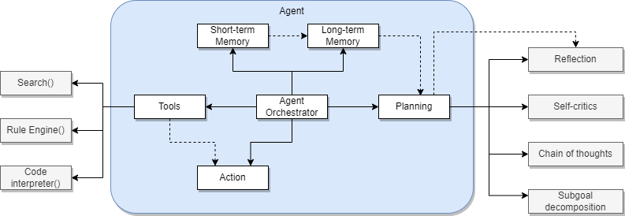

# Agentic AI

[Agent](https://lilianweng.github.io/posts/2023-06-23-agent/) is an orchestrator pattern where the LLM decides what actions to take from the current query and context. With chain, developer code the sequence of tasks, with agent the LLM decides. 

The reference architecture for an agent looks like what Lilian Weng illustrated in the figure (light adaptation):

The planning phase includes techniques lie Chain of Thought ("think step by step"), Tree of thoughts (explores multiple reasoning paths) or LLM+P (used external long-horizon planner).

Short term memory is the context, and limited by the LLM context window size. Long term memory is the vector store supporting the maximum inner product search, it is also used to self improve agents. Entity memory is a third type of memory to keep information of the subjects of the interactions or work to be done. Short term memory helps exchanging data between agents too. 

Tools are used to call external services or other LLMs. Neuro symbolic architecture can be built with expert system modules combined with general-purpose LLM. LLM routes to the best tool.

There are [different types](https://python.langchain.com/docs/modules/agents/agent_types/) of agent: Intended Model, Supports Chat, Supports Multi-Input Tools, Supports Parallel Function Calling, Required Model Params.

## Guidelines

Agents perform better if we define a role to play, instruct them with prompt to help them to focus on a goal, add tools to access external systems, combine them with other agents to cooperate. Memory is important to keep better context, understand what was done so far, apply this knowledge for future execution and chain content between agents. 

Focus is becoming important as the context windows are becoming larger. With too many information LLM can lose the important points and goals. Try to think about multiple agents to do better work together.

Same too much tools add confusion for the agents, as they have hard time to select tool, or distinguishes what is a tool, a context or an history. Be sure to give them tools for what they need to do. 

Guardrails are helping to avoid models to loop over tool usages, creating hallucinations, and deliver consistent results. 

## Use cases

* Agents to plan an article, write this article and review for better edition.
* 
## References

* [LLM Powered Autonomous Agents - Lilian Wang](https://lilianweng.github.io/posts/2023-06-23-agent/)
* [Prompt engineering with external APIs](https://lilianweng.github.io/posts/2023-03-15-prompt-engineering/#external-apis)
* [Crew-ai tutorial on deeplearning.ai](https://learn.deeplearning.ai/courses/multi-ai-agent-systems-with-crewai)