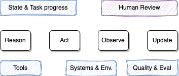

# IBM Bob best practices

???- info "Updates"
    08/26/2026

IBM Bob is an IBM AI coding assistant built on top of different LLM models. It operates inside VS Code and offers three specialized modes, a skill system, MCP extension, and a 270k-token context window.

---

## Modes

Bob comes with three built-in modes. Selecting the right one for the task avoids wasted tokens and produces sharper output.

| Mode | Purpose | Tools available |
| --- | --- | --- |
| **Agent** | Write, modify, and refactor code — fix bugs, implement features, run commands | Full: Read, Edit, Execute, MCP, Skill, Todo, Subtask, Subagent, Mode |
| **Plan** | Design before implementation — architecture, specs, task breakdown | Read, Edit, MCP, Skill, Subagent, Mode (no Execute) |
| **Ask** | Understand code or concepts without touching files | Read, MCP, Skill, Subagent, Mode (read-only) |

 
**Mode selection strategy**

1. **Start in Plan mode** for new projects or complex features. Read the plan carefully before proceeding. It is possible to persist the plan and iterate until it fits the goals.
2. **Switch to Agent mode** when you are ready to implement. Bob can make the transition autonomously once the plan is approved.
3. **Use Ask mode** to explore the codebase, understand patterns, or get explanations — without the risk of accidental edits.

Switch modes with `⌘` + `.` (macOS) or `Ctrl` + `.` (Windows/Linux), or via the dropdown to the left of the chat input. Bob may suggest a switch autonomously when the work evolves.

---

## Prompting effectively

> **"Create a React component that displays a sortable table of user data"** works better than **"Make me a table component."**

### For simple requests

- State what to do and what to avoid.
- Reference specific files with `@` mentions (e.g., `@src/api/client.ts`).
- Include the exact error text when fixing a bug, and ask Bob to address the root cause rather than suppress the symptom.

### For complex requests

1. Provide a clear overview of the goal.
2. Include relevant background context — constraints, existing patterns, non-goals.
3. Break the task into logical steps in the prompt itself.
4. Use `@` mentions to anchor Bob to the right files immediately.
5. Review Bob's responses and give feedback to refine.

### Useful prompt templates

| Goal | Prompt |
| --- | --- |
| Fix a build error | `The build fails with: [paste error]. Fix it and verify the build succeeds. Address the root cause, don't suppress the error.` |
| Fix a runtime error | `Use subagents to investigate why [service] is throwing [error]. Check logs and recent changes.` |
| Understand the codebase | `Read [folder]. What are the key files and flows?` |
| Design a new feature | `I want to build [description]. Interview me about edge cases, trade-offs, and approach using AskUserQuestion. Then write a spec to SPEC.md.` |
| Review a PR | `Review PR #[number]. Look for edge cases, race conditions, and consistency with existing patterns.` |
| Address PR feedback | `Read the review comments on PR #[number]. Address each one, reply to the threads, and push fixes.` |

---

## Context window management

Bob's context window is **270,000 tokens** per task. Everything counts: system prompt, rules, skills, file reads, and conversation history. Once full, old content is summarized or dropped — quality degrades.

### What fills the window

| Category | When it grows |
| --- | --- |
| System prompt + Tool definitions | Fixed at task start |
| Rules (`AGENTS.md`, `.bob/rules/`) | Fixed at task start |
| Skills | When Bob activates a skill mid-thread |
| Messages | Every prompt, reply, file read, tool output, and `@` mention |

**Messages** is almost always the biggest category in long sessions. Watch the token usage indicator (top-right of the chat panel) and click it to see the breakdown.

### Agentic Loop

From the prompt engineering done 2 years ago, to context engineering (system rules, history, ) to agent loop. The agent loop reasons, acts, observes, updates state, evaluates results, and involves humans when needed.

<figure markdown='span'>
{ width=600}
</figure>

* The context includes rules, AGENTS.md, skill list, MCP tools.
* And messages: user prompt, agent responses, tool results and loaded @ files
* Hooks to add some deterministic context and control are supported by agent like Bob

### Best practices

- **One task per work goal.** Click `+` (New task) when the topic changes — carrying unrelated history adds cost and can confuse Bob. A good task contains fgour things: the **what, where, done, limits**.
- **Scope before exploring.** State the goal, expected outcome, and constraints before asking Bob to read files. Name files and functions explicitly; avoid vague prompts like *"read the whole repo"*.
- **Keep standing context lean.** `AGENTS.md` and rule files should contain only commands Bob cannot guess (build commands, test runners, style rules). Remove verbose tutorials or file-by-file descriptions.
- **Add context only when needed**: do not attach a full project. Use the path: **Find -> Look -> Plan --> Change --> Check**, where each step slightly enriches the next slice of context.
- **Use subagents for repo-wide reads.** Subagents return a summary rather than dumping every tool step into `Messages`, keeping the parent context clean. Use prompt: **Spawn Explore subagent** to get a sub-agent to search and summarize. The summary is sent back to the task.
- **Disconnect unused MCP servers and skills.** Fixed categories still consume tokens even if you never call those tools.
- **Reset when stuck.** If Bob starts producing repetitive or drifting output, start a new task rather than continuing to prompt corrections into a poisoned context.
- **Restate the must-keeps after a reset**: summary of what is done. Keep in file.
- **Use the lightest mode that can do the job**. Save plan on disk. Example of prompt: 'write our plan to plan.md with a short checklist'. Later in a new task use: '@plan.md, implement cheklist item 2 only. Update progress.md when done`

### Context poisoning symptoms

- Suggestions repeat or wander from the actual repo.
- Tool calls no longer match what was asked.
- A corrective prompt helps once, then the problem returns.

**Recovery:** Start a new task with `+`, paste only the relevant log lines or code snippet Bob needs, and re-scope the goal.

---

## Project setup: AGENTS.md and rules

### AGENTS.md

Run `/init` to generate an `AGENTS.md` file at the project root and mode-specific variants under `.bob/`. Bob automatically loads this into every new conversation.

Good content for `AGENTS.md`:

| Include | Exclude |
| --- | --- |
| Build/test/lint commands | Standard language conventions |
| Non-obvious architecture decisions | Detailed API docs (link instead) |
| File structure and naming patterns | Long tutorials or explanations |
| Common gotchas | File-by-file codebase descriptions |

### Custom rules

Create markdown files under `.bob/rules/` for rules that apply to all modes, or under `.bob/rules-{mode}/` for mode-specific rules:

```
.bob/
  rules/               # applied to all modes
    coding_standards.md
  rules-agent/         # only in Agent mode
    test_requirements.md
  rules-plan/          # only in Plan mode
    architecture_guidelines.md
```

Rules are loaded at task start and count against the fixed context budget — keep them short and operational.

**Useful rules patterns:**

```md
Always include concise JSDoc strings for every public function.
Be very concise in your wording.
Write a summary of every interaction into internal-monologue/ with a timestamp prefix.
```

The "internal monologue" pattern creates an audit trail that persists across sessions and gives Bob cross-session continuity.

---

## Skills

Skills are reusable instruction sets stored as `SKILL.md` files. Bob activates them automatically based on the task description.

### Locations

| Path | Scope |
| --- | --- |
| `<project>/.bob/skills/<name>/SKILL.md` | Project-specific |
| `~/.bob/skills/<name>/SKILL.md` | Global / personal |

Project-level skills take precedence over global ones with the same name.

### SKILL.md format

```markdown
---
name: code-review
description: Review code for bugs, security issues, and best practices
---

When reviewing code, check for:
- Security vulnerabilities (OWASP Top 10)
- Performance bottlenecks
- Missing error handling at API boundaries
- Unused imports and dead code

Provide a summary with severity levels for each finding.
```

The `description` field is critical — Bob uses it to decide when to activate the skill. A vague description causes the skill to be ignored.

### Tips

- **Single responsibility**: one skill per specific task type.
- **Keep `SKILL.md` concise**: move detailed reference material into companion files in the same folder.
- **Version-control project skills** so the whole team benefits.
- **Enable auto-approve for skills** in Settings → Auto-Approve if the skill's actions are low risk.
- Use the **Skills tab** in Bob Settings to verify which skills are loaded.

---

## MCP servers

MCP (Model Context Protocol) extends Bob with custom tools: database queries, external APIs, internal services, and more.

- Configure servers under **Settings → MCP**.
- Use the **Bob Marketplace** for community-contributed servers (monday.com, product knowledge bases, etc.).
- Prefer **project-scoped** MCP configuration over global to avoid loading unnecessary tools in every workspace.
- Enable per-tool `Always allow` only for tools whose side-effects are well understood.

---

## Security and auto-approve

Auto-approve bypasses confirmation prompts. Use it carefully.

| Action | Risk | Recommendation |
| --- | --- | --- |
| Read | Low | Safe to auto-approve |
| Write (file edits) | Medium | Auto-approve on dev branches only |
| Execute (terminal) | High | Keep manual; define an allow-list of trusted commands |
| MCP | Varies | Enable per-tool only |
| Skills | Low–Medium | Safe to auto-approve when skill behavior is known |

**Guidelines:**

- Start restrictive — add permissions only as needed.
- Disable auto-approve entirely when working with sensitive code or production systems.
- Review what Bob has done periodically, especially file modifications.
- Never auto-approve in production environments.

---

## Subagents

Bob spawns subagents for isolated, self-contained work. A subagent runs in its own context window and returns a summary — keeping the parent conversation clean.

Bob uses subagents only when **all** of the following are true:

- The task is clearly self-contained and only a summary is needed back.
- It would add significant irrelevant content to the main context.
- It cannot be done with one or two direct tool calls.

Two types:

| Type | Model | Access |
| --- | --- | --- |
| `explore` | Lighter | Read-only codebase exploration |
| `general` | Default | Full tool access |

Set `fork_context: true` when the subagent needs prior conversation decisions or constraints.

---

## Sources

- [IBM Bob documentation](https://docs.bob.ibm.com)
- [Deeplearning.ai — Claude Code course](https://learn.deeplearning.ai/courses/claude-code-a-highly-agentic-coding-assistant)
- [Get Shit Done: meta-prompting for Claude Code](https://github.com/gsd-build/get-shit-done)
* [Markus Eisele's 'Bob book'](https://pages.github.ibm.com/Markus-Eisele/bob-book/)
