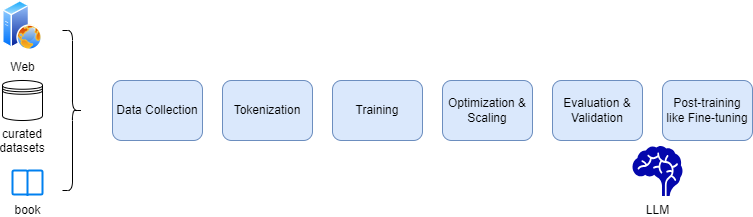
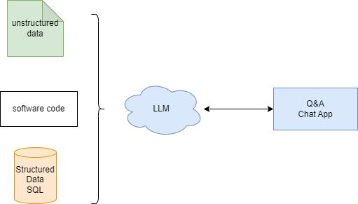
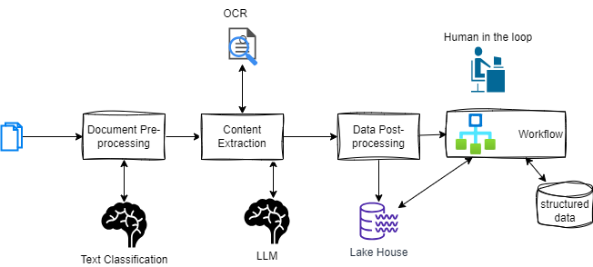
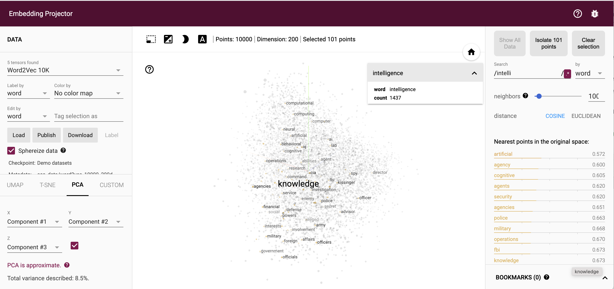

# Generative AI

???- info "Updates"
    Created Aug 2023 - Updated 06/2024

## Introduction

Generative AI is a combination of neural network models to create new content (text, image, music, videos..) from a requesting query. Models are pre-trained on vast amounts of unlabeled data, using from 7B up to 500B of parameters.

Gen AI applies well to different category of use cases: improve customer experiences, improve employee's productivity, help around creativity, and help optimizing business process ([See Use Case section](#use-cases)). 

### Transformer Architecture

**GPT-3 (Generative Pre-trained Transformer 3)** breaks the NLP boundaries with training on 175B parameters. It is built on **Transformer** which uses self-**attention** mechanism to weigh the significance of different words in a sentence to understand the context in a sequence of data. 

The **attention** mechanism computes the similarity between tokens (from the embeddings of words) in a sequence. That way, the model builds an intuition of what the text is saying. The closer two words are in a vector space, the higher the attention scores they will obtain and the higher the attention they will give to each other.

The models are trained on vast amounts (Terabytes) of text data like books, articles, websites etc. 
This helps the model learn grammar, facts, reasoning abilities and even some level of common sense from the content. 

The second part of the GPT-3 architecture are the **layers** of transformers stacked on top of each other. Within each layer, there are feed-forward neural networks to process the data.

The training has two stages: **Pre-training** where the model attempts to predict the next word in a sentence using its own corpus, and **fine tuning** where the model can be tuned for specific *tasks* or *content*. During the pre-training process, the model automatically takes context into account from all the training data, and tracks relationships in sequential data, like the words in a sentence, to develop some understanding of the real world.

The models are commonly referred to as **foundation models** (FMs).

The unlabeled data used for pre-training is usually obtained by crawling the web and public sources.

At **inference** time, the input text is tokenized into individual tokens which are fed into the model. After processing using the transformer mechanism, the model returns result tokens which are then turned back into readable text.


???- info "Difference between ML and LLM"
    * **Foundational Models** can perform many tasks because twatsonhey contain a large number of parameters that make them capable of learning complex concepts. Through their pre-training exposure to **internet-scale** unstructured data in all its various forms and myriad of patterns, FMs learn to apply their knowledge within a wide range of contexts.
    * **Regular models** are trained for one **specific task**, like image classification or speech recognition. ML models require lots of **labeled data** relevant to their task.

The largest pre-trained model in 2019 (BERT) was 330M parameters while the state-of-the-art LLM in 2023 is 540B parameters.


A transformer-based model has an encoder component that converts the input text into embeddings (mathematical representations of the token semantic), and a decoder component that consumes these embeddings to emit some output text. Transformers process the entire input all at once, during the learning cycle, and therefore can be parallelized.

Three types of transformer:

1. **Encoded only**: generate no human readable content, used when applications need to efficiently query to find similar items.
1. **Encoder-decoder** model is trained to treat every natural language processing (NLP) problem (e.g.,
translate an input string in one language to another) as a text-to-text conversion problem.
1. **Decoder-only** model is for text generation.

Models with encoder-decoder and decoder-only architectures are **generative** models.

The process is text -> tokens (a token may be less than a word, and on average a 5 chars) -> vector. Vectors of similar word are close in the multi-dimensional space. A vector, in NLP, has a lot of dimensions, representing its characteristics in the world of meaning. The best tokenization method for a given dataset and task is not always clear, and different methods have their own strengths and weaknesses. Sub-word tokenization combines the benefits of character and word tokenization by breaking down rare words into smaller units while keeping frequent words as unique entities.

#### HuggingFace Transformer

[HuggingFace Transformer](https://github.com/huggingface/transformers) provides thousands of pre-trained models to perform tasks on text, images and audio.

### Pre-training process

The goal of pr-training is to teach the model the structure, patterns and semantics of the human language. The pre-training process for GPT-3 involves collecting and preprocessing vast amounts of diverse text data, training a Transformer-based model to predict the next token in a sequence, and optimizing the model using powerful computational resources.

**Corpus** = a collection of texts, and a vocabulary is the set of unique tokens found within the corpus. Corpus needs to be large and with high quality data.

The process looks like:



For the data collection, it is import to get diverse source of data, including web site, books, curated datasets to address wide range of topics, writing styles and linguistic nuances. Data preparation is still key, but complex as to remove low-quality text, harmful content...
As part of this preparation, text can be converted to lowercase to reduce variability. Tokenization helps to handle rare words and different languages.

The primary objective during pre-training is to predict the next token in a sequence. This is a form of unsupervised learning where the model learns from the context provided by preceding tokens. 

The training phase includes the forward pass where input tokens go through the transformer layers. The loss calculation is computing the difference between predicted token and actual next token. Finally the backward pass apply gradients computation to minimize the loss, and tune the model parameters.

The entire dataset is split into **batches**, and the model is trained over multiple **epochs**.

The optimization phase includes tuning hyperparameters like learning rate and batch size. To be able to scale we need to run training on distributed computers.

A portion of the data is set aside as a validation set to monitor the model's performance and prevent overfitting.

**Perplexity** is a common metric used to evaluate language models, measuring how well the model predicts a sample


### Generic development approach

Some ways to use Generative AI in business applications:

* Build foundation model from scratch: very expensive and time consuming, with highly skilled ML scientists.
* Reuse existing foundation models available as open-source (hundred of model on [Hugging Face hub](https://huggingface.co/models)), then add own corpus on top of it, to fine tune the model for better accuracy.
* Use generative AI services or APIs offered by foundation model vendors. There is no control over the data, cost and customization. Use [prompt engineering](#prompt-engineering) or [RAG techniques](./rag.md) to get better answers, .

???- "Hugging Face"
    [Hugging Face](https://huggingface.co/) is an open-source provider of natural language processing (NLP), which makes it easy to add state of the art ML models to applications. We can deploy and fine-tune pre-trained models reducing the time it takes to set up and use these NLP models from weeks to minutes.

### Model fine-tuning

The [Huggingface LLM leader board](https://huggingface.co/spaces/HuggingFaceH4/open_llm_leaderboard) is a good source of information for model quality assessments relative to certain use cases.

## Use cases

We can group the Generative AI use cases in different categories:

???- info "Improve customer experiences"
    * Chatbot functionality with context, with better user's experiences. Reduce operational costs using automated response.
    * Documentation summarization: See model like Jurassic-2 Jumbo from [AI21 studio](https://www.ai21.com/studio), claude-v2 works well too.
    * Personalization


???- info "Improve employee productivity"
    * Code generation
    * Translation, reports, summarization...
    * Search via Q&A Agent for specific subject, based on Corporate document processing. LLM helps understanding the text and the questions. The LLM is enriched, trained on proprietary corpus:

    { width=400}

    * Self service tutor based on student progress, prompt activities, and respond to questions
    * Personalized learning path generation
    * Low-code development with GenAI agents

???- info "Creativity"
    * Auto-generation of marketing material
    * Personalized emails
    * Sales scripts for customer's industry or segment
    * Speeding the ideation phase of a product development

???- info "Business process optimization"
    * Automatically extracting and summarizing data from documents: combine OCR with prompt to extract data and build json doc to be structured for downstream processing: Gen AI based intelligent document processing may looks like this:

    

    * Data augmentation to improve data set quality. Keep the privacy of original data sources, and help trains other models: generate image of rusted pumps to train an anomaly detection model on pumps.
    * Propose some supply chain scenario

* Uber has [conducted Hackathon using genAI](https://www.uber.com/blog/the-transformative-power-of-generative-ai/) and identified that all Software Development Life Cycle phases are impacted by Generative AI usages, including: capturing complete specifications faster, explain existing code, generating UI code, automate code refactoring, unit test generation or e2e testing for mobile app, review code, code relationship map automatically created from call stacks, Pull Request and code review automation, code documentation generation based on PRs. But LLMs may generate buggy code, as well as spreading error-prone code pattern. 

* [Generative Adversarial Networks](https://towardsai.net/p/l/gans-for-synthetic-data-generation) are used to limit the risk of adversarial manipulation in deep learning image recognition. It attempts to generate fake data that looks real by learning the features from the real data.

It would be difficult to find any business use-case where a base FM can be used effectively. Added techniques are needed to be useful in enterprise, like RAG, fine tuning, new training, knowledge graph and neuro-symbolic AI solutions.

### Industries

These following industry-specific use cases present the potential applications of Generative AI:

1. Supply Chain Management:

    * Improve visibility into multi-tier supplier performance concerns
    * Identify potential risk areas within the supply chain

1. Quality Control and Nonconformance Management:

    * Identify the root cause of nonconformance issues
    * Prescribe resolutions to address quality concerns

1. Engineering Cost Optimization:

    * Promote the reuse of common parts across different platforms to reduce costs

1. Cross industry:

    * Sentiment analysis: Gauge customer sentiment towards products, services, or brands
    * Assist with proofreading tasks
    * Update and maintain databases
    * Analyze customer reviews
    * Monitor social media platforms

1. Education and Universities:

    * Moderate and develop educational content
    *  Help students find the most effective pathways to graduation

1. Safety and Risk Management:

    * Identify potential safety risks, such as gas leaks
    * Generate recommendations for remedial work to mitigate risks

1. Travel Industry:

    * Enhance trip planning with personalized recommendations, services, and offers

1. Product Review Summarization:

    * Offload the task of summarizing product reviews from humans to LLMs
    * Add unstructured reviews as a new corpus for search functionality
    * Separate reviews based on user-provided ratings
    * Task an LLM to extract different sets of information from each high-level category of reviews

### Classical concerns and challenges

A single large model is unlikely to solve every business problem effectively. To differentiate their generative AI applications and achieve optimal performance, companies should rely on their **own data sets** tailored to their unique use case. Cost of training and inference, privacy and intellectual property are top concerns. FM can be "fine-tuned" for a specific task, by using a small number of labeled examples, specific to the company's industry or use case. Fine-tuned models can deliver more accurate and relevant outputs. But training, retraining model and even inference are expensive.

* For generative AI, the input is very ambiguous, but also the output: there is no determinist output.  Models produce incorrect and contradictory answers. With classical ML, output is well expected. Trained sentiment analysis algorithms on labelled data will perform better than any LLM for that task. Always try to assess when to use ML.
* There are a lot of models available today, each with unique strengths and characteristics. How to get the ones best suited for business needs? The size of the model is linked to the compute power developers have and how much they can pay (availability of the hardware is also an issue). 
* There is difficulty to determine which source documents are leading to the given answers.
* We need to optimize for training cost, and inference cost. And then assess how to amortization of the training cost to integrate to what can be billed to end-users.
* Current models comparison is based on Multi-task Language Understanding on MMLU](https://paperswithcode.com/sota/multi-task-language-understanding-on-mmlu) benchmark. But CIOs care less about standard results, they want models that work well on their data.
* For large enterprise, adopting LLM at scale means running hundreds, even thousands, of models at any time. With high frequency of innovation, lead customers to replace their models quicker than expected, reinforcing the need to train and deploy new models in production quickly and seamlessly.
* Cost being a major issue in short term, model may become smaller and access to powerful distributed smaller hardware will help to do inference locally (smartphone with TPU).
* Protect Intellectual Property: never pass confidential information to Gen AI SaaS based API
* Protect the brand, avoid bias, discrimination, aligned to company values: any business decision should not be done by uncontrolled Gen AI.


**Classical questions** to address before starting a Gen AI solutions:

* How to leverage open model like Mistral, LLama, DBRX?
* How to verify accuracy on unstructured data as query and documents? 
* AI Models are becoming stronger when connected to data, enterprise data, and fine tuning. It is important to adopt a Gen AI strategy that is linked to the data strategy too. Model will be deployed where data is. 
* When transitioning to more stateful Gen AI-based solutions to make the model more specialized or better tuned for dedicated use cases, the model will require self-improvement capabilities. To support this, the solution will need to maintain states, which will be persisted using Lake House technology
* Current main stakeholder for Gen AI, is the developer, moving to business users will be challenging as some of their jobs are at risk, they may reject the technology at a all.
* How to stop doing a lot of prompt engineering and start doing model fine tuning? Always address what we should evaluate the solution on. Gen AI can help to build prompt with the use of [meta prompting](./prompt-eng.md/#automatic-prompt-engineering) techniques. 
* How to measure hallucination where the models make up inaccurate responses that are not consistent with the training data.
* How to integrate AI capability in the enterprise business processes and decisions? How does human in the loop step can be added to the process?
* Whenever we want to teach an LLM to use a tool, we need enough annotated tool calls to fine tune the LLM. We can use in-context learning to create a model that annotates tool calls for the input query. Incorrect calls can be filtered by executing the tools and filtering the outputs based on the ground truth answer.

## Concepts

A LLM is part of the evolution of NLP as it is a trained deep learning model that understands and generates text in a human like fashion. But they are doing stupid mistakes.

### NLP processing

To process a text input with a transformer model, the text is **tokenized** into a sequence of words or part of words. These tokens are then **encoded** as numbers and converted into **embeddings**, which are vector-space representations of the tokens that preserve their meaning: for example a word dog will have 512 potential numerical attributes used to describe what is a dog: height, legs, head form...). Below is a simple representation of the embedding in the 3 dimension space:



*See the web site [projector.tensorflow.org/](https://projector.tensorflow.org/)*

???- info "Embedding"
    See the [Encord's guide to embeddings in machine learning](https://encord.com/blog/embeddings-machine-learning/): 

Next, the encoder in the transformer, transforms the embeddings of all the tokens into a **context vector**. Using this vector, the transformer decoder generates output based on clues. The decoder can produce the subsequent word. We can reuse the same decoder, but this time the clue will be the previously produced next-word. This process can be repeated to create an entire paragraph.

This process is called **auto-regressive generation**.

When processing text, the AI looks at a few tokens around each word to help understand the context. This surrounding group of tokens is called the **context window**. It is the sliding group of tokens around a word that provides contextual information to help the AI understand and generate natural language.

???- info "Context Window"
    A **context window** is the sliding group of tokens around a word that provides contextual information to help the AI understand and generate natural language.
    
    If the current word is "apple", the AI might look at a context window of the 5 tokens before and after it. So the context window could be: "I ate a sweet red [apple] this morning for breakfast". The tokens in the context window give the AI useful information about the current word. In this case, they indicate [apple] is probably a noun referring to the fruit. 

    With a narrow context window, the AI has less context to ensure the content flows logically and coherently over a long text. Restrictive context windows can result in more generic, impersonal text. The model has less perspective to generate nuanced or creative content.

Transformers do not need to code the grammar rules, they acquire them implicitly from big corpus.

During the training process, the model learns the statistical relationships between words, phrases, and sentences, allowing it to generate coherent and contextually relevant responses when given a prompt or query.

The techniques to customize LLM applications from simplest to more complex are:

* **Zero-shot inference**: allows a pre-trained LLM to generate responses to tasks that it hasn’t been specifically trained for. In this technique, the model is provided with an input text and a prompt that describes the expected output from the model in natural language. 
* Prompt engineering with zero-shot inference.
* **Prompt engineering with few-shot inference**: **Few-shot** learning involves training a model to perform new tasks by providing few examples. This is useful where limited labeled data is available for training.
* [Retrieval augmented generation (more complex)](#retrieval-augmented-generation-rag).
* Fine tune an existing foundation model.
* Pre-train an existing foundation model: example is domain specific model, like the Bloomberg's LLM.
* Build a foundation model from scratch.
* Support human in the loop to create high quality data sets.

### Important Terms

| Term | Definition |
| --- | --- |
| **Agent** | Agents give AI apps a fundamentally new set of capabilities: to solve complex problems, to act on the outside world, and to learn from experience post-deployment. [Ex. Auto GPT](https://github.com/Significant-Gravitas/AutoGPT) | 
| **AI21 Labs**	| AI21 Studio provides API access to Jurassic-2 large language models. Their models power text generation and comprehension features in thousands of live applications. AI21 is building state of the art language models with a focus on understanding meaning. |
| **BARD** | AI chat service from Google - powered by the LaMDA model. Similar to ChatGPT. |
| **BERT** | Bidirectional Encoder Representations from Transformers (BERT) is a family of masked-language models published in 2018 by researchers at Google. It is much smaller than current LLMs, so if the task can be accomplished by BERT it can be very helpful for developers - however it usually does not perform as well as other foundation models because it is not large enough. |
| **BLOOM**	| [BLOOM](https://huggingface.co/bigscience/bloom) is an auto regressive Large Language Model (LLM), trained to continue text from a prompt on vast amounts of text data using industrial-scale computational resources. As such, it is able to output coherent text in 46 languages and 13 programming languages that is hardly distinguishable from text written by humans. BLOOM can also be instructed to perform text tasks it hasn't been explicitly trained for, by casting them as text generation tasks. It is a popular open source instructor based model. Developers who want an open source alternative to GPT might look at this. |
| **co:here** |	[Co:here](https://cohere.com/) platform can be used to generate or analyze text to do things like write copy, moderate content, classify data and extract information, all at a massive scale. |
| Model **compression** | Technique to reduce the size of the model in memory, it includes *quantization* (approximating a neural network by using smaller precision 8-bit integers instead of 32-bit floating point numbers) and *distillation* (transferring of knowledge from a larger teacher model to a smaller student model).|
| **Data Distributed Training**	| A distributed training algorithm which can speed up ML training by distributing batches of data between forward and backward passes in a model. This can be very helpful when we have large datasets but does not solve the problem of not being able to fit a model on one machine |
| **Davinci**| OpenAI's GPT3 text-to-text based model. It is proprietary and only available by API. People can fine tune this model on OpenAI.|
| **DeepSpeed** | DeepSpeed is an open source deep learning optimization library for PyTorch. The library is designed to reduce computing power and memory usage and to train large distributed models with better parallelism on existing computer hardware. DeepSpeed is optimized for low latency, high throughput training. It can be used on AWS SageMaker to help both inference and training of large models which don't fit on a single GPU. |
| **Distributed Training** | In distributed training the workload to train a model is split up and shared among multiple mini processors, called worker nodes. These worker nodes work in parallel to speed up model training. |
| **Embeddings** | Vector representations of non-vector data including images, text, audio. Embeddings allow to perform mathematical operations on otherwise non-mathematical inputs. Each word gets mapped to a points in embedding space. Similar words end up close together in the vector space. This allows the model to generalize based on semantic human-like meaning. For example: what is the average of the previous two sentences? |
| **Few shot Learning** | or *few-shot prompting* is a prompting technique that allows a model to process examples before attempting a task. |
| **Fine Tuning** | Foundation model further trained to specific tasks. Example: training BLOOM to summarize chat history where we have examples of these text examples. |
| **FLAN** | FLAN(Fine-tuned LAnguage Net): is a LLM with Instruction Fine-Tuning. It is a popular open source instructor based model which scientists can train. Persons who want an open source alternative to GPT might look at this. |
| **Generative adversarial network (GAN)** | A deep learning architecture where two networks compete in a zero sum game. When one network wins, the other loses and vice versa. Common applications of this, includes creating new datasets, image generation, and data augmentation. This is a common design paradigm for generative models. |
| **Generative question and answering** | The new and improved retrieval augmented generation (RAG) |
| **GPT** | OpenAI's generalized pre-trained transformer foundation model family. GPT 1 and 2 are open source while 3 and 4 are proprietary. GPT1,2,3 are text-to-text while gpt4 is multi-modal. |
| **Hallucinations** | LLMs may give answers which are incorrect or seemingly made up. Hallucinations are mainly a data problem, LLMs suffer from knowledge cut-off where they only know up to the point their training data stops. They also are trained on wide varieties of data some of which can be inaccurate or incomplete. To minimize it, use Top-P, Top-K, Temperature and RAG models. |
| **Jurassic**	| This is AI21 lab's foundation text to text model. It has instructor and non-instructor based versions and is available on AWS marketplace. This is very appealing for customers because they can get 1) extremely high model quality/accuracy and 2) deploy the model to a dedicated endpoint for dedicated compute. |
| **LaMDA**	| Language model was trained on dialogue from Google. Very similar to ChatGPT but produced by Google. It is a proprietary model. |
| [LangChain](../coding/langchain.md) | LangChain provides a standard interface for chains, lots of integrations with other tools, and end-to-end chains for common applications.The core idea of the library is that we can “chain” together different components to create more advanced use cases around LLMs. For example, LangChain assists with retrieval augmented generation. A common flow for LangChain would be 1) get input from user 2) search relevant data 3) engineer the prompt based on the data retrieved 4) prompt a zero shot instructor model 5) return the output to the user. |
| **Model compilation** | Model compilation is the act of tracing a model computational graph in order to deploy to lower level hardware and code. This is a necessary step to run on specialized hardware. |
| **Model Distribution** | When a model's size prohibits it from being stored on one GPU. This occurs when models start to be in the 10's of billions of parameter range. This has a few consequences 1) it costs a lot to train and host these models 2) specialized libraries are required to help. |
| **MultiModal Models**	| Multi-modal learning attempts to model the combination of different modalities of data, often arising in real-world applications. An example of multi-modal data is data that combines text (typically represented as discrete word count vectors) with imaging data consisting of pixel intensities and annotation tags. |
| **Pinecone** | A sparse dense vector database which can be used to store sentence embeddings and then utilize approximate nearest neighbor search to fine similarity matches. This can be used for semantic search (search which matches the meaning) and then applied as 'context' to LLMs for question and answering. |
| **Pre-training** | Unsupervised learning method which is used to steer foundation models to domain specific information. Example: pre-training FLAN with Medical documents to understand medical context previously missing from the model. |
| **RAG** |  It is a technique for providing additional, targeted information to the model through the prompt. While using any search to find data for the prompt could be considered RAG, it often refers to the specific technique of creating embeddings from a corpus of documents, storing those embeddings in a vector database, searching that database with a user query, and then providing those results to the LLM for completion. This gives the LLM the ability to do a semantic search over a knowledge base and to use the results of that search in formulating the answer. This technique can be used to provide more up-to-date or more use-case-specific information to the model to enhance its accuracy for specific use cases. It can also help reduce hallucinations, for example, by specifying that the model should only respond with information contained in the search results. |
| **Reinforcement learning with human feedback (RLHF)** | The secret sauce to making chat based foundation models. The process involves using human feedback with LLM chat interactions to inform a reinforcement learning procedure to help train an LLM to "talk to humans" instead of only prompts. There are two huge benefits 1/ this substantially reduces the amount of prompt engineering required and 2/ this allow the LLM to take into account chat context as well as the information it has available to it. |
| **Single shot learning** | *Zero-shot learning* (ZSL) is a problem setup in ML where, at test time, a learner observes samples from classes which were not observed during training, and needs to predict the class that they belong to | 
| **Stability.ai** | Stability AI is open source generative AI company currently developing breakthrough AI models applied to imaging, language, code, audio, video, 3D content, design, biotech. With AWS they provide the world’s fifth-largest supercomputer – the Ezra-1 UltraCluster – supplying the necessary power to generate these advancements. Stability AI’s premium imaging application DreamStudio, alongside externally built products like Lensa, Wonder and NightCafe, have amassed over 40 million users. |
| **Stable Diffusion** | Stable diffusion is a popular open source text to image generation tool. It can be used for use cases like 1/ marketing content generation 2/ game design 3/ fashion design and more. |
| **Text to text** | Any model which takes in text inputs and produces text outputs. Ex: entity extraction, summarization, question answer. |
| **Transfer learning**	| The act of transferring the power of a foundation model to your specific task. |
| **Transformer** |	A ML model for transforming one sequence into another, using attention.|


### Summarization

Text summarization is a Natural Language Processing (NLP) technique that involves extracting the most relevant information from a text document and presenting it in a concise and coherent format.

Summarization works by sending a prompt instruction to the model, asking the model to summarize our text.

[See hands-on notes on LangChain.](../coding/langchain.md/#summarization-chain)

### Retrieval augmented generation (RAG)

[See separate chapter](./rag.md).

### Common LLM inference parameters

#### Randomness and Diversity

Foundation models support the following parameters to control randomness and diversity in the response:

**Temperature** – Large language models use probability to construct the words in a sequence. For any given next word, there is a probability distribution of options for the next word in the sequence. When we set the temperature closer to zero, the model tends to select the higher-probability words. When we set the temperature further away from zero, the model may select a lower-probability word which leads to creative output.

In technical terms, the temperature modulates the probability density function for the next tokens, implementing the temperature sampling technique. This parameter can deepen or flatten the density function curve. A lower value results in a steeper curve with more deterministic responses, and a higher value results in a flatter curve with more random responses.

**Top K** – Top K defines the cut off where the model no longer selects the words. For example, if K=50, the model selects from 50 of the most probable words that could be next in a given sequence. This reduces the probability that an unusual word gets selected next in a sequence.

In technical terms, Top K is the number of the highest-probability vocabulary tokens to keep for Top-K-filtering - This limits the distribution of probable tokens, so the model chooses one of the highest-probability tokens.

**Top P** – Top P defines a cut off based on the sum of probabilities of the potential choices. If we set Top P below 1.0, the model considers the most probable options and ignores less probable ones. Top P is similar to Top K, but instead of capping the number of choices, it caps choices based on the sum of their probabilities.
For the example prompt "I hear the hoof beats of ," we may want the model to provide "horses," "zebras" or "unicorns" as the next word. If we set the temperature to its maximum, without capping Top K or Top P, we increase the probability of getting unusual results such as "unicorns." If we set the temperature to 0, we increase the probability of "horses." If we set a high temperature and set Top K or Top P to the maximum, we increase the probability of "horses" or "zebras," and decrease the probability of "unicorns."

#### Lengths

The following parameters control the length of the generated response.

**Response length** – Configures the minimum and maximum number of tokens to use in the generated response.

**Length penalty** – Length penalty optimizes the model to be more concise in its output by penalizing longer responses. Length penalty differs from response length as the response length is a hard cut off for the minimum or maximum response length.

In technical terms, the length penalty penalizes the model exponentially for lengthy responses. 0.0 means no penalty. Set a value less than 0.0 for the model to generate longer sequences, or set a value greater than 0.0 for the model to produce shorter sequences.

#### Repetitions

The following parameters help control repetition in the generated response.

**Repetition penalty (presence penalty)** – Prevents repetitions of the same words (tokens) in responses. 
1.0 means no penalty. Greater than 1.0 decreases repetition.

### Vector Database

A vector database is optimized for storing and querying large vector arrays using machine learning techniques. It's highly scalable and fast at performing operations like similarity searches across vectors. 

Similarity search helps to identify items (vectors) that share similar characteristics or properties with the query item (a new vector). 


Queries return results based on vector similarity scores, revealing hidden semantic connections in data. 

[FAISS](https://faiss.ai/index.html) from Facebook is a library for efficient similarity search and clustering of dense vectors. Faiss can compute vector Euclidien distance using GPU or CPU.

[ChromaDB](https://github.com/chroma-core/chroma) is an open source embedding database which supports Queries, filtering, density estimation and similarity search. It can persist on local disk or use a server deployment. It uses collection for storing the documents, metadatas, embeddings, and ids. Chroma DB by default uses a sentence transformer model to calculate embeddings.

(Code using ChromaDB [end to end solution with qa-retrieval](https://github.com/jbcodeforce/ML-studies/blob/master/e2e-demos/qa_retrieval/Main.py)) or [code langchain/rag folder](https://github.com/jbcodeforce/ML-studies/tree/master/llm-langchain/rag) specially [build_agent_domain_rag.py]()https://github.com/jbcodeforce/ML-studies/blob/master/llm-langchain/rag/build_agent_domain_rag.py

Docker compose to start chromadb

```yaml
  chroma:
    image: ghcr.io/chroma-core/chroma:latest
    volumes:
      - ./chromadb/.chroma/index
    ports:
      - 8005:8000
```

Traditional open source index or database such as OpenSearch, Postgresql support now vector store and similarity search. 

## Current Technology Landscape

### OpenAI - [ChatGPT](https://openai.com/blog/chatgpt)

OpenAI is an AI research and deployment company. Their vision: intelligence—AI systems are generally smarter than humans: 

1. With broad general knowledge and domain expertise, GPT-4 can follow complex instructions in natural language and solve difficult problems with accuracy.
1. DALL·E 2 can create original, realistic images and art from a text description. It can combine concepts, attributes, and styles.
1. Whisper can transcribe speech into text and translate many languages into English.

Chat Generative pre-trained Transformer is a proprietary instruction-following model, which was released in November 2022. It is a system of models designed to create human like conversations and generating text by using statistics. It is a Causal Language Model (CLM) trained to predict the next token.

The model was trained on trillions of words from the web, requiring massive numbers of GPUs to develop. The model was trained using Reinforcement Learning from Human Feedback (RLHF), using the same methods as [InstructGPT](https://en.wikipedia.org/wiki/GPT-3), but with different data collection setup. 

* [Build an AI that can answer questions about your website](https://platform.openai.com/docs/tutorials/web-qa-embeddings): crawl, use embeddings, and a search function. It is a good starting point for knowledge based app.

### Meta with [LLama 2 & 3](https://meta.ai/llama3/)

A foundational, 65-billion-parameter large language model created by Facebook which has been open sourced for academic use. Many models have been released based on Llama2, but they also inherit the license requirement for non-commercial use.

It is possible to run LLama2 on local machine with [ollama](https://ollama.com/), and a [simple LangChain]()

* [Anakin](https://anakin.ai/) is a platform to access different models 
* [Perplexity Labs](https://labs.perplexity.ai/), a part of Perplexity AI, provides a user-friendly platform for developers to explore and experiment with large language models, including Llama 3
* [https://huggingface.co/chat/](https://huggingface.co/chat/)
* [Replicate](https://replicate.com/)
* [Vercel](https://vercel.com/)

### [Mistral - Mixture of Experts](https://mistral.ai/news/mixtral-of-experts/)

A french company who has developed the **Mixtral 8x7B** model, a high-quality sparse mixture of experts model (SMoE) with open weights.


### [Google Gemini](https://gemini.google.com/)

Is the public Generative multimodal AI from Google DeepMind team with the support of 3 different sizes, the smallest being able to run on Mobile. Its [reasoning capabilities](https://blog.google/technology/ai/google-gemini-ai/#capabilities) can help make sense of complex written and visual information.

### Amazon SageMaker

[SageMaker Jumpstart](https://docs.aws.amazon.com/sagemaker/latest/dg/studio-jumpstart.html) provides pre-trained, open-source models for a wide range of problem types to get started on ML.

It supports training on LLMs not in Bedrock, like [OpenLLama](https://github.com/openlm-research/open_llama), [RedPajama](https://github.com/togethercomputer/RedPajama-Data), [Mosaic Pre-trained Transformer-7B](https://www.mosaicml.com/blog/mpt-7b), [Flan-T5/UL2](https://huggingface.co/docs/transformers/main/model_doc/flan-ul2), [GPT-J-6B](https://huggingface.co/EleutherAI/gpt-j-6b), [NEOX-20B](https://huggingface.co/EleutherAI/gpt-neox-20b) and [Bloom/BloomZ](https://huggingface.co/bigscience/bloom), with a gain of up to 40% faster.

Some useful articles:

* [AWS- Quickly build high-accuracy Generative AI applications on enterprise data using Amazon Kendra, LangChain, and large language models.](https://aws.amazon.com/blogs/machine-learning/quickly-build-high-accuracy-generative-ai-applications-on-enterprise-data-using-amazon-kendra-langchain-and-large-language-models/)
* [SageMaker my own personal study.](https://jbcodeforce.github.io/yarfba/ai-ml/sagemaker/).


## Interesting legal considerations

* Think not created by a human could not be copyrighted.
* Model deployed will not use data sent to improve itself.
* Right to use an image/photo to train a model is a problem.


## Deeper dive

* [Vulnerabilities of LLM](https://owasp.org/www-project-top-10-for-large-language-model-applications/descriptions/).
* [GANs for Synthetic Data Generation.](https://towardsai.net/p/l/gans-for-synthetic-data-generation)
* [Artificial Intelligence and the Future of Teaching and Learning](https://www2.ed.gov/documents/ai-report/ai-report.pdf).
* [Fine-tune a pre-trained model HuggingFace tutorial](https://huggingface.co/docs/transformers/training).
* [Prompt engineering is the new feature engineering.](https://www.amazon.science/blog/emnlp-prompt-engineering-is-the-new-feature-engineering)
* [Amazon-sponsored workshop advances deep learning for code.](https://www.amazon.science/blog/amazon-sponsored-workshop-advances-deep-learning-for-code)
* [RAG with OpenSearch Service](https://catalog.workshops.aws/semantic-search/en-US/module-7-retrieval-augmented-generation).
* [Running LLM on local laptop using llama.cpp](https://github.com/ggerganov/llama.cpp)
* [BertNet knowledge graphs from llm](https://openreview.net/pdf?id=ntIq8Wm79G-)

[>>> Prompt Engineering](./prompt-eng.md) 