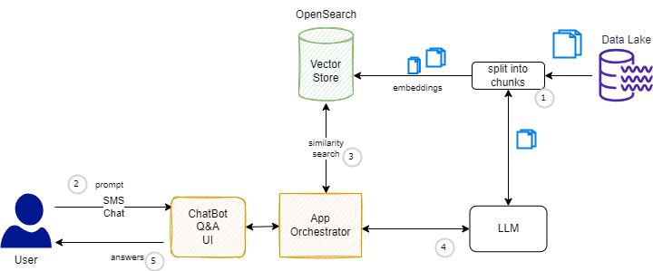
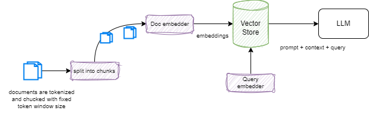

# Retrieval augmented generation (RAG)

RAG is the act of supplementing generative text models with data outside of what it was trained on. This is applied to businesses who want to include proprietary information which was not previously used in a foundation model training set but does have the ability to search. Technical documentation which is not public is a good example of the usage of RAG. RAG also helps reducing hallucinations.

The following diagram illustrates a classical RAG architecture.

1. Before being able to answer any user's questions, the documents must be processed and a stored in a document store index using the following process:

    * Load the documents from the sources (object storage).
    * Process and split them into smaller chunks.
    * Create a numerical vector representation of each chunk using Embeddings model.
    * Create an index using the chunks and the corresponding embeddings.

1. The user ask queries, with a prompt via a Q&A or Chat interface.
1. An application orchestrator uses the retriever to do a semantic search in the vector database, and build a context. 
1. Context, query, prompt are sent to the model, to get generated answer.
1. Answer is sent back to the user.

## Scoping discovery

Before doing an efficient RAG implementation, we need to address a set of important questions:

* How to chunk the documents?
* How to encode the chunks?
* When to retrieve? How and what to retrieve?
* How to encode query?
* What pre-processing is needed before calling the model API?
* How to prompt?
* How to post process the answer?
* How to learn?
* How to scale?
* What to optimize this entire system?
* Do we need fine tuning and existing model?

### Training and test time

There are really two different scopes to consider. Training time includes addressing how to update model, how to update document encoder, and query encoder. Do we need to pre-train from zero or leverage an existing model. 

For testing the model phase, we need to address what index to use, may it be different than during training? How to combine the different models to work together to address the business requirements.

### Frozen RAG

This is the Retrieval augmented generation with no training. Data are in context only. The prompt drives the LLM to maximize the in-context learning performance.

The result of the search is pass to the LLM as context. This is very limited to in-context learning. 

### Retrievers

The retrieval is very important. The main concept is using the TF-IDF measure: it is a parse (most words never occur) retrieval approach using to compute a cost function for a query within a document, based on the term-frequency (TF) and the [inverse document frequency (IDF)](https://en.wikipedia.org/wiki/Tf%E2%80%93idf) which measures the importance of a word to a document. 

[Dense retrieval](https://arxiv.org/abs/2004.04906) brings semantic similarity (cosinus score between embeddings) on a dense representations of words and documents by pre-training the retriever with relevant information. 

### Vector Database

The first vector databases were based on [FAISS](https://github.com/facebookresearch/faiss), a library for efficient similarity search and clustering of dense vectors.

## Langchain example

For a classical RAG using LangChain:

RAG produces great quality result, due to augmenting use-case specific context coming directly from vectorized information stores. It has the highest degree of flexibility when it comes to changes in the architecture. We can change the embedding model, vector store and LLM independently with minimal to moderate impact on other components.

Training from scratch produces the highest quality result amongst Prompt, RAG, fine tuning, but cost far more and need deep data science skill set.

[See hands-on with LangChain](../coding/langchain.md/#retrieval-augmented-generation).