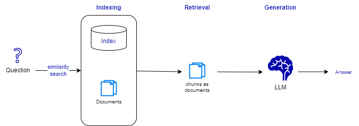
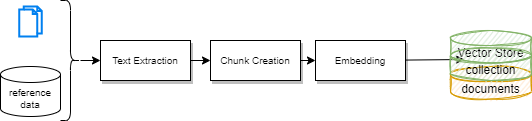

# Retrieval Augmented Generation (RAG)

## What is covered in this section


LLMs have a knowledge cut-off time, where data coming after are not known by the model.  Pre-training is a one-off exercise. When enterprises need to get their private knowledge integrated to LLM, they can do fine tuning or present semantic search results as part of the input context window. RAG addresses this problem as it is the act of supplementing generative text models with data outside of what it was trained on. 


While model increases in token pre-training size, they also increase the size of the context window. When the context window is big enough, application can send more contextual data, that leads to better results. RAG is the technique to add information to this context window to get better results. RAG  helps reducing hallucinations.

## Basic architecture

The Retrieval Augmented Generation may be seen as a three stages process:



1. **Indexing** a batch processing to ingest documents and data from a source and indexing them. During processing semantic search is used to retrieve relevant documents from the index. Indexing supports loading the documents, splitting large documents into smaller chunks. Chunks help to stay within the LLM's context window. Indexing includes storage of the documents and index of the splits.

  * [Simple indexing code from a blog content](https://github.com/jbcodeforce/ML-studies/blob/7a9d7b86fac629e01ad65bc390b2c7e83d019da5/llm-langchain/openAI/build_agent_domain_rag.py#L17-L43) using LangChain RecursiveCharacterTextSplitter and Chroma DB for vector store and retriever.

1. **Retrieval**: retrieves the relevant data (splits) from the index, then passes that to the model as part of the context.
1. **Generation**: generate the response in plain natural language.

This process is supported by tools for documents ingestion, splitting, embedding, indexing, retrieval and integration with the real time conversation flow. From the simple query text  the process needs to do query construction, translation, and LLM calling. The following diagram illustrates a classical a natural conversation application with RAG architecture:


1. The user ask queries via a Q&A or Chat user interface. The query may be decomposed and also embedded. 
1. An application orchestrator uses the retriever to do a **semantic search** into the vector database, and build a context. 

    ```python
    retriever = vectorstore.as_retriever(search_type="similarity", search_kwargs={"k": 6})
    retrieved_docs = retriever.invoke("What are the approaches to Task Decomposition?")

    ```

1. Context, query, system prompt are sent to the model, to get the generated text. For this step there are two approaches: sequential where text generation follows retrievals, or parallel processing where retrievals and text generations are done in parallel and then intertwined. 

    ```python
      # with a langchain that use the context variable as defined within the Prompt to pass the retrieved documents:
    rag_chain = (
      {"context": retriever, "question": RunnablePassthrough()}
      | prompt
      | llm
      | StrOutputParser()
    )
    ```

1. Response is sent back to the user.


RAG systems work well because LLMs has the in-context learning capability, which allows models to use previously unseen data to perform accurate predictions without weight training.

??? practice "Domain specific vector store"
    The presence of mixed-domain data in the same vector store can introduce noise and potentially degrade performance.
    Isolating vector stores for each domain can help maintain domain-specific information and improve model accuracy within individual domains

???- Info "In-context learning"
    Traditional machine learning models are typically trained on fixed datasets and do not adapt well to new data or tasks without retraining from scratch. With NLP in-context learning involves continually updating the model as new data becomes available. The techniques include online learning, transfer learning, fine-tuning, or using memory-based architectures.

## Embeddings

Embeddings are the numerical representation of the document chunks, and should help to represent sematic concepts. They are used to create the index, and to compare the query with the document chunks. 

The vector numbers intend to capture the attributes of the object. Dense embeddings were introduced by Google’s **word2vec** (Mikolov et al) in 2014. The transformation of word to vector, gives the capability to compute arithmetics with words, like **similarity** computation. Vectors which are closer together, mean they represent semantically similar concepts. With embeddings, we are representing things in a high-dimensional space (dimensions are the count of numbers a vector has), and we are giving each element a place and direction in space. See [this basic code](https://github.com/jbcodeforce/ML-studies/blob/master/llm-langchain/RAG/embeddings_hf.py) which uses `SentenceTransformer all-MiniLM-L6-v2` model to encode sentences of 100 tokens, construct from a markdown file.

Embeddings are created using a pre-trained LLM, and the documents are used to fine-tune the LLM. The fine-tuning process is done using a small subset of the documents, and the LLM is trained to predict the next word in the document. 

The fine-tuned LLM is then used to generate the embeddings. The embedding size is usually between 200 to 1000 dimensions. 

The embedding process is time consuming, and may take several days to complete. The embedding model is usually saved and re-used, and most of the time in open access. 

Embeddings are used to compare the query with the document chunks. The cosine similarity is used to compute the similarity between the query and the document chunks. 

The cosine similarity is a measure of the similarity between two non-zero vectors of an inner product space. It is defined to equal the cosine of the angle between them, which is also the same as the inner product of the same vectors normalized to both have length 1. 


## RAG assessment scoping questions

Before doing an efficient RAG implementation, we need to address a set of important questions:

* Who is the end user? External user, clients of the enterprise may have an incredible power to impact the brand. 
* What is the source of the documentation? What are the current data pipelines in place for each data sources, what are the touch points and security boundaries in place?
* Is there any structured data sources we need to consider for the search?
* How often the documentation change over time? Is there any governance in place to manage documents quality?
* How to extract relevant information from the document? Is there any PII in any document that may breach?
* How to avoid ingestion of malicious content into the knowledge corpus? Who can access what?
* How does the content look like in the document to determine chunk size and overlap?
* When to retrieve? How and what to retrieve?
* What are the expected set of most asked questions on the current corpus?
* How to post process the answer?
* How to learn new information?
* What to optimize in this entire system?
* How to handle queries outside of the domain? This may lead to adopt a domain specific LLM and combined with a generalized LLM.
* How the deployment will occur? Self-hosted, using API-based LLM? What is the expected latency supported? What cost is expected?
* Is there any compliances and regulations to follow?

The above questions should help to address:

* Can RAG give good answers?
* Do we need to fine tuning an existing model?

Training time includes addressing how to update LLM, how to update the document encoder, and the query encoder. Some major questions to address are: Do we need to pre-train from zero or leverage an existing model? What data quality do we have? how far the indexing data will be from the future query data. 

## Zoom to the RAG process

### Document Pipeline

The RAG preparation is a very important part of the process to ensure good retrieval results.

{ width=600 }

* **Text extraction** is employed to isolate relevant textual information and remove any noise. Document content is used for keyword or similarity search in any RAG apps. In a document, some elements are important for RAG preparation: the title, narrative text, list item, table, image, but also element metadata like filename, type, page number and section. It is the most expensive task in the RAG process.

* **Chunk creation** is to segment text into smaller chunks or sections. This step is essential for efficient retrieval and processing. Chunk size is important to keep the context and some sort of semantic, while overlapping between chunks will help to create vector that are still close while the text section is bigger than the chunk size. Tuning chunk parameters is balancing between preserving context and keeping accuracy. Sophisticated sentence segmentation techniques can be used. Some references are [SBERT](https://www.sbert.net/) and HuggingFace [SentenceTransformer](https://www.philschmid.de/optimize-sentence-transformers).

The two other components are already described. 

Document processing is hard because of the different document type (HTML, PDF, Doc, Markdown, Tex...) and structure. It is better to use template and structure to facilitate content extraction. Extracting metadata requires understanding of the document structure. For pdf, advanced solution mix OCR and neural network.

For short sentence smaller than 256 chars, the all sentence can be used as chunk. For bigger text section, the embedding used may have some better results with chunks from 256 to 512 tokens. The bigger the size of the chunk, the higher the risk of hallucination. While too short, will miss the meaning. The word embedding introduced with Word2Vec or Bert has still given good results but with a lot of computation.

One chunk strategy is to construct chunk from document elements: the document is broken down into atomic elements, which are combined into chunk until reaching a token threshold. Align the chunking break condition to the structure of the document: per section, new title...

* The [Unstructured.io API Services](https://unstructured-io.github.io/unstructured/api.html) with a python library can be used for ingesting and digesting unstructured documents of various type (See also deeplearning.ai tutorial).

???- info "Extract from pdf"
    There are different techniques to get content from unstructured file like a pdf. The first is to use object detection to draw and label bounding boxes around the layout elements on a document image (Document Layout Detection). OCR is used to extract text from bounding box. Some pdf as text the extraction can be done without OCR. The second technique use vision transformers.

### Vector Store

The vector store is a database used to store the document chunks and the corresponding embeddings. It is used by the retriever to search for the document chunks related to the query. The first vector databases were based on [FAISS](https://github.com/facebookresearch/faiss), a library for efficient similarity search and clustering of dense vectors.

The vector store can be implemented using different databases such as:

* [Elasticsearch](https://www.elastic.co/).
* [Faiss](https://github.com/facebookresearch/faiss).
* [Annoy](https://github.com/spotify/annoy).
* [HNSW](https://github.com/nmslib/hnswlib).
* [ChromaDB](https://docs.trychroma.com/embeddings)

The vector store is usually implemented using a distributed database to improve the performance of the retrieval process. 

### Frozen RAG

This is the Retrieval augmented generation with no training. Data are in context only. The prompt drives the LLM to maximize the in-context learning performance. The selection of the right data chunk and the correct embedding model are crucial.


The result of the search is pass to the LLM as context. This is limited to in-context learning. 

### Retrievers

RAG architecture is based by the retrieval method used, such as BM25 (a traditional one) or more advanced dense retrievers which use neural network based embeddings.

The main concept is using the TF-IDF measure: it is a parse (most words never occur) retrieval approach using to compute a cost function for a query within a document, based on the term-frequency (TF) and the [inverse document frequency (IDF)](https://en.wikipedia.org/wiki/Tf%E2%80%93idf) which measures the importance of a word to a document. 

[Dense retrieval](https://arxiv.org/abs/2004.04906) brings semantic similarity (cosinus score between embeddings) on a dense representations of words and documents by pre-training the retriever with relevant information. 


#### Retriever considerations

* RAG models need to be fine-tuned to improve the retrieval and the generation processes. The fine tuning includes integrating the specific, domain knowledge to assess the quality of the retrieved information and the generated one.
* RAG processing needs to take into consideration the different configuration parameters to get good results with minimum latency: consider the number of documents to return, the size of the returned vectors, the total length of the text returned, then number of query to run in parallel. The retrieval vector size impacts the granularity of the semantic match between the query and the documents.
* Adding efficient metadata about the document (section or chunk) may help to implement an **Hybrid search** strategy which combines semantic search with filtering on metadata or search on keywords.
* In a multi-step question answering system, it is challenging to select the correct documents based on the question alone. [IRCoT](https://arxiv.org/abs/2212.10509) uses LLM to generate a thought sentence used to retrieve documents from the corpus. The documents are then added to the context and the prompt.
* Effective retrieval is fundamental in RAG system. Assessing the quality of the search results is not easy, and may combine similarity matrix and rule based systems. Different algorithms may be used like cosine similarity, multi query retrievers, ensemble retrievers.
* RAG may generate wrong results, so some quality control needs to be deployed to remove noise.
* RAG application design should address all the discovery questions and so use extensive planning, extensive testing using multi-scenario of user behavior and query. Use "what-if" simulations. Address hallucination prevention, privacy protection, and source quality control.
* Start small with all the guard rail in place.
* Using small LLM for embedding may lead to issues as some terms used in the knowledge based may not be part of the primary LLM corpus. If cost and skill are not an issue, then training its own LLM may be a better solution to reach higher quality, as even fine tuning a model may not bring enough quality to the responses.

#### Assessing the quality of RAG systems

Evaluating the performance of a RAG systems, brings its own challenges, specially the ability to retrieve relevant information. Traditional approach uses human annotations, or heuristic prompts. Annotations is time consuming and expensive, and subject to human biases.

Looking at the results, we can have too many matches, or not match at all because of loss of important information within the document which is relevant to the search. The user may want to get the most recent information which may not be the most semantically similar.

There are two new approaches to evaluate RAG, the Facts as a Function (FaaS) [Katranidis-Barany](https://arxiv.org/html/2403.03888v2) ot ARES (Automated Retrieval Augmented Generation Evaluation System)[](https://arxiv.org/html). With FaaS, a fact is a callable function using json objects, to improve the interpretability of the RAG evaluation.

ARES uses LLM to generate query-passage-answer triples and then fine-tuned LLM judges to assess the RAG. It leverages both human annotated data and LLM generated ones.

## Query transformations

Query transformations focus on re-writing and / or modifying questions for retrieval using LLM to create other related questions. The prompt declares to generate different version of the user's question. The goal is to try to address limitations of the distance-based similarity search. 

* *ith **multiple query** LLM returns 4 to 5 questions which are used to query the vector store via the retriever and then merge the returned documents by removing any duplicate, and send the merged documents to the LLM for generation using the context. 


See the code in [multiple_queries_rag.py](https://github.com/jbcodeforce/ML-studies/blob/7a9d7b86fac629e01ad65bc390b2c7e83d019da5/llm-langchain/openAI/multiple_queries_rag.py).


* With **Rag fusion** the approach is to apply merging logic using a function so developer can apply some filtering and heuristics:


And the related code in [rag_fusion.py](https://github.com/jbcodeforce/ML-studies/blob/7a9d7b86fac629e01ad65bc390b2c7e83d019da5/llm-langchain/openAI/rag_fusion.py).

* **Answer recursively** chain the Q&A and use the response of previous calls as part of the input context for the next question. The prompt looks like:

```python
template = """Here is the question you need to answer:
\n --- \n {question} \n --- \n
Here is any available background question + answer pairs:
\n --- \n {q_a_pairs} \n --- \n
Here is additional context relevant to the question: 
\n --- \n {context} \n --- \n
Use the above context and any background question + answer pairs to answer the question: \n {question}
"""
```

* **Answer individually** use LLM for each question and regroup the answers in the context for the original question. 


The question creation prompt is [rlm/rag-prompt](https://smith.langchain.com/hub/rlm/rag-prompt). The final prompt looks like:

```python
context = format_qa_pairs(questions, answers)
template = """Here is a set of Q+A pairs:

{context}

Use these to synthesize an answer to the question: {question}
"""
```

* With **Hypothetical Document Embedding (HyDE)** the first prompt create an hypothetical document using a prompt like:

```python
template = """Please write a scientific paper passage to answer the question
Question: {question}
Passage:""
```

See the related code in [rag_HyDE.py](https://github.com/jbcodeforce/ML-studies/blob/master/RAG/rag_HyDE.py).

## Query Routing

When we have multiple indexes for different domains, and for different questions we want to query different subsets of these indexes.  Query routing is the process of classifying which index or subset of indexes a query should be performed on. For that we use logical and semantic routing.


## Knowledge graph integration in RAG

From the standard RAG architecture, the pre-processing step may be modified by adding context to the query before it performs a retrieval from the vector database. This context may specify enterprise specific ontology and term definitions. Since years, Knowledge graphs (KG) are helping search engine to build acronym dictionaries.

???+ info "Knowledge Graph"
    *A Knowledge Graph is a set of data points connected by relations that describe a domain, for instance, a business, an organization, or a field of study.*

Question may be broken down into sub-questions and can require numerous documents to be provided to the LLM to generate an accurate answer.

For chunks selection, document hierarchies can be used to reference which documents the query needs to use. One KG with document hierarchy to chunks in the vector database.

Use contextual dictionary to understand which document chunks contain important topics. Natural language rules define how to search document related to the meaning of the query.

KG may help to add additional information that must exist in any answer referring to a specific concept that failed to be retrieved or did not exist in the vector database. This is the concept of **answer augmentation**. 

Rules may be used to eliminate repetition within the LLM results, and personalize response to the users.

An hypothetical sequence diagram for a RAG orchestrator enhanced by a knowledge graph, may look like:


Knowledge graph is easily extractable in a coherent form. 

## Sources of information

* [Read more from this medium article](https://medium.com/enterprise-rag/injecting-knowledge-graphs-in-different-rag-stages-a3cd1221f57b).

* [Pykg2vec- Python Library for KGE Methods](https://github.com/Sujit-O/pykg2vec)
* [Deeplearning.ai - Preprocessing Unstructured Data for LLM Applications](https://learn.deeplearning.ai/courses/preprocessing-unstructured-data-for-llm-application)

## LangChain examples

For a classical RAG using LangChain:


RAG produces great quality result, due to augmenting use-case specific context coming directly from vectorized information stores. It has the highest degree of flexibility when it comes to changes in the architecture. We can change the embedding model, vector store and LLM independently with minimal to moderate impact on other components.

Training from scratch produces the highest quality result amongst Prompt, RAG, fine tuning, but cost far more and need deep data science skill set.

[See hands-on with LangChain](../coding/langchain.md/#retrieval-augmented-generation).