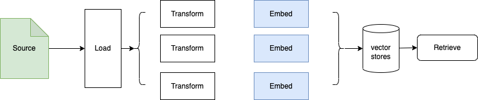

# Retrieval Augmented Generation (RAG)

## What is covered in this section

LLMs have a knowledge cut-off time, where data coming after are not known by the model.  Pre-training is a one-off exercise. When enterprises need to get their private knowledge integrated to LLM, they can do fine tuning or present semantic search results as part of the input context window. RAG addresses this problem as it is the act of supplementing generative text models with data outside of what it was trained on. 

While model increases in token pre-training size, they also increase the size of the context window. When the context window is big enough, application can send more contextual data, that leads to better results.

RAG  helps reducing hallucinations.

## Basic architecture

he Retrieval Augmented Generation may be seen as a three stages process:

This process is supported by tools that support documents ingestion, splitting, embedding, indexing, retrieval and integration in the real time conversation components, which needs to support query construction, translation, and LLM calling. The following diagram illustrates a classical RAG architecture:

1. Before being able to answer any user's questions, the documents must be processed and stored in a vector store index using the following process:

    * Load the documents from the sources (object storage).
    * Process and split them into smaller chunks.
    * Create a numerical vector representation of each chunk using **Embeddings**.
    * Create an index using the chunks and the corresponding embeddings.

1. The user ask queries via a Q&A or Chat user interface.
1. An application orchestrator uses the retriever to do a **semantic search** into the vector database, and build a context. 
1. Context, query, system prompt are sent to the model, to get the generated text. For this step there are two approaches: sequential where text generation follows retrievals, or parallel processing where retrievals and text generations are done in parallel and then intertwined. 
1. Response is sent back to the user.

???- Info "Embeddings"
    **Embeddings** are vectors of numbers that represent an underlying concept. The numbers intend to capture the attributes of the object. Dense embeddings were introduced by Google’s **word2vec** (Mikolov et al) in 2014. This transformation of word to vector, gives the capability to compute arithmetics with words, like **similarity** computation. Vectors that are closer together mean they represent semantically similar concepts. With embeddings, we are representing things in a high-dimensional space (dimensions are the count of numbers a vector has), and we are giving each element a place and direction in space.

RAG systems work well because LLMs has the in-context learning capability, which allows models to use previously unseen data to perform accurate predictions without weight training.

???- Info "In-context learning"

## RAG assessment scoping questions

Before doing an efficient RAG implementation, we need to address a set of important questions:

* Who is the end user? External user, clients of the enterprise may have an incredible power to impact the brand. 
* What is the source of the documentation? What are the current data pipelines in place for each data sources, what are the touch points and security boundaries in place?
* How often the documentation change over time? Is there any governance in place to manage documents quality?
* How to extract relevant information from the document? Is there any PII in any document that may breach?
* How to avoid ingestion of malicious content into the knowledge corpus? Who can access what?
* How to chunk the documents?
* How to encode the chunks?
* When to retrieve? How and what to retrieve?
* How to encode query?
* What pre-processing is needed before calling the model API?
* How to prompt?
* How to post process the answer?
* How to learn new information?
* How to scale?
* What to optimize this entire system?
* Do we need fine tuning and existing model?
* How to handle queries outside of the domain? This may lead to adopt a domain specific LLM and combined with a generalized LLM.
* How the deployment will occur? Self-hosted, using API-based LLM? What is the expected latency supported? What cost is expected?
* Is there any compliances and regulations to follow?

### Training and test time

There are really two different scopes to consider. Training time includes addressing how to update model, how to update the document encoder, and the query encoder. Do we need to pre-train from zero or leverage an existing model? 

For testing the model phase, we need to address what index to use, may it be different than during training? How to combine the different models to work together to address the business requirements?

### Frozen RAG

This is the Retrieval augmented generation with no training. Data are in context only. The prompt drives the LLM to maximize the in-context learning performance.

The result of the search is pass to the LLM as context. This is limited to in-context learning. 

### Retrievers

RAG architecture is based by the retrieval method used, such as BM25 (a traditional one) or more advanced dense retrievers which use neural network based embeddings.

The main concept is using the TF-IDF measure: it is a parse (most words never occur) retrieval approach using to compute a cost function for a query within a document, based on the term-frequency (TF) and the [inverse document frequency (IDF)](https://en.wikipedia.org/wiki/Tf%E2%80%93idf) which measures the importance of a word to a document. 

[Dense retrieval](https://arxiv.org/abs/2004.04906) brings semantic similarity (cosinus score between embeddings) on a dense representations of words and documents by pre-training the retriever with relevant information. 

The generative part of RAG usually uses transformer based models like GPT2 or 3.

#### Retriever considerations

* RAG models need to be fine-tuned to improve the retrieval and the generation processes. The fine tuning includes integrating the specific, domain knowledge to assess the quality of the retrieved information and the generated one.
* RAG processing needs to take into considearation the different configuration parameters to get good results with minimum latency: consider the number of documents to return, the size of the returned vectors, the total length of the text returned, then number of queries run in parallel. The retrieval vector size impacts th granularity of the semantic match between the query and the documents.
* In a multi-step question answering system, it is challenging to select the correct documents based on the question alone. [IRCoT](https://arxiv.org/abs/2212.10509) uses LLM to generate a thought sentence used to retrieve documents from the corpus. The documents are then added to the context and prompt.
* Effective retrieval is fundamental in RAG system. Assessing the quality of the search results is not easy, and may combine similarity matrix and rule based systems. Different alogrithms may be used like cosine similarity, multi query retrievers, ensemble retrievers.
* RAG may generate wrong results, so some quality control needs to be deployed to remove noise.
* RAG application design should address all the discovery questions and so use extensive planning, extensive testing using multi-scenario of user behavior and query. Use "what-if" simulations. Address hallucination prevention, privacy protection, and source quality control.
* Start small with all the guard rail in place.
* Using small LLM for embedding may lead to issues as some terms used in the knowledge based may not be part of the primary LLM corpus. If cost and skill are not an issue, then training its own LLM may be a better solution to reach higher quality, as even fine tuning a model may not bring enough quality to the responses.

#### Assessing the quality of RAG systems

Evaluating the performance of a RAG systems, brings its own challenges, specially the ability to retrieve relevant information. Traditional approach uses human annotations, or heuristic prompts. Annotations is time consuming and expensive, and subject to human biases.

There are two new approaches to evaluate RAG, the Facts as a Function (FaaS) [Katranidis-Barany](https://arxiv.org/html/2403.03888v2) ot ARES (Automated Retrieval Augmented Generation Evaluation System). With FaaS, a fact is a callable funtion using json objects, to improve the interpretability of the RAG evaluation.

ARES uses LLM to generate query-passage-answer triples and then fine-tuned LLM judges to assess the RAG. It leverages both human annotated data and LLM generated ones.

### Vector Database

The first vector databases were based on [FAISS](https://github.com/facebookresearch/faiss), a library for efficient similarity search and clustering of dense vectors.

## Knowledge graph integration in RAG

From the standard RAG architecture, the pre-processing step may be modified by adding context to the query before it performs a retrieval from the vector database. This context may specify enterprise specific ontology and term definitions. Since years, Knowledge graphs (KG) are helping search engine to build acronym dictionaries.

???+ info "Knowledge Graph"
    *A Knowledge Graph is a set of data points connected by relations that describe a domain, for instance, a business, an organization, or a field of study.*

Question may be broken down into sub-questions and can require numerous documents to be provided to the LLM to generate an accurate answer.

For chunks selection, document hierarchies can be used to reference which documents the query needs to use. One KG with document hierarchy to chunks in the vector database.

Use contextual dictionary to understand which document chunks contain important topics. Natural language rules define how to search document related to the meaning of the query.

KG may help to add additional information that must exist in any answer referring to a specific concept that failed to be retrieved or did not exist in the vector database. This is the concept of **answer augmentation**. 

Rules may be used to eliminate repetition within the LLM results, and personalize response to the users.

An hypothetical sequence diagram for a RAG orchestrator enhanced by a knowledge graph, may look like:

Knowledge graph is easily extractable in a coherent form. 

## Sources of information

* [Read more from this medium article](https://medium.com/enterprise-rag/injecting-knowledge-graphs-in-different-rag-stages-a3cd1221f57b).

* [Pykg2vec- Python Library for KGE Methods](https://github.com/Sujit-O/pykg2vec)

## LangChain examples

For a classical RAG using LangChain:

RAG produces great quality result, due to augmenting use-case specific context coming directly from vectorized information stores. It has the highest degree of flexibility when it comes to changes in the architecture. We can change the embedding model, vector store and LLM independently with minimal to moderate impact on other components.

Training from scratch produces the highest quality result amongst Prompt, RAG, fine tuning, but cost far more and need deep data science skill set.

[See hands-on with LangChain](../coding/langchain.md/#retrieval-augmented-generation).