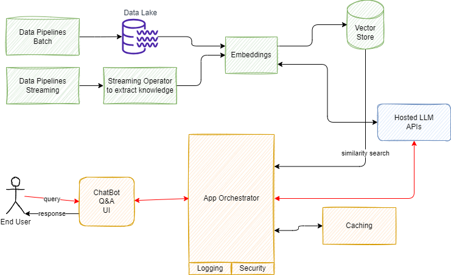

<<<<<<< HEAD

# Reference Architecture for LLM solution

Developing and serving custom LLMs require a lot of work around managing infrastructure, data, models, pipelines, prompts, context windows, application states, observability, embeddings, storage mechanisms, caching and augmented generation. 

## Application integration with LLM

This section present a generic reference architecture as defined by [A16Z](https://a16z.com/emerging-architectures-for-llm-applications) for a LLM solution.  I extended their architecture with event streaming as a source of data and knowledge:

1. **Data pipelines** are batch processing, which in the context of LLM, may combine unstructured documents with structured CSVs, Json, or SQL table content. This data processing may be done in a map-reduce platform, like Apache Spark, to perform the Extract Transform Load job. Most of existing pipelines land their output to Data Lake. But modern data pipelines may call directly a LLM to build embeddings and save them into a Vector Store. The flow looks like in the figure below, which is based on classical Retrieval Augmented Generation (RAG) process.

    

    RAG retrieves data from outside the language model (non-parametric) and augments the prompts by adding the relevant retrieved data in context.

1. **Streaming** is where connection to event-driven architecture lands: a lot of business services / microservices are generating important events to be part of the future context of the end-user interaction with the application. Those events can be aggregated, and a similar pipeline can be done with streaming application, consuming events, and doing the embedding via LLM calls then push to Vector Store.
1. **Embeddings** is the technique to create a numerical vector representation of each document chunks. To support embeddings creation, there are a set of open-source solutions, like the [Sentence Transformers library from Hugging Face](https://huggingface.co/sentence-transformers), or proprietary solutions using hosted APIs.
1. **Vector Store**, persits vectors, a numerical representation of NL sentence, with indexing capability and similarity search function. Multiple solutions exist as Vector Store: [Faiss](https://faiss.ai/index.html), [ChromaDB](https://www.trychroma.com/), [AWS OpenSearch](https://docs.aws.amazon.com/opensearch-service/latest/developerguide/what-is.html), Redis, Kendra, OpenSearch Serverless, RDS for PostgreSQL, Aurora PostgreSQL, Pinecone.
1. **Hosted LLM** is a model serving service with LLM accessed via API. 
1. **Orchestrator** is the solution code, which connects all those components together. It may use session caching in distributed, cloud based environment, uses Vector Store to do silimarity semantic search, and exposes API to be used by a ChatBot or a Q&A user interface.

=======

# Reference Architecture for LLM solution

Developing and serving custom LLMs require a lot of work around managing infrastructure, data, models, pipelines, prompts, context windows, application states, observability, embeddings, storage mechanisms, caching and augmented generation. 

## Application integration with LLM

This section present a generic reference architecture as defined by [A16Z](https://a16z.com/emerging-architectures-for-llm-applications) for a LLM solution.  I extended their architecture with event streaming as a source of data and knowledge:

1. **Data pipelines** are batch processing, which in the context of LLM, may combine unstructured documents with structured CSVs, Json, or SQL table content. This data processing may be done in a map-reduce platform, like Apache Spark, to perform the Extract Transform Load job. Most of existing pipelines land their output to Data Lake. But modern data pipelines may call directly a LLM to build embeddings and save them into a Vector Store. The flow looks like in the figure below, which is based on classical Retrieval Augmented Generation (RAG) process.

    

    RAG retrieves data from outside the language model (non-parametric) and augments the prompts by adding the relevant retrieved data in context.

1. **Streaming** is where connection to event-driven architecture lands: a lot of business services / microservices are generating important events to be part of the future context of the end-user interaction with the application. Those events can be aggregated, and a similar pipeline can be done with streaming application, consuming events, and doing the embedding via LLM calls then push to Vector Store.
1. **Embeddings** is the technique to create a numerical vector representation of each document chunks. To support embeddings creation, there are a set of open-source solutions, like the [Sentence Transformers library from Hugging Face](https://huggingface.co/sentence-transformers), or proprietary solutions using hosted APIs.
1. **Vector Store**, persits vectors, a numerical representation of NL sentence, with indexing capability and similarity search function. Multiple solutions exist as Vector Store: [Faiss](https://faiss.ai/index.html), [ChromaDB](https://www.trychroma.com/), [AWS OpenSearch](https://docs.aws.amazon.com/opensearch-service/latest/developerguide/what-is.html), Redis, Kendra, OpenSearch Serverless, RDS for PostgreSQL, Aurora PostgreSQL, Pinecone.
1. **Hosted LLM** is a model serving service with LLM accessed via API. 
1. **Orchestrator** is the solution code, which connects all those components together. It may use session caching in distributed, cloud based environment, uses Vector Store to do silimarity semantic search, and exposes API to be used by a ChatBot or a Q&A user interface.

>>>>>>> 0d6401c17707d5173c4bc1b6e287c4b1ac9c4f0f
## LLM training architecture