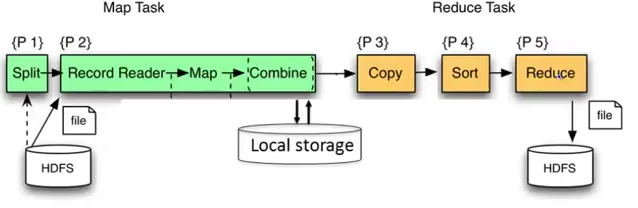
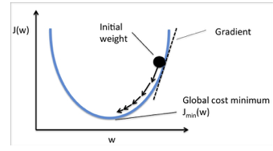
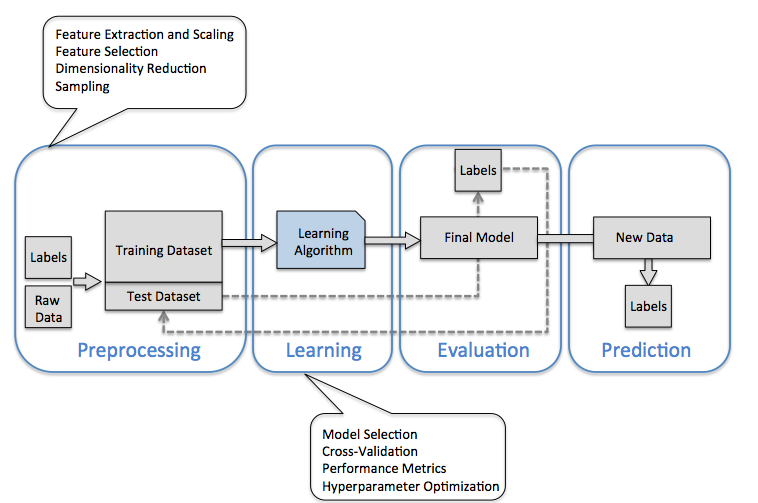

# Machine learning studies

This repository includes different code to help me learn how to do machine learning with Python and jupyter notebook, and summary of
the different books and web site I studied over time.

Content is based of the folloewing different sources like:

* [Python Machine learning - Sebastian Raschka's book](https://www.amazon.com/Python-Machine-Learning-Sebastian-Raschka/dp/1783555130/ref=asc_df_1783555130/?tag=hyprod-20&linkCode=df0&hvadid=312140868236&hvpos=1o7&hvnetw=g&hvrand=12056535591325453294&hvpone=&hvptwo=&hvqmt=&hvdev=c&hvdvcmdl=&hvlocint=&hvlocphy=9032152&hvtargid=pla-406163981473&psc=1)
* [Collective intelligence - Toby Segaran's book](https://www.amazon.com/Programming-Collective-Intelligence-Building-Applications/dp/0596529325/ref=sr_1_2?crid=1UBVCJKMM17Q6&keywords=collective+intelligence&qid=1553021611&s=books&sprefix=collective+inte%2Cstripbooks%2C236&sr=1-2)
* [Stanford Machine learning training - Andrew Ng](https://www.coursera.org/learn/machine-learning)
* Intel ML 101 tutorial
* Kaggle
* Introduction to Data Sciences - University of Washington


## Data Science major concepts

There are three types of tasks of data scientist do: 

* preparing data to run a model (gathering, cleaning, integrating, transforming, filtering, combining, extracting, shaping...)
* running the model, tuning it and assessing its quality
* communicate the results

Enterprises are using data as an important assets to derive empirical dicisions and for that they are 
adopting big data which means high volume, high variety and high velocity.

In most enterprise data are about customers and come from different sources like click stream, shopping cart, sensors,...

### Analytics

The concept of statistical inference is to draw conclusions about a population from sample data using one of the two key methods:
 hypothesis tests and confidence intervals.

But the truth wears off: previous analysis done on statistical data are less true overtime. Analytics need to be a continuous processing.

* **Hypothesis test**:  compare an experimental group to a control group. There are two types of result:

    * H0 for null hypothesis: this happens when there is no difference between the groups
    * Ha for alternative Hypothesis: happens when there is statistically significant difference between the groups

 the bigger the number of case (named study size) the more statistical power you have, and better you are to get better results.

We do not know the difference in two treatments is not just due to chance. But we can calculate the odds that it is. Which is named the **p-value**.

Statistics does not apply well to large-scale inference problem that big data brings. Big data is giving more spurious results than small data set.
The curse of big data is the fact that when you search for patterns in very, very large data sets with billions or trillions 
of data points and thousands of metrics, you are bound to identify coincidences that have no predictive power.

### Map - reduce

One of the classical approach to run analytics on big data is to use the map-reduce algorithm, which can be summarized as:

- split the dataset into chunks and process each chunk on a different computer: chunk is typically 64Mb
- each chunk is replicated several times on different racks for fault tolerance
- when processing a huge dataset the first processing step is to read from distributed file system and to split data into chunk files
- then a record reader read records from file, then runs the map function which is customized for each different problem to solve
- the combine operation: identify key, value with the same key and apply a combine function which should be associative and commutative
- the output of map function are saved to local storage, then reduce task pulls the record per key from the local storage to sort the value and then call the last custom function: reduce

 

- system architecture is based on shared nothing, in opposite of sharing file system or sharing memory
- massive parallelism on thousand of computers where jobs run for many hours. The % of failure of such job is high, 
so the algorithm should tolerate failure
- For a given server a mean time between failure is 1 year then for 10000 servers, we have a likelihood of failure around one failure / hour
- Distributed FS: very large files TB and PB. Different implementations: Google FS or Hadoop DFS

Hadoop used to be the map-reduce platform, now Apache Spark is used for that or Apache Flink.

## Machine learning

Machine learning is a system that automatically learns programs/ functions from data. There is not programming step. The goal is to find a function to predict **y** from **x**,
 and continuously measures the prediction performance.

Statistics works on data by applying a model of the world or stochastic models of nature, using linear regression, logistic regression, cox model,... 

Two types of machine learning algorithm:

* **Supervised learning**: Supervised because we give to the algorithm a dataset with a right answers  (y). It is used for 
**regression** classification problem when the goal is to predict **continuous value** output, or 
**classification** problem is when we are trying to predict one of a small number of discrete-valued outputs,
 such as whether it is Sunny (which we might designate as class 0), Cloudy (say class 1) or Rainy (class 2). 
Another example is when a human assigns a topic label to each document in a corpus, and the algorithm learns how 
to predict the label. The output is always a set of sets of items. Items could be points in a space or vertices in a graph

* **Unsupervised learning:** Giving a dataset we are able to explore the structure of our data to extract meaningful 
information without the guidance of a known outcome variable or reward function. **Clustering** is an exploratory
 data analysis technique that allows us to organize a pile of information into meaningful subgroups (clusters) 
 without having any prior knowledge of their group memberships

Three majors components to have for machine learning:

* **representation**: define what is the classifier: a rule, a decision tree, a neural network...
* **evaluation**: how to know if a given classifier is good or bad: how to assess rule result. 
Could be the `# of errors` on some test set, `# of recalls`, squared error, likelihood?... 
We may compute the coverage of a rule: `# of data points` that satisfy the conditions and 
the `accuracy = # of correct predictions / coverage`
* **optimization**: how to search among all the alternatives, greedy search or gradient descent? 
One idea is to build a set of rules by finding the conditions that maximize accuracy.

When you have a dataset try to humanly inspect the data, and do some plotting diagram with some attribute over other.
Then to select a naive class, look at attribute where you can derive some basic rules. This will build a first hypothesis.
To assess an hypothesis build a **confusion matrix**: a square matrix where column and rows are the different class label of an outcome.
The cells count the number of time the rules classified the dataset. And assess the **accuracy** number: sum good results/ total results.

With **reinforcement learning**: the goal is to develop a system (agent) that improves its performance 
based on interactions with the environment. The agent can then use reinforcement learning to learn a series 
of actions that maximizes this reward via an exploratory trial-and-error approach or deliberative planning.  

**Unsupervised dimensionality reduction** is a commonly used approach in feature preprocessing to remove noise 
from data, which can also degrade the predictive performance of certain algorithms, and compress the data onto 
a smaller dimensional subspace while retaining most of the relevant information.

### Model Representation

The notation used:

```
m= # of training examples
X= input variables or features
y= output or target
(x(i),y(i)) for the ith training example
```
When the number of features is more than one the problem becomes a linear regression.

Training set is the input to learning algorithm, from which we generate an hypothesis that will be used to map from x to y.

In **regression analysis**, we are given a number of predictor (explanatory) variables and a continuous response variable (outcome),
 and we try to find a relationship between those variables that allows us to predict an outcome. 

Hypothesis function h can be represented as a linear function of x;  

=\sum_{i} \theta_{i} * x_{i}= \theta^{T}*x)

Xo = 1 so a feature is a vector and T is also a row vector of dimension n+1 so H is a matrix multiplication. 
It is called *multivariate linear regression*.

To find the good coefficients , the algorithm needs to compare the results H(x) using a cost function:

  = \frac{1}{2m} \sum_{1}^{m}(h_{\theta} (x_{i}) - y_{i})^2)

The algorithm to minimize the cost function is called the **gradient descent**, and uses the property of the cost function 
being continuous convex linear, so differentiable:

 

The principle is to climb down a hill until a local or global cost minimum is reached. In each algorithm iteration, 
we take a step away from the gradient where the step size is determined by the value of the **learning rate** (alpha) as well as 
the slope of the gradient.

When J(Ti) is already at the local minimum the slope of the tangent is 0 so Tj will not change.
When going closer to the local minimum the slope of the tangent will go slower so the algo will automatically take smaller step.
If alpha is too big, gradient  descent can overshoot the minimum and fail to converge or worse it could diverge.
The derivative is the slope of the tangent at the curve on point Tj. When derivative is close to zero, it means we reach a minima.

When the unit of each feature are very different the gradient descent will take a lot of time to find the minima. 
So it is important to transform each feature so they are in the same scale. (close to: from -1 to 1 range)

### Building a machine learning system

To building a machine learning system, we need to use four components as outlined in figure below:



Raw data rarely comes in the form and shape that is necessary for the optimal performance of a learning algorithm. 
Thus, the preprocessing of the data is one of the most crucial steps in any machine learning application. 
Many machine learning algorithms also require that the selected features are on the same scale for optimal performance,
 which is often achieved by transforming the features in the range [0, 1] or a standard normal distribution with zero mean
  and the unit variance.

Some of the selected features may be highly correlated and therefore redundant to a certain degree. 
In those cases, **dimensionality reduction** techniques are useful for compressing the features onto a lower 
dimensional subspace.

Reducing the dimensionality of the feature space has the advantage that less storage space is required, 
and the learning algorithm can run much faster.

To determine whether a machine learning algorithm not only performs well on the training set but also generalizes 
well to new data, we need to **randomly divide** the dataset into a separate **training** and **test** sets.

In practice, it is essential to compare at least a handful of different algorithms in order to train and select 
the best performing model. 

First we have to decide upon a metric to measure performance. One commonly used metric is classification accuracy,
 which is defined as the proportion of correctly classified instances.

After selecting a model that has been fitted on the training dataset, we can use the test dataset to estimate how
 well it performs on this unseen data to estimate the generalization error.

## Coding

### Environment

To avoid impacting my laptop (Mac) python installation, I use docker image with python and all the minimum needed library. 
The dockerfile is in this folder is used to build a development image.
As an alternate Kaggle has a more complete [docker image](https://github.com/Kaggle/docker-python) to start with. 

```sh
# CPU based
docker run --rm -v $(pwd):/home -it gcr.io/kaggle-images/python /bin/bash
# GPU based
docker run -v $(pwd):/home --runtime nvidia --rm -it gcr.io/kaggle-gpu-images/python /bin/bash
```

As some of the python codes are using matplotlib and graphics, it is possible to use the MAC display 
with docker and X11 display (see [this blog](https://cntnr.io/running-guis-with-docker-on-mac-os-x-a14df6a76efc)) for details.

* Install XQuartz with `brew install xquartz`. Then start Xquartz from the application or using: `open -a Xquartz`. A white terminal window will pop up. The first time Xquartz is started, open up the preferences menu and go to the security tab. Then select “allow connections from network clients” to check it on.
* Build environment images: `docker build -t jbcodeforce/python37 .`

#### Run my python development shell

When using graphic: start **Xquartz** from (applications/utilities), be sure the security settings allow connections from network clients.

Then run the following command to open a two bi-directional streams between the docker container and the X window system of Xquartz.

```shell
$ source ./setDisplay.sh
$ socat TCP-LISTEN:6000,reuseaddr,fork UNIX-CLIENT:\"$DISPLAY\"
```

which is what the `socatStart.sh` script does.

Start a docker container with an active bash shell with the command:

```shell
./startPythonDocker.sh
```

Then navigate to the python code from the current `/home` folder, and call python

```
$ python deep-net-keras.py
```

### Classifiers

All the examples execute from the python environment in dockerr

#### Perceptron

Based on the human neuron model, Frank Rosenblatt proposed an algorithm that would 
automatically learn the optimal weight coefficients that are then multiplied with the input
 features in order to make the decision of whether a neuron fires or not. 
 In the context of supervised learning and classification, such an algorithm could then be
 used to predict if a sample belonged to one class or the other.
The problem is reduced to a binary classification (-1,1), and an activation function 
that takes a linear combination of input X, with corresponding weights vector W, 
to compute the net input z = sum(w(i) * x(i)) i from 1 to n
If the value is greater than a threshold the output is 1, -1 otherwise.
The function is called unit step function. 
If w0 is set to be -threshold and x0=1 then the equation becomes:

=\sum_{i} \theta_{i} * x_{i}= \theta^{T}*x)

The following python code uses numpy as np to compute the matrix dot product wT*x:

```python
def netInput(self,X):
     return np.dot(X,self.weights[1:]) + self.weights[0]
   
def predict(self,X):
   return np.where(self.netInput(X)>=0.0,1,-1)
```

The weights are computed using the training set. The value of weight delta, which is used to update the weight , is calculated by the perceptron learning rule:

= \eta*(y_{i} - mean(y_{i}))* x_{i}^j)

eta is the learning rate, Y(i) is the known answer or target for i th sample. The weight update is proportional to the value of X(i)
 
It is important to note that the convergence of the perceptron is only guaranteed if the two classes are linearly separable and the learning rate is sufficiently small.


The fit function implements the update to the weight.

Execute the python implementation with:

```sh
#under ml-python/classifiers folder
python TestPerceptron.py
```

#### Adaline

In ADALINE the weights are updated based on a linear activation function
(the identity function) rather than a unit step function like in the perceptron.


```sh
#under ml-python/classifiers folder
python TestAdaline.py
```

### Cost function

One of the key ingredients of supervised machine learning algorithms is to define an 
objective function that is to be optimized during the learning process. This objective 
function is often a cost function that we want to minimize. So the weights update will 
minimize the cost function. The cost function could be the sum squared errors between 
the outcomes and the target label:

=\frac{1}{2} * \sum_{i} (y_{i} - \phi (z_{i}))^2)

which translates in python as

```python
errors = (y - output)          
cost = (errors** 2).sum() / 2.0
```

and where 


in python:

```python
def netInput(self,X):
        # compute z = sum(x(i) * w(i)) for i from 1 to n, add the threshold
        return np.dot(X,self.weights[1:]) + self.weights[0]
```

The cost function is convex continuous linear and can be derived, so that we can use the gradient descent algorithm to find the local minima:

```python
def fit(self,X,y):
    self.weights=np.zeros(1+X.shape[1])
    self.costs=[]
    for _ in range(self.nbOfIteration):
        output = self.netInput(X)
        errors = (y - output)
      # calculate the gradient based on the whole training dataset. Use the matrix * vector 
        self.weights[1:] += self.eta * X.T.dot( errors)
        self.weights[0] += self.eta * errors.sum()
        cost = (errors**2).sum() / 2.0
        self.costs.append(cost)
    return self
```

The weight difference is computed as the negative gradient * the learning rate eta. To compute the gradient of the cost function, we need to compute the partial derivative of the cost function with respect to each weight w(j). 
So putting all together we have:

the weight update is calculated based on all samples in the training set (instead of updating the weights incrementally after each sample), which is why this approach is also referred to as "batch" gradient descent.
So basically to minimize the cost function we took steps into the opposite direction of a gradient calculated from the entire training set.

When the features are standardized (each feature value is reduced by the mean and divided by the standard deviation) the ADALine algorithm converges more quickly.


```python
X_std = np.copy(X)
X_std[:,0]=(X[:,0]-np.mean(X[:,0]))/np.std(X[:,0])
X_std[:,1]=(X[:,1]-np.mean(X[:,1]))/np.std(X[:,1])
```
 
The previous approach can take a lot of time when the dataset includes millions of records. A more efficient approach is to take the stochastic gradient descent. It is used with online training, where the algorithm is trained on-the-fly, while new training set arrives.
The weights are computed with: 

```python
def updateWeights(self,xi,target):
        output = self.netInput( xi)
        error = (target - output)
        self.weights[1:] += self.eta * xi.dot( error)
        self.weights[0] += self.eta * error
        cost = (error** 2)/ 2.0
        return cost
```
To obtain accurate results via stochastic gradient descent, it is important to present it with data in a random order, which is why we want to shuffle the training set for every epoch to prevent cycles.
 

### Anomaly detection


