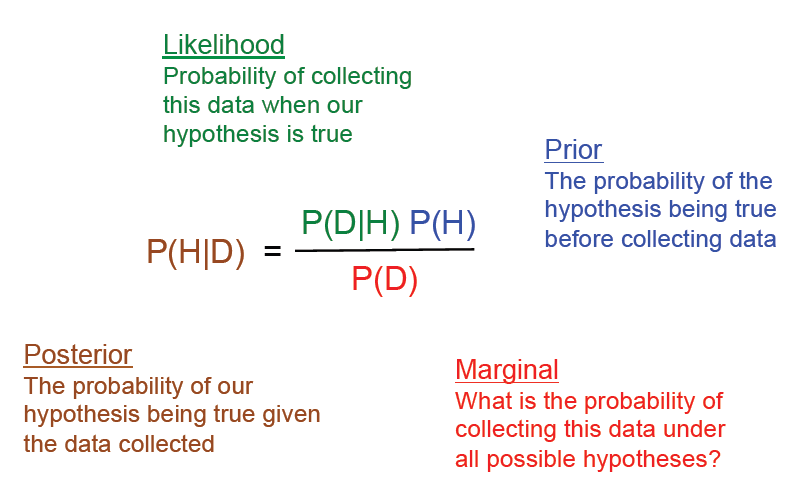
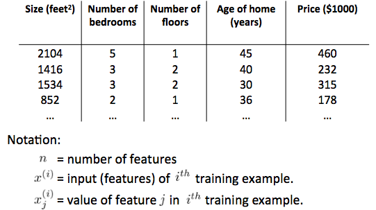
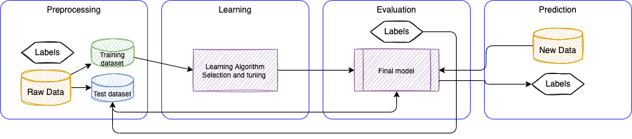

# AI and Machine Learning studies

!!! info "Update"
    Created 2017 - Update 12/2023

This repository includes notes, code samples, and Jupyter notebooks, to learn how to do machine learning using Python and other technologies. This content comes from studying different labs at IBM, AWS, Kaggle, Coursera and Udemy courses, and reading different books and web sites on this exciting subjet.

## AI/ML Market

AI/ML by 2030 will be a $B300 market. Every company is using AI/Ml already or consider using it in very short term. 2023 illustrated AI being part of the world with the arrival of Generative AI. Some on the main business drivers include:

* Make faster decisions by extracting and analyzing data from unstructured documents, voice or video records, transcripts...
* Generate and operationalize predictive and prescriptive insights to make decision at the right time.
* Generative AI: create new content, ideas, conversations, stories, images, videos or music from question or suggestions.

The stakeholders interested by AI/ML are CTOs, CPOs, Data Scientists, business analysts who want to derive decision from data.

## Data Science major concepts

There are three types of task data scientists do: 

* Preparing data to run a model (gathering, cleaning, integrating, transforming, filtering, combining, extracting, shaping...).
* Running the machine learning model, tuning it and assessing its quality.
* Communicate the results.
* With the new Feature Store technologies, data scientists also prepare the features for reusability and governance.

Enterprises are using data as the main asset to derive empirical decisions and for that, they are adopting big data techniques which means high volume, high variation and high velocity.

In most enterprise data are about customers' behaviors and come from different sources like click stream, shopping cart content, transaction history, historical analytics, IoT sensors,...

### Analytics

The concept of statistical inference is to draw conclusions about a population from sample data using one of the two key methods:

* Hypothesis tests.
* Confidence intervals.

But the truth wears off: previous analysis done on statistical data are less true overtime. Analytics need to be a continuous processing.

#### Hypothesis tests  

The goal of hypothesis test is to compare an experimental group to a control group. There are two types of result:

* **H0** for null hypothesis: this happens when there is no difference between the groups.
* **Ha** for alternative hypothesis: happens when there is statistically significant difference between the groups.

The bigger the number of cases (named study size) the more statistical power we have, and better we are to get better results.

We do not know if the difference in two treatments is not just due to chance. But we can calculate the odds that it is. Which is named the **p-value**.

Statistics does not apply well to large-scale inference problems that big data brings. Big data is giving more spurious results than small data set.

The curse of big data is the fact that when we search for patterns in very, very large data sets with billions or trillions of data points and thousands of metrics,  we are bound to identify coincidences that have no predictive power.

### Mathematical foundations

#### Covariance

=\sum_{i}^{} (x_{i} - u_{x})(y_{i} - u_{y}))

#### Correlation

=\frac{cov(x,y)}{\sqrt {\sum_{i}^{} (x_{i} - u_{x})^2} * \sqrt {\sum_{i}^{} (y_{i} - u_{y})^2 }) 

#### Bayesian

In machine learning, there are two main approaches: the Bayesian approach and the frequentist approach. The Bayesian approach is based on probability theory and uses Bayes' theorem to update probabilities based on new data. The frequentist approach, on the other hand, is based on statistical inference and uses methods such as hypothesis testing and confidence intervals to make decisions.

**Bayes theorem**:

 = P(B|A) P(A) / P(B))

{ width=500 }

The Bayesian approach is often used in situations where there is uncertainty and the data is complex, while the frequentist approach is often used in situations where there is a large amount of data and the relationships between the variables are well-defined.

#### Data distributions

[See this notebook presenting](https://github.com/jbcodeforce/ML-studies/blob/master/notebooks/Distributions.ipynb) some python code on different data distributions like Uniform, Gaussian, Poisson. It can be executed in VScode using the pytorch kernel.

#### Normalization

Normalization of ratings means adjusting values measured on different scales to a notionally common scale, often prior to averaging.

In statistics, normalization refers to the creation of shifted and scaled versions of statistics,
where the intention is that these normalized values allow the comparison of corresponding normalized values for different
 datasets in a way that eliminates the effects of certain gross influences, as in an anomaly time series.

Feature scaling used to bring all values into the range [0,1]. This is also called unity-based normalization.

/(Xmax-Xmin))

### Map - Reduce

One of the classical approach to run analytics on big data is to use the map-reduce algorithm, which can be summarized as:

* Split the dataset into chunks and process each chunk on a different computer: chunk is typically 64Mb.
* Each chunk is replicated several times on different racks for fault tolerance.
* When processing a huge dataset, the first processing step is to read from distributed file systems and to split data into chunk files.
* Then a record reader reads records from files, then runs the `map` function which is customized for each different problem to solve.
* The combine operation identifies <key, value> with the same key and applies a combine function which should have the associative and commutative properties.
* The output of map function are saved to local storage, then `reduce` task pulls the record per key from the local storage to sort the value and then call the last custom function: reduce

{ width=900 }

* System architecture is based on shared nothing, in opposite of sharing file system or sharing memory approach.
* Massive parallelism on thousand of computers where jobs run for many hours. The % of failure of such job is high, so the algorithm should tolerate failure.
* For a given server, a mean time between failure is 1 year then for 10000 servers, we have a likelihood of failure around one failure / hour.
* Distributed FS: very large files TB and PB. Different implementations: Google FS or Hadoop DFS.

Hadoop used to be the map-reduce platform, now [Apache Spark](https://spark.apache.org/) is used for that or [Apache Flink](https://flink.apache.org/).

## Machine Learning

Machine learning is a system that automatically learns programs/ functions from data. There is not programming step. The goal is to find a function to predict **y** from a set of features, **Xs**, and continuously measures the prediction performance.

Statistics work on data by applying a model of the world or stochastic models of nature, using linear regression, logistic regression, cox model,... 

Two types of machine learning algorithm, supervised or unsupervised learning.

### Supervised learning

The main goal in supervised learning is to learn a model from labeled training data that allows us to make predictions about unseen or future data. 

**Classification** problem is when we are trying to predict one of a small number of discrete-valued outputs, such as whether it is Sunny (which we might designate as class 0), Cloudy (say class 1) or Rainy (class 2). The class labels are defined as multiple classes or binary classification task, where the machine learning algorithm learns a set of rules in order to distinguish between the possible classes. Classification can be defined when a human assigns a topic label to each document in a corpus, and the algorithm learns how to predict the label. The output is always a set of sets of items. Items could be points in a space or vertices in a graph.

[For more detail see this Classifier note](./ml/classifier.md)
 
Another subcategory of supervised learning is **regression** classification, where the outcome signal is **continuous value** output. In the table below the Price is the outcome (y), the square feet, # of bedrooms… are features
 
{ width=600 }

In regression analysis, we are given a number of predictor (explanatory) variables and a continuous response variable (outcome), and we try to find a relationship between those variables that allows us to predict future outcome. 

### Unsupervised learning

Giving a dataset we are able to explore the structure of the data to extract meaningful 
information without the guidance of a known outcome variable or reward function. 

**Clustering** is an exploratory data analysis technique that allows to organize a pile of information into meaningful subgroups (clusters) without having any prior knowledge of their group memberships.

[See this note for more details.](./ml/unsupervised.md)

### Reinforcement learning

The goal is to develop a system (agent) that improves its performance based on interactions with the environment. Through the interactions, an agent can then uses reinforcement learning to learn a series of actions that maximizes the reward via an exploratory trial-and-error approach or deliberative planning.  

### Unsupervised dimensionality reduction

This is a commonly used approach in feature preprocessing to remove noise from data, which can also degrade the predictive performance of certain algorithms, and compress the data onto a smaller dimensional subspace while retaining most of the relevant information.

### ML System

Building machine learning system includes 4 components as outlined in figure below:

{ width=1100 }

Raw data rarely comes in the form and shape that is necessary for the optimal performance of a learning algorithm.
Thus, the preprocessing of the data is one of the most crucial step in any machine learning application. Clean data are becoming a feature for the training.

The model testing is based on one of the three cross-validation types:

* **Validation**: where we split the dataset into three pieces: train, test, and validation.
* the **Leave-one-out** (LOOCV): only one datapoint as test sample, and use other rows for training set.
* **K-fold validation**: randomly split the dataset into kfold, and for each fold, we train and record the error.

Many machine learning algorithms also require that the selected features are on the same scale for optimal performance, which is often achieved by transforming the features in the range [0, 1] or a standard normal distribution with zero mean and the unit variance.

Some of the selected features may be highly correlated and therefore redundant to a certain degree. 

In those cases, **dimensionality reduction** techniques are useful for compressing the features onto a lower dimensional subspace.

Reducing the dimensionality of the feature space has the advantage that less storage space is required, and the learning algorithm can run much faster.

To determine whether a machine learning algorithm not only performs well on the training set but also generalizes well to new data, we need to **randomly divide** the dataset into separate **training** and **test** sets.

In practice, it is essential to compare at least a handful of different algorithms in order to train and select the best performing model. 

First we have to decide upon a metric to measure performance. One commonly used metric is classification accuracy, which is defined as the proportion of correctly classified instances.

After selecting a model that has been fitted on the training dataset, we can use the test dataset to estimate how well it performs on this unseen data to estimate the generalization error.

### Model Representation

The commonly aggreed notation used is:

```sh
m= # of training examples
X= input variables or features
y= output or target
(x(i),y(i)) for the ith training example
```

When the number of features is more than one the problem becomes a linear regression.

Training set is the input to learning algorithm, from which we generate an hypothesis that will be used to map from X to y.

In **regression analysis**, we are given a number of predictor (explanatory) variables and a continuous response variable (outcome), and we try to find a relationship between those variables that allows us to predict an outcome. 

Hypothesis function `h(x)` can be represented as a linear function of `x`:  

=\sum_{i} \theta_{i} * x_{i}= \theta^{T}*x){ width=300 }

Xo = 1.

A feature is a vector and `T` is also a row vector of dimension n+1, therefore `h(x)` is a matrix multiplication. It is called **multivariate linear regression**.

To find the good coefficients , the algorithm needs to compare the results `h(x)` using a cost function.

### Cost function

One of the key ingredients of supervised machine learning algorithms is to define an objective function that is to be optimized during the learning process. This objective function is often a cost function that we want to minimize. So the weights update will minimize the cost function. The cost function could be the sum squared errors between the outcomes and the target label:

 = \frac{1}{2m} \sum_{1}^{m}(h_{\theta} (x_{i}) - y_{i})^2){ width=300 }

The algorithm to minimize the cost function is called the **gradient descent**, and uses the property of the cost function being continuous convex linear, so differentiable:

{ width=500 }

The principle is to climb down a hill until a local or global cost minimum is reached. In each algorithm iteration, we take a step away from the gradient where the step size is determined by the value of the **learning rate** (alpha) as well as the slope of the gradient.

When J(Ti) is already at the local minimum the slope of the tangent is 0 so Tj will not change. When going closer to the local minimum the slope of the tangent will go slower so the algo will automatically take smaller steps.
If alpha is too big, gradient  descent can overshoot the minimum and fail to converge or worse, it could diverge. (The derivative is the slope of the tangent at the curve on point Tj; when derivative is close to zero, it means, we reach a minima).

When the unit of each feature are very different the gradient descent will take a lot of time to find the minima.
So it is important to transform each feature so they are in the same scale. (e.g. from -1 to 1 range, or [0,1] range)


A cost function may be coded in Python as:

```python
errors = (y - output)          
cost = (errors** 2).sum() / 2.0
```

where: 

{ width=200 }

in python:

```python
def netInput(self,X):
        # compute z = sum(x(i) * w(i)) for i from 1 to n, add the threshold
        return np.dot(X,self.weights[1:]) + self.weights[0]
```

The cost function is convex continuous linear and can be derived, so that we can use the gradient descent algorithm to find the local minima:

```python
def fit(X,y):
    weights=np.zeros(1+X.shape[1])
    costs=[]
    for _ in range(nbOfIteration):
        output = netInput(X)
        errors = (y - output)
      # calculate the gradient based on the whole training dataset. Use the matrix * vector 
        weights[1:] += eta * X.T.dot( errors)
        weights[0] += eta * errors.sum()
        cost = (errors**2).sum() / 2.0
        costs.append(cost)
    return costs
```

The weight difference is computed as the negative gradient * the learning rate `eta`. To compute the gradient of the cost function, we need to compute the partial derivative of the cost function with respect to each weight `w(j)`. 
So putting all together we have:

)x_{i,j}&space;){ width=300 }

the weight update is calculated based on all samples in the training set (instead of updating the weights incrementally after each sample), which is why this approach is also referred to as "batch" gradient descent.
So basically to minimize the cost function we took steps into the opposite direction of a gradient calculated from the entire training set.

## Books and other sources

Content is based of the following different sources:

* [Python Machine learning - Sebastian Raschka's book](https://www.amazon.com/Python-Machine-Learning-Sebastian-Raschka/dp/1783555130/ref=asc_df_1783555130/?tag=hyprod-20&linkCode=df0&hvadid=312140868236&hvpos=1o7&hvnetw=g&hvrand=12056535591325453294&hvpone=&hvptwo=&hvqmt=&hvdev=c&hvdvcmdl=&hvlocint=&hvlocphy=9032152&hvtargid=pla-406163981473&psc=1).
* [Collective intelligence - Toby Segaran's book](https://www.amazon.com/Programming-Collective-Intelligence-Building-Applications/dp/0596529325/ref=sr_1_2?crid=1UBVCJKMM17Q6&keywords=collective+intelligence&qid=1553021611&s=books&sprefix=collective+inte%2Cstripbooks%2C236&sr=1-2).
* [Stanford Machine learning training - Andrew Ng](https://www.coursera.org/learn/machine-learning).
* [Dive into deep learning book](https://d2l.ai)
* [Amazon Sagemaker Python SDK](https://sagemaker.readthedocs.io/en/stable/)
* [Kaggle](http://kaggle.com)
* Introduction to Data Sciences - University of Washington.
* [Jeff Heaton - Applications of Deep Neural Networks.](https://github.com/jeffheaton/t81_558_deep_learning)
* [AWS SageMaker](https://aws.amazon.com/sagemaker/getting-started/).