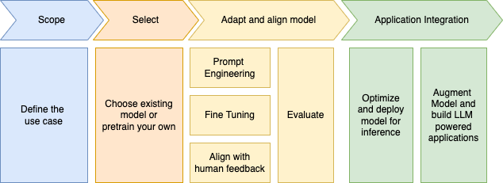

# Implementation solution methodology

???- info "Version"
    Created 02/2024 - Updated July 2024

## Introduction

### What is agentic applications

Explain the purpose of the guide, its intended audience (developers, designers, project managers, etc.), and the scope of the methodology it outlines. 

TBW
The adoption of LLM in an enterprise ecosystem should not be an afterthought process. Leaders should go over the hype, and really address what those technologies can help them with. Interesting to see that companies who offer hosted LLMs in the cloud are not encouraging their own employees to use those LLMs internally. With text generation and text enhancement, all employees will bring the same quality of results and it will be difficult to measure them.

Currently AI systems are helping to take million of business decisions every days using the classical expert systems, combined or not with ML predictive scoring. Any business process activities involving human task, may be able to leverage better automation by adopting AI agent to help them doing their task quicker with better results and accuracy. Actually LLM has poor accuracy results to be trustable for any business. But there is way to improve this.

The classical LLM use cases of summarization, text improvement, and idea generations are useful for a lot of business activities, and hallucinations have no dramatic impact as the human is still taking the lead on acting from the LLM responses. Human may judge the result content, pick and choose from the returned text what makes the most sense.

The current tendency to imagine LLM being an orchestrator of functions or services and therefore being embeddable into a business process, may not be acceptable in many use cases. Process automation needs consistency, high level of accuracy and coded business logic to manage orchestration and compensation flows when exceptions occur. 

Nevertheless chatbot or Q&A interface may be integrated in any business application where a human needs to process data. We can list the following capabilities the project methodology should be help developers to address:

* Helping users in the context of where they are in the current business application or workflow. Current Chatbot with coded conversation flow are the cheapest solution to implement helpful assistant. But with its strong NLP capability LLM will be more flexible and user friendly. The knowledge corpus can come from RAG or fine tuned model.
* Summarizing the information gathered so far in the context of different customer interactions.
* Searching in enterprise knowledge base for answer to customer's query
* Proposing a sequence of actions to address a certain problem based on internal guidelines

TBC 
For each function or service to integrate, developer needs to review the interface characteristics which provided semantic and behavior description of the system to integrate with. There are a lot of best practices inherited from SOA, that should help us deciding, how much a LLM can do for integration, and how much they may help human takes the next best actions.

## Introduction

The adoption of generative AI in the enterprise, follows the same project management practices as the ones of any other data, analytics and decision system solution implementations. In this chapter, we define what are the specifics methodology requirements to address and the proposed project phases to consider.

The proposed methodology uses the successful practices used during thousands of consulting engagements around decision automation solution implementations.

Always starts by the business problem to solve.

## Classical business process Generative AI can help to address

In the context of a business process, like in insurance claim processing, there are some activities that were already automated with the adoption of decision services, which uses inference rule engine, (the AI of the 90s), with hundred of rules to address insurance product configuration, feature eligibility, pricing computation, basic claim acceptance, risk scoring, to name a few.

Parts of those process, have human activities, and the complete orchestration is done by business process management system or application logic mostly coded as state machines. When humans are involved, they verify documents, correlate information between different data sources, some time rekey data into different systems, and apply some non-coded business policies, but documented somewhere to decide to accept, reject the claim or most likely ask for more information. 

Obviously with SOA and microservice adoption, rekeying data should be history, and most middleware integrations, can move those data between systems. Document processing is already well covered by OCR products. The document processing with OCR gives good results but are not 100% accurate, Robot Process Automation (RPA) has helped to integrate new data source to legacy systems, but still has issue in training underlying models. 

So how a Gen AI, multi model deep learning, may help in this claim example? Human can get document summarization, query a corporate document corpus to get better semantic search results, extract specific facts relevant to the claim from unstructured data like emails, paper mail scanned in pdf, or even images. Gen AI will not take decision. ML predictive scoring, classification models do not take decision, human does... or code or business rule engine do.

Consider bring AI into business processes as soon as you see the following behavioral patterns:

- humans are involved to make the process progressing
- the process is running for a long time. Straight thought processing flows are already fine tuned for automation and bringing unstructured response may more impact the latency than improves it.
- humans needs a lot of knowledge about the business, the process, existing historical cases, to take better decisions.
- SMEs are leaving company, new comers need to be efficiently trained,
- human asking help from subject matter experts when a case is more complex.
- human may needs to consult other data sources to get better data to take decision. 

Event storming methodology helps to identify the business process to model. During this workshop we can add special notation to highlight human tasks candidate to be supported by generative AI.

## Methodology requirements

The methodology needs to support:

* a simple and short requirement discovery phase, and how to choose the right use case
* focusing on the task within a business process where AI may help human actors, so we can narrow the scope of the solution to bring immediate value
* the definition of a sustainable architecture, selecting the products, tools or software components for what they are supposed to help with,
* the implementation of  minimum valuable product to proof the value of the proposed solution with working software
* the integration of continuous end user feedbacks with solution playback practices and continuous measurements.
* how to integrate data and AI across any cloud
* how to measure AI bias, deploy in a secure and compliant environment

## Best practices

As we focus in business problem to address. the methodology adopts the following well known and adopted practices of:

* **Design thinking** to address human's needs and perspectives of the end-users. It encourages developing empathy map, pain and challenges, end user's problem, develop innovative ideas to solve the problem at hand, and prototyping experimentations to get earlier feedbacks.
* **Lean startup** with Minimum Viable Product implementations, measure against hypothesis and pivot practices.
* **Agile** development practices with test-driven development.
* **GitOps** to simplify hybrid cloud solution deployment, using infrastructure as code
* **Decisions and data focus** to address the need for data, and normalize the decisions to be taken in the context of a business process, a business applications and the data to use.

AI helps to take business decision, if not, it is useless. So understanding the decisiosn to take are keys to the success of any AI project implementation.

### Discovery Assessment

When engaging with a customer it is important to assess where they are in their GenAi adoption, and essentially what use cases they are planning to support. Think big about the opportunities, but start small with problems that cause day-to-day irritations for the employees or customer.

???- question "Research for opportunities"
    * What manual or repetitive processes could be automated with generative AI?
    * Where do employees spend the most time today gathering information to do their jobs?
    * What customer/user pain points could be addressed with more natural conversation?
    * What content creation processes could be enhanced through AI generated drafts?
    * What expert skills are scarce in your organization that AI models could supplement?
    * What insights could be uncovered from large volumes of unstructured data using AI?
    * What risks or inefficiencies exist from decisions made with incomplete information?
    * Where does communication break down today between teams, customers or regions?
    * What predictions would help you make smarter real-time decisions?
    * What new products, services or business models could AI capabilities enable?
    * What tasks or processes still rely heavily on tribal knowledge that could be systematized?
    * What information gets trapped in siloed systems and could be unlocked with AI?
    * What customer research efforts could be accelerated with interactive AI agents?
    * What compliance processes result in slowdowns getting products/services to market?

???- question "Use cases and business needs"
    * What are the potential use cases? B2B, B2C, Employees?
    * Is the use case considered a strategic priority? Sponsor?
    * What is the value associated with the use case?
    * Are subject matter experts available to support the use case?
    * Who is the end user?
    * What are the current user's challenges and pains?
    * What will be the "ha-ha" moment for the user?
    * Do you have data sets? Quality?

???- question "Experience in AI"
    * Are you using AI in your current business applications, or processes?
    * What are current/past successes by adopting AI in the business execution?
    * What is the current level of ML support needed for your technical staff?
    * Do you need capabilities like summarization, text generation, speech recognition?
    * How will you monitor model performance and detect model drift over time?

???- question "Generative AI current adoption"
    * How familiar with Generative AI? and its common use cases?
    * What GenAI technologies have you/are you evaluating?
    * Have you started prototyping?
    * Do you have AI-powered products or features on your roadmap?
    * Do you have tried to use an existing generative models? to tune it?
    * What are the current process to evaluate Gen AI models?
    * What is your risk appetite for model hallucination and its potential consequences?
    * How do you plan to do domain  adaptation? Do you plan to pre-train, fine-tune or do some in-context  prompting for domain adaptation?
    * How frequently data changes? How frequently do you expect to need to retrain models with new data?

???- question "Integration needs"
    * Is it a new solution or extending an existing one?
    * Where data coming from?
    * What type of systems to integrate the solution with? 
    * Any expected performance requirements? 

???- question "Security and compliance needs"
    * Code privacy and IP related code control

### Interface Characteristics

This section lists the full set of interface characteristics to consider for each system to integrate with:

* FUNCTIONAL DEFINITION

    * Principal data objects
    * Operation/function
    * Read or change
    * Request/response objects

* TECHNICAL INTERFACE

    * Transport
    * Protocol
    * Data format

* INTERACTION TYPE

    * Request-response or fire-forget
    * Thread-blocking or asynchronous
    * Batch or individual
    * Message size

* PERFORMANCE

    * Response times
    * Throughput
    * Volumes
    * Concurrency

* INTEGRITY

    * Validation
    * Transactionality
    * Statefulness
    * Event sequence
    * Idempotence

* SECURITY

    * Identity/authentication
    * Authorization
    * Data ownership
    * Privacy

* RELIABILITY

    * Availability
    * Delivery assurance

* ERROR HANDLING

    * Error management capabilities
    * Known exception conditions
    * Unexpected error presentation

From these characteristics, it does not seem realist to design a solution where the LLM service provider will be able to execute some function code from their SaaS platform to integrate on-premises services, with interface characteristic that is no REST, json, stateless, idempotent, synchronous. So outside of toy solution we need something else to get real adoption.

### Generative AI context

Some cloud provider leaders think, that enterprise will have a large library of dedicated models. Training model cost a lot of money for ensure results. Fine tuning a model may be attractive, but needs experts in deep learning tuning. We are currently more seeing a library of prompts and a small set of reliable LLMs that developers can trust. 

There will be still developers, data scientists, product managers, to develop solution around LLMs. A solution will use different LLMs and different capabilities to support multiple requirements that a business application needs: summarization, Q&A, chatbot, translation for example will mostly be combined in a lot of enterprise solutions.

Data enrichment, prompt engineering, user interface, deployment, HA, multi tenancy, security, decision governance may all be part of any AI solution.

[Deeplearning.ai](https://www.deeplearning.ai/) proposes the following LLM project life cycle:

### Gen AI Specific Scoping

1. Go over the [discovery assessment](#discovery-assessment)
1. Define what the key metrics are and how to evaluate the solution. If the use cases fall into the Document Q&A and Document Summarization categories, the metric used will be **accuracy**. **Accuracy** will be determined based on the documents (data) provided and the respective questions users ask against the model.
1. Define a list of questions that we expect the application to answer. Be sure to have a list of correct answers. In case of summarization use cases, we need sample summaries and sample questions to generate those summaries for document summarization use cases.

### Model Evaluation

There are web sites to evaluate existing LLMs, but they are based on public data, and may not perform well in the context of a specific use case with private data.

The methodology looks like in the following steps:

* Select models based on specific use case and tasks
* Human calibration of the models: understand behavior on certain tasks, fine tune prompts and assess against a ground truth using cosine-sim. Rouge scores can be used to compare summarizations, based on statistical word similarity scoring.
* Automated evaluation of models: test scenario with deep data preparation, was is a good answer. LLM can be used as a judge: variables used are accuracy, coherence, factuality, completeness. Model card
* ML Ops integration, self correctness

Considerations

* Licensing / copyright
* Operational
* Flexibility
* Human language support

### Consumers of LMs

This is the category of application that consumes pre-trained models to generate text, image, videos, audio or code.

----------------------------------------

Building a guide for a methodology to develop agentic applications involves providing a structured framework that developers and designers can follow to create applications that exhibit autonomous and proactive behavior. Here's a suggested structure for your guide: 

## Introduction: 

- Provide an overview of the concept of agentic applications, defining what they are, their characteristics, and their potential benefits to users. 

- Explain the purpose of the guide, its intended audience (developers, designers, project managers, etc.), and the scope of the methodology it outlines. 

## Theoretical Foundation: 

- Dive into the theoretical underpinnings of agentic computing, discussing relevant concepts such as artificial intelligence, agency, autonomy, and proactive behavior. 

- Reference existing research and studies in the field to provide a solid academic foundation for the methodology. 

## Methodology Overview: 

- Present a high-level overview of the steps or phases involved in the methodology. 

- Explain how each step contributes to the development of agentic applications and how they build upon each other. 

## Step-by-Step Process: 

- Define the first step, which could be understanding the problem domain and requirements gathering. Discuss techniques for identifying opportunities for agentic behavior and gathering user needs and expectations. 

- Detail the design phase, covering aspects like defining the application's personality, determining the level of autonomy required, and designing interactions that showcase agentic behavior effectively. 

- Move to the development phase, providing guidance on choosing the right technologies, frameworks, and tools to implement agentic behavior. Discuss best practices, design patterns, and potential challenges and how to overcome them. 

- Address the testing and evaluation phase, offering strategies for validating the agentic behavior of the application. Discuss user testing methodologies, metrics for evaluating agentic performance, and techniques for refining the application based on feedback. 

- Include a section on deployment and maintenance, covering considerations for releasing agentic applications into production and ensuring their long-term evolution and improvement. 

## Case Studies: 

- Provide real-world examples of agentic applications and how they were successfully developed using the methodology. 

- Detail the specific challenges faced, the solutions implemented, and the outcomes achieved, offering practical insights to readers. 

## Best Practices and Recommendations: 

- Offer a summary of key takeaways, best practices, and recommendations for developing agentic applications effectively. 

- Include tips on common pitfalls to avoid and how to ensure the agentic behavior aligns with user expectations and ethical guidelines. 

## Conclusion and Next Steps: 

- Wrap up the guide by reiterating the key points and summarizing the benefits of following the methodology. 

- Provide suggestions for further reading and resources for those who want to delve deeper into specific aspects of agentic application development. 

Remember to keep the language concise and clear throughout the guide, ensuring that it is accessible to your intended audience. Use visuals, diagrams, and examples to illustrate concepts and make the guide more engaging. This structure should provide a solid framework for developers and designers to understand and implement agentic behavior in their applications effectively.
