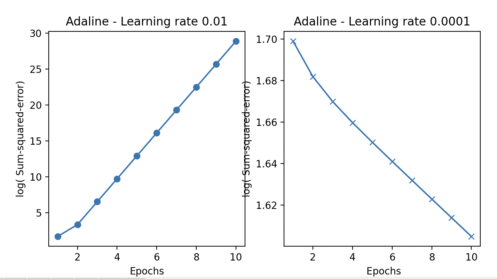
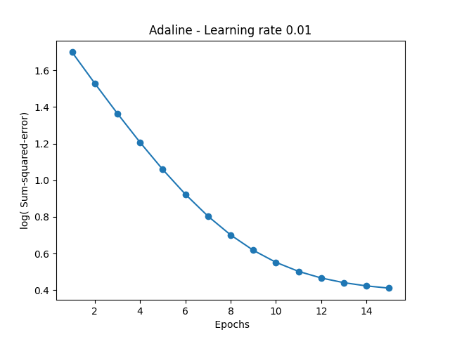
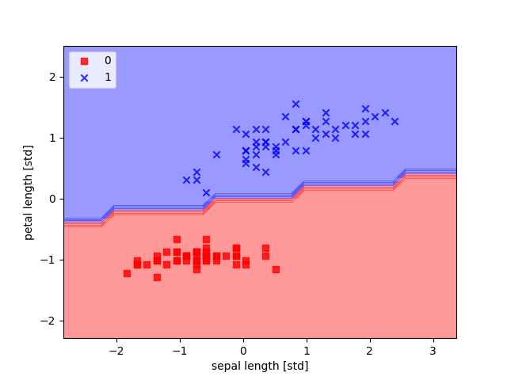
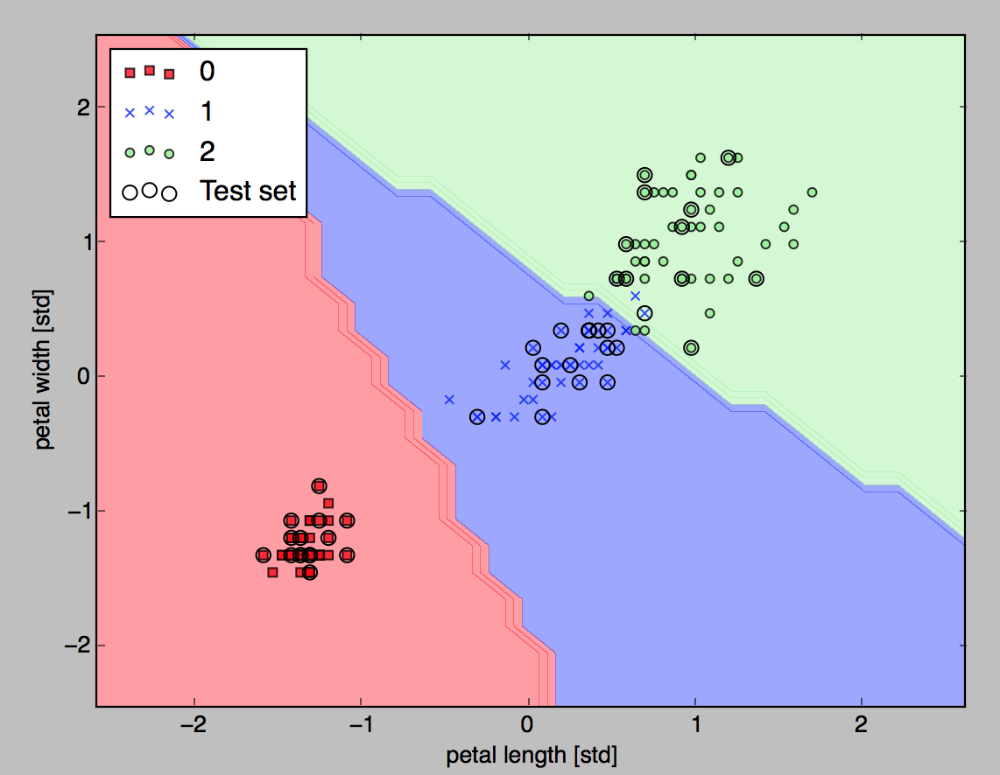
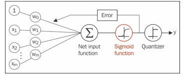
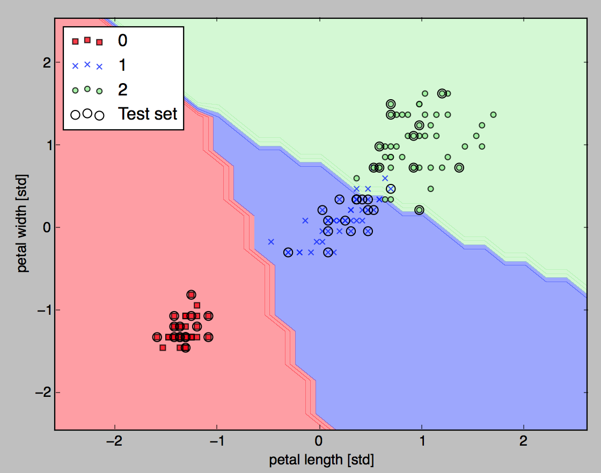
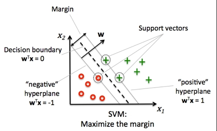

# Classifiers

**Classification** problem is when we are trying to predict one of a small number of discrete-valued outputs. The class labels are defined as multiple classes or binary classification task, where the machine learning algorithm learns a set of rules in order to distinguish between the possible classes.

Below is a python example of using the iris flower NIST dataset: 4 features, three potential classes:

```python
feature_names= ['sepal length (cm)', 'sepal width (cm)', 'petal length (cm)', 'petal width (cm)'] 
target_names= ['setosa', 'versicolor', 'virginica']
data= [ 5.1,  3.5,  1.4,  0.2], [ 4.9,  3. ,  1.4,  0.2]

target= [0, 0, 0, 0,…1,1,1,… 2,2,2]
```

Three majors components to have for each machine learning classifier:

* **Representation**: define what is the classifier: a rule, a decision tree, a neural network...
* **Evaluation**: how to know if a given classifier is giving good or bad results: how to asses result rule. 
Could be the `# of errors` on some test set, `# of recalls`, squared error, likelihood?... 
We may compute the coverage of a rule: `# of data points` that satisfy the conditions and the `accuracy = # of correct predictions / coverage`.
* **Optimization**: how to search among all the alternatives, greedy search or gradient descent? 
One idea is to build a set of rules by finding the conditions that maximize accuracy.

For each dataset, try to humanly inspect the data, and do some plotting diagrams with some attributes over others.
Then to select a naive class, look at attribute, where we can derive some basic rules. This will build a first hypothesis.
To assess an hypothesis build a **confusion matrix**: a square matrix where column and rows are the different class label of an outcome. The cells count the number of time the rules classified the dataset. Assess the **accuracy** number: sum good results/ total results.

??? Notes "Code execution"
    All the Classifier Python apps execute well from the python environment in docker. See [environement note.](../coding/index.md/#environments)

## Perceptron

Based on the human neuron model, Frank Rosenblatt proposed an algorithm that would 
automatically learn the optimal weight coefficients that are then multiplied with the input
 features in order to make the decision of whether a neuron fires or not. 
 In the context of supervised learning and classification, such an algorithm could then be
 used to predict if a sample belonged to one class or the other.

The problem is reduced to a binary classification (-1,1), and an activation function 
that takes a linear combination of input X, with corresponding weights vector W, 
to compute the net input as:

```python
z = sum(w(i) * x(i)) i from 1 to n
```

If the value is greater than a threshold the output is 1, -1 otherwise. The function is called `unit step` function. 

If w0 is set to be -threshold and x0=1 then the equation becomes:

=\sum_{i} \theta_{i} * x_{i}= \theta^{T}*x){ width=300 }

The following python functions in a Perceptron class, use numpy library to compute the matrix dot product wT*x:

```python
def netInput(self,X):
     return np.dot(X,self.weights[1:]) + self.weights[0]
   
def predict(self,X):
   return np.where(self.netInput(X)>=0.0,1,-1)
```

The weights are computed using the training set. The value of delta, which is used to update the weight , is calculated by the perceptron learning rule:

= \eta*(y_{i} - mean(y_{i}))* x_{i}^j){ width=300 }

eta is the learning rate, Y(i) is the known answer or target for i th sample. The weight update is proportional to the value of X(i)
 
It is important to note that the convergence of the perceptron is only guaranteed if the two classes are linearly separable and the learning rate is sufficiently small.

{ width=800 }

The [fit function](https://github.com/jbcodeforce/ML-studies/blob/6073cbb4560386dde09d833878ad0724172ded4b/ml-python/classifiers/Perceptron.py#L24) implements the weights update algorithm.

Test the python Perceptron implementation, uisnf NIST iris dataset. The way to use the perceptron: Create an instance by specifying the eta coefficient and the number of epochs (passes over the training set) to perform

```sh
#under ml-python/classifiers folder
python TestPerceptron.py
```

The test loads the dataset, fit the Perceptron with a training set, plots some sample of the two types of Iris. Then displays the decision boundary to classify an Iris in one of the two classes: setosa, versicolor.

## Adaline

In  ADAptive LInear NEuron classifier, the weights are updated based on a linear activation function (the `Identity` function) rather than a unit step function like in the Perceptron.

{ width=800 }

```sh
# Start python docker
# under ml-python/classifiers folder
python TestAdaline.py
```

The test works on the Iris dataset too, when we choose a learning rate that is too large, we have an error rate that becomes larger in every epoch because we overshoot the global minimum.



When the features are standardized (each feature value is reduced by the mean and divided by the standard deviation) the ADALine algorithm converges more quickly.

The two regions illustrates the two classes, with good results: 


The following curve shows the cost function results per iteration or epoch




```python
X_std = np.copy(X)
X_std[:,0]=(X[:,0]-np.mean(X[:,0]))/np.std(X[:,0])
X_std[:,1]=(X[:,1]-np.mean(X[:,1]))/np.std(X[:,1])
```
 
The previous approach can take a lot of time when the dataset includes millions of records. A more efficient approach is to take the **stochastic gradient descent** approach. It is used with online training, where the algorithm is trained on-the-fly, while new training set arrives.

The weights are computed with: 

)*%20x_{i}){ width=300 }

```python
def updateWeights(self,xi,target):
        output = self.netInput( xi)
        error = (target - output)
        self.weights[1:] += self.eta * xi.dot( error)
        self.weights[0] += self.eta * error
        cost = (error** 2)/ 2.0
        return cost
```

To obtain accurate results via stochastic gradient descent, it is important to present it with data in a random order, which is why we want to shuffle the training set for every epoch to prevent cycles.
 


## Logistic regression

Another classification approach is to use ‘Logistic Regression’ which performs very well on linearly separable set:

```python
from sklearn.linear_model import LogisticRegression
lr = LogisticRegression( C = 1000.0, random_state = 0)
lr.fit( X_train_std, y_train)
lr.predict_proba(X_test_std[0,:])
```

For C=1000 we have the following results:

{ width=500 }

Logistic regression uses the odds-ratio `P/(1-P)`, P being the probability to have event e: in our case P could be the probability that a set of values for the feature X leads that the sample is part of a class 1. 

In fact, the mathematical model uses the `log (P/(1-P))` as function in the model. It takes input values in the range 0 to 1 and transforms them to values over the entire real number range, which we can use to express a linear relationship between feature values and the log-odds:

)=\sum_{i} \theta_{i} * x_{i}= \theta^{T}*x){ width=400 }

For logistic regression, the hypothesis function is used to predict the probability of having a certain sample X being of class y=1. This is the sigmoid function:

=\frac{1}{(1+e^{-z})}){ width=300 }

Here, z is the net input, that is, the linear combination of weights and sample features= W’.x 

The sigmoid function is used as activation function in the classifier:

{ width=600 }

The output of the sigmoid function is then interpreted as the probability of particular sample belonging to class 1 

=P(y=1 | x;w)){ width=300 }

given its features X parameterized by the weights W.

Logistic regression can be used to predict the chance that a patient has a particular disease given certain symptoms. As seen before to find the weights W, we need to minimize a cost function, which in the case of logistic regression is:

=C\left [ \sum_{i}^{n} (-y^{i} log(\phi(z^{i})) - (1 - y^{i}))log(1-\phi(z^{i})) \right ] + \frac{1}{2}\left\| w \right\|^2){ width=500 }

The C=1/lambda parameter used in logistic regression api is the factor to control overfitting.

 is the regularization bias to penalize extreme parameter weights.

### Fitting

**Overfitting** is a common problem in machine learning, where a model performs well on training data but does not generalize well to unseen data. If a model suffers from overfitting, we also say that the model has a **high variance**, which can be caused by having too many parameters that lead to a model that is too complex given the underlying data. 

**Variance** measures the consistency (or variability) of the model prediction for a particular sample instance if we would retrain the model multiple times: if the training set is splitted in multiple subsets, the model can be trained with those subsets and each time the sample instance prediction is run, the variance is computed. If the variability is big, then the model is sensitive to randomness.

**Bias** measures how far off the predictions are from the correct values in general. One way of finding a good bias-variance tradeoff is to tune the complexity of the model via regularization. 

**Regularization** is a very useful method to handle collinearity (high correlation among features), filter out noise from data, and eventually prevent overfitting. For regularization to work properly, we need to ensure that all our features are on comparable scales.

The decision boundary is the hypothesis that separate clearly the training set.

Decreasing the factor of control of overfitting, C, means the weight coefficients are shrinking so leading to overfitting. Around C=100 the coefficient values stabilize leading to good decision boundaries:

{ width=600 }

For C=100 we have now

{ width=600 }

## Maximum margin classification with support vector mancines (SVM)

In SVM the goal is now to maximize the margin: the distance between the decision boundary and the training samples.

{ width=600 }

The rationale behind having decision boundaries with large margins is that they tend to have a lower generalization error whereas models with small margins are more prone to overfitting.

To train a SVM model

```python
from sklearn.svm import SVC
svm = SVC(kernel='linear',C=1.0,random_state=0)
svm.fit(X_train_std,y_train)
```
