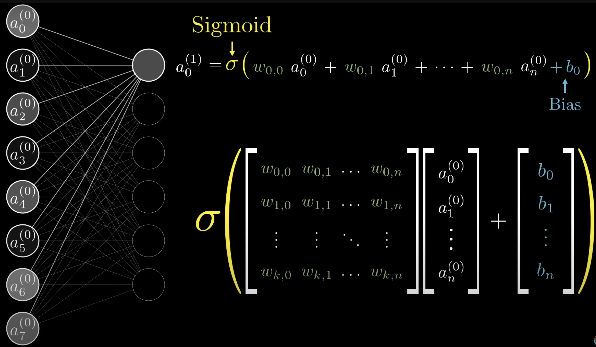
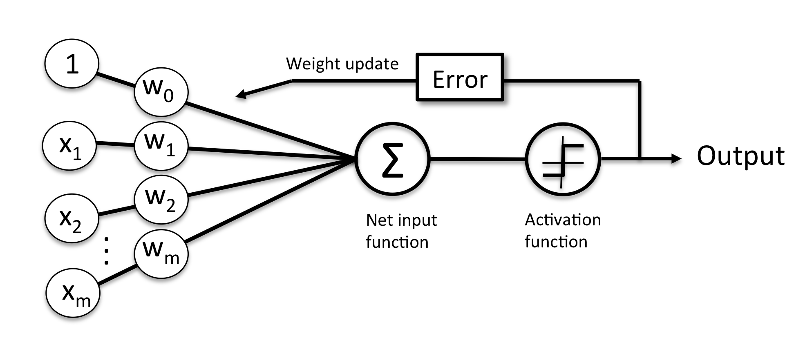

# Deep learning

It is a machine learning techniques which uses neural networks with more than one layer.

## Neural Network

A Neural network processes numerical representation of unstructured data, injected in an 'input layer' (called "feature vector") to generate result as part of the output layer by using a mathematical construct of network of hidden layers (See YouTube video: ["Neural Network the ground up"](https://www.youtube.com/watch?v=aircAruvnKk)). "Deep" learning means many hidden layers.

A classical learning example of neural network usage, is to classify images, like the hand written digits of the NIST dataset.

A neuron holds a function that returns a number between 0 and 1. For example in simple image classification, neuron may hold the grey value of a pixel of a 28x28 pixels image (784 neurons). The number is called **activation**. At the output layer, the number in the neuron represents the percent of one output being the expected response. Neurons are connected and each connection is weighted.

Convolutional neural networks (CNNs) allows input size to change without retraining. The output of the regression neural network is numeric, and the classification output is a class.

The value of the neuron 'j' in the next layer is computed by the classical logistic equation taking into account previous layer neurons (`a`) (from 1 to n (i being the index on the number of input)) and the weight of the connection (`a(i)` to `neuron(j)`):

=\sigma (\sum_{i} \omega_{i} * a_{i} - bias)){ width=300 }

To get the activation between 0 and 1, it uses the [sigmoid function](../concepts/maths.md#sigmoid-function), the bias is a number to define when the neuron should be active.



Modern neural network does not use sigmoid function anymore but the [Rectifier Linear unit function](https://en.wikipedia.org/wiki/Rectifier_(neural_networks)).

=max(0,a))

Neural networks input and output can be an image, a series of numbers that could represent text, audio, or a time series...

The simplest architecture is the [perceptron](./classifier.md#perceptron), represented by the following diagram:



There are four types of neurons in a neural network:

1. Input Neurons - We map each input neuron to one element in the feature vector.
1. Hidden Neurons - Hidden neurons allow the neural network to be abstract and process the input into the output. Each layer receives all the output of previous layer.
1. Output Neurons - Each output neuron calculates one part of the output.
1. Bias Neurons - Work similar to the y-intercept of a linear equation. It introduces a 1 as input.

Neurons is also named nodes, units or summations. See [the sigmoid play notebook to understand the effect of bias and weights](https://github.com/jbcodeforce/ML-studies/tree/master/deep-neural-net/sigmoid-play.ipynb) 

Training refers to the process that determines good weight values.

It is possible to use different Activation functions,(or transfer functions), such as hyperbolic tangent, sigmoid/logistic, linear activation function, Rectified Linear Unit (ReLU), Softmax (used for the output of classification neural networks), Linear (used for the output of regression neural networks (or 2-class classification)).

ReLU activation function is popular in deep learning because the gradiant descend function needs to take the derivative of the activation function. With sigmoid function, the derivative quickly saturates to zero as 
 moves from zero, which is not the case for ReLU.

The two most used Python frameworks for deep learning are [TensorFlow/Keras](https://www.tensorflow.org/) (Google) or [PyTorch](../coding/pytorch.md) (Facebook).

## Classification neural network architecture

The general architecture of a classification neural network.

| Hyperparameter | Classification | 
| --- | --- | 
| Input layer shape (in_features) |	Same as number of features |
| Hidden layer(s) | Problem specific, minimum = 1, maximum = unlimited |
| Neurons per hidden layer| Problem specific, generally 10 to 512 |
| Output layer shape (out_features)| for binary 1 class, for multi-class: 1 per class |
| Hidden layer activation |	Usually ReLU but can be many others |
| Output activation | For binary: Sigmoid, for multi-class:	Softmax |
| Loss function	| Binary cross entropy.  For multi-class Cross entropy |
| Optimizer | SGD (stochastic gradient descent), Adam (see torch.optim for more options) |

Below is an example of very simple NN in PyTorch:

```python
from torch import nn

model_0 = nn.Sequential(
    nn.Linear(in_features=2, out_features=5),  # layer 1
    nn.Linear(in_features=5, out_features=1)   # layer 2
).to(device)

model_0
```

Or use a subclass of pyTorch `nn.Module` as demonstrated in [classifier.ipynb](https://github.com/jbcodeforce/ML-studies/tree/master/pytorch/classification/classifier.ipynb) notebook, to search for the circle classes in sklearn circles dataset, or a multi classes classification in [multiclass-classifier.ipynb](https://github.com/jbcodeforce/ML-studies/tree/master/pytorch/classification/multiclass-classifier.ipynb).

## Learning

Same as previous ML problems, we can use supervised ( picture and corresponding class) and unsupervised learning. For image or voice, the 'self-supervised learning' uses to generate supervisory signals for training data sets by looking at the relationships in the input data.

Transfer learning is used to get what a first neural network as learn as input to a second NN. 

### GPU vs CPU

1. When the training loss is way lower than the test loss, it means "overfitting" and so loosing time.
1. When both losses are identical, time will be wasted if we try to regularize the model.
1. To optimize deep learning we need to maximize the compute-bound processing by reducing time spent on memory transfer and other things. Bandwidth cost is by moving the data from CPU to GPU, from one node to another, or even from CUDA global memory to CUDA shared memory.

## Computer Image

Address how a computer sees, images.

### Convolutional Neural Network

A [Neural Network](https://towardsdatascience.com/a-comprehensive-guide-to-convolutional-neural-networks-the-eli5-way-3bd2b1164a53) to process images by assigning learnable weights and biases to various aspects/objects in the image, and be able to differentiate one from the other. It can successfully capture the spatial and temporal dependencies in an image through the application of relevant filters.
Image has three matrices of values matching the size of the picture (H*W) and the RGB value.
CNN reduces the size of the matrices without loosing the meaning. For that it uses the concept of Kernel, a window, shifting over the image.


A typical structure of a convolutional neural network:

**Input layer -> [Convolutional layer -> activation layer -> pooling layer] -> Output layer**

The layers between [] can be replicated.

Every layer in a neural network is trying to compress data from higher dimensional space to lower dimensional space. Below is an example of those method

```python
# Convolutional layer
nn.Conv2d(in_channels=input_shape, out_channels=hidden_units, kernel_size=3, stride=1, padding=1),
nn.ReLU(),  # activation layer
# pooling layer
nn.MaxPool2d(kernel_size=2, stride=2),    
```

* Conv2d is compressing the information stored in the image to a smaller dimension image
* MaxPool2d takes the maximum value from a portion of a tensor and disregard the rest.

See this [CNN explainer tool.](https://poloclub.github.io/cnn-explainer/)

Simple image dataset using the [Fashion NIST](https://github.com/zalandoresearch/fashion-mnist) and the [PyTorch Image Models](https://github.com/huggingface/pytorch-image-models) as a collection of image models, layers, utilities, optimizers, schedulers, data-loaders / augmentations, and reference training / validation scripts

The non-linear classifier and one CNN is in [fashion_cnn.py](https://github.com/jbcodeforce/ML-studies/tree/master/pytorch/computer-vision/fashion_cnn.py).

[MIT - Convolutional Neural Network presentation - video](https://www.youtube.com/watch?v=iaSUYvmCekI&list=PLtBw6njQRU-rwp5__7C0oIVt26ZgjG9NI&index=4)

## Transfer Learning

Takes an existing pre-trained model, and use it on our own data to fine tune the parameters. It helps to get better results with less data, and lesser cost and time. In Computer Vision, [Image Net](https://www.image-net.org) includes million of images on which models were trained. 

[PyTorch has pre-trained models](https://pytorch.org/vision/stable/models.html), [Hugging Face](https://huggingface.co/models), [PyTorch Image Models - Timm](https://github.com/huggingface/pytorch-image-models) is a collection of image models, layers, utilities, optimizers, schedulers, data-loaders / augmentations, and reference training / validation scripts. [Paper with code](https://paperswithcode.com/sota) is a collection of the latest state-of-the-art machine learning papers with code implementations attached.

See [PyTorch transfer learning for image classification]()

## Sources of information

* Big source of online book [Dive into Deep Learning from Amazoniens](https://d2l.ai).
* [Udemy PyTorch for deep learning](https://www.learnpytorch.io/)
* [Horace He- Making Deep Learning Go Brrrr From First Principles](https://horace.io/brrr_intro.html)
* [MIT - CNConvolutional Neural Network presentation - video](https://www.youtube.com/watch?v=iaSUYvmCekI&list=PLtBw6njQRU-rwp5__7C0oIVt26ZgjG9NI&index=4)


