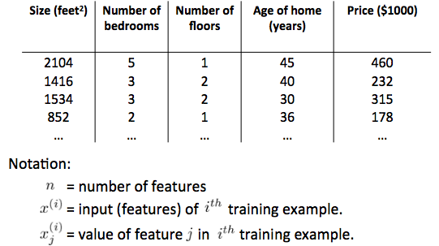
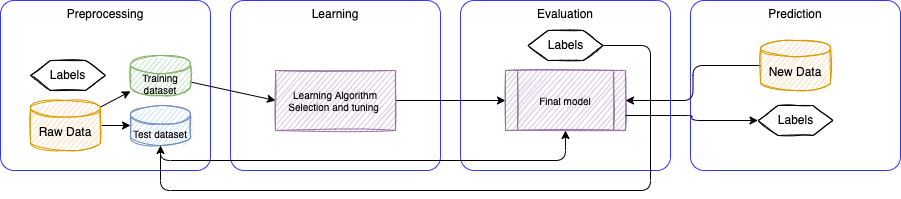

# Machine Learning

Machine learning is a system that automatically learns programs/ functions from data. There is not programming step. The goal is to find a function to predict **y** from a set of features, **X**, and continuously measures the prediction performance.

Statistics work on data by applying a model of the world or stochastic models of nature, using linear regression, logistic regression, cox model,... 

Two types of machine learning algorithm:s

1. **Supervised learning.**
1. **Unsupervised learning.**

## Supervised learning

The main goal in supervised learning is to learn a model from labeled training data that allows us to make predictions about unseen or future data. 

**Classification** problem is when we are trying to predict one of a small number of discrete-valued outputs, such as whether it is Sunny (which we might designate as class 0), Cloudy (say class 1) or Rainy (class 2). The class labels are defined as multiple classes or binary classification task, where the machine learning algorithm learns a set of rules in order to distinguish between the possible classes. Classification can be defined when a human assigns a topic label to each document in a corpus, and the algorithm learns how to predict the label. The output is always a set of sets of items. Items could be points in a space or vertices in a graph.

[For more detail see this Classifier note](./classifier.md)
 
Another subcategory of supervised learning is **regression** classification, where the outcome signal is **continuous value** output. In the table below the Price is the outcome (y), the square feet, # of bedrooms… are features
 
{ width=600 }

In regression analysis, we are given a number of predictor (explanatory) variables and a continuous response variable (outcome), and we try to find a relationship between those variables that allows us to predict future outcome. 

## Unsupervised learning

Giving a dataset we are able to explore the structure of the data to extract meaningful 
information without the guidance of a known outcome variable or reward function. 

**Clustering** is an exploratory data analysis technique that allows to organize a pile of information into meaningful subgroups (clusters) without having any prior knowledge of their group memberships.

[See this note for more details.](unsupervised.md)

## Reinforcement learning

The goal is to develop a system (agent) that improves its performance based on interactions with the environment. Through the interactions, an agent can then uses reinforcement learning to learn a series of actions that maximizes the reward via an exploratory trial-and-error approach or deliberative planning.  

## Unsupervised dimensionality reduction

This is a commonly used approach in feature preprocessing to remove noise from data, which can also degrade the predictive performance of certain algorithms, and compress the data onto a smaller dimensional subspace while retaining most of the relevant information.

## ML System

Building machine learning system includes 4 components as outlined in figure below:

{ width=1100 }

Raw data rarely comes in the form and shape that is necessary for the optimal performance of a learning algorithm.
Thus, the preprocessing of the data is one of the most crucial step in any machine learning application. Clean data are becoming a feature for the training.

The model testing is based on one of the three cross-validation types:

* **Validation**: where we split the dataset into three pieces: train, test, and validation.
* the **Leave-one-out** (LOOCV): only one data point as test sample, and use other rows for training set.
* **K-fold validation**: randomly split the dataset into **kfold**, and for each fold, we train and record the error.

Many machine learning algorithms also require that the selected features are on the same scale for optimal performance, which is often achieved by transforming the features in the range [0, 1] or around a standard normal distribution with zero mean and the unit variance.

Some of the selected features may be highly correlated and therefore redundant to a certain degree. 

In those cases, **dimensionality reduction** techniques are useful for compressing the features onto a lower dimensional subspace.

Reducing the dimensionality of the feature space has the advantage that less storage space is required, and the learning algorithm can run much faster.

To determine whether a machine learning algorithm not only performs well on the training set but also generalizes well to new data, we need to **randomly divide** the dataset into separate **training** and **test** sets.

In practice, it is essential to compare at least a handful of different algorithms in order to train and select the best performing model. 

First we have to decide upon a metric to measure performance. One commonly used metric is classification accuracy, which is defined as the proportion of correctly classified instances.

After selecting a model that has been fitted on the training dataset, we can use the test dataset to estimate how well it performs on this unseen data to estimate the generalization error.

## Model Representation

The commonly agreed notation used is:

```sh
m= # of training examples
X= input variables or features
y= output or target
(x(i),y(i)) for the ith training example
```

When the number of features is more than one the problem becomes a linear regression.

Training set is the input to learning algorithm, from which we generate an hypothesis that will be used to map from X to y.

In **regression analysis**, we are given a number of predictor (explanatory) variables and a continuous response variable (outcome), and we try to find a relationship between those variables that allows us to predict an outcome. 

Hypothesis function `h(x)` can be represented as a linear function of `x`:  

=\sum_{i} \theta_{i} * x_{i}= \theta^{T}*x){ width=300 }

Xo = 1.

A feature is a vector and `T` is also a row vector of dimension n+1, therefore `h(x)` is a matrix multiplication. It is called **multivariate linear regression**.

To find the good coefficients , the algorithm needs to compare the results `h(x)` using a cost function.

## Cost function

One of the key ingredients of supervised machine learning algorithms is to define an objective function that is to be optimized during the learning process. This objective function is often a cost function that we want to minimize. So the weights update will minimize the cost function. The cost function could be the sum squared errors between the outcomes and the target label:

 = \frac{1}{2m} \sum_{1}^{m}(h_{\theta} (x_{i}) - y_{i})^2){ width=300 }

The algorithm to minimize the cost function is called the **gradient descent**, and uses the property of the cost function being continuous convex linear, so differentiable:

{ width=500 }

The principle is to climb down a hill until a local or global cost minimum is reached. In each algorithm iteration, we take a step away from the gradient where the step size is determined by the value of the **learning rate** (alpha) as well as the slope of the gradient.

When J(Ti) is already at the local minimum the slope of the tangent is 0 so Tj will not change. When going closer to the local minimum the slope of the tangent will go slower so the algo will automatically take smaller steps.
If alpha is too big, gradient  descent can overshoot the minimum and fail to converge or worse, it could diverge. (The derivative is the slope of the tangent at the curve on point Tj; when derivative is close to zero, it means, we reach a minima).

When the unit of each feature are very different the gradient descent will take a lot of time to find the minima.
So it is important to transform each feature so they are in the same scale. (e.g. from -1 to 1 range, or [0,1] range)


A cost function may be coded in Python as:

```python
errors = (y - output)          
cost = (errors** 2).sum() / 2.0
```

where: 

{ width=200 }

in python:

```python
def netInput(self,X):
        # compute z = sum(x(i) * w(i)) for i from 1 to n, add the threshold
        return np.dot(X,self.weights[1:]) + self.weights[0]
```

The cost function is convex continuous linear and can be derived, so that we can use the gradient descent algorithm to find the local minima:

```python
def fit(X,y):
    weights=np.zeros(1+X.shape[1])
    costs=[]
    for _ in range(nbOfIteration):
        output = netInput(X)
        errors = (y - output)
      # calculate the gradient based on the whole training dataset. Use the matrix * vector 
        weights[1:] += eta * X.T.dot( errors)
        weights[0] += eta * errors.sum()
        cost = (errors**2).sum() / 2.0
        costs.append(cost)
    return costs
```

The weight difference is computed as the negative gradient * the learning rate `eta`. To compute the gradient of the cost function, we need to compute the partial derivative of the cost function with respect to each weight `w(j)`. 
So putting all together we have:

)x_{i,j}&space;){ width=300 }

the weight update is calculated based on all samples in the training set (instead of updating the weights incrementally after each sample), which is why this approach is also referred to as "batch" gradient descent.
So basically to minimize the cost function we took steps into the opposite direction of a gradient calculated from the entire training set.