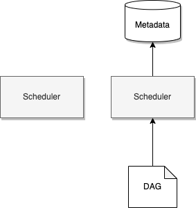

# Apache Airflow

Implement batch-oriented orchestration workflow platform, based on Python framework to connect to any technology.  

## Value propositions

* Deploy locally or to a distributed cluster.
* Airflow components are extensible to adjust to specific environment
* Version controlled with rollback to previous versions
* Not for event-based workflow, not streaming solution. Can be combined with Kafka to batch process data in topics.

## Concepts

* Use Directed A Graph represents the workflow to execute
* Component Architecture

    