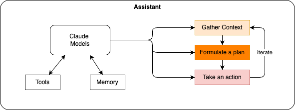

# Claude Code

An agentic coding assistant which not only address coding assistant, but also discovery and design.

The architecture of the assistant looks like:

* claude.md file represents memory across sessions. it can include style guidelines and common commands. This file is automatically loaded into the context.
* [See overview](https://code.claude.com/docs/en/overview).

## Capabilities

* Conversation history is stored locally, which is loaded into context.
* Can launch sub-agents
* Manage to dos
* Refer back to previous information
* Agentic search

## Sources

* [Deeplearning training](https://learn.deeplearning.ai/courses/claude-code-a-highly-agentic-coding-assistant)
* [Using Claude for a lot of things]()
* [Use LiteLLM as proxy for Claude code - tutorial](https://docs.litellm.ai/docs/tutorials/claude_responses_api)