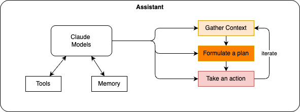

# Claude Code

???- info "Updates"
    03/17/2026

An agentic coding assistant which not only addresses coding, but also discovery and design.

The architecture of the assistant looks like:



* **CLAUDE.md** file represents memory across sessions. It can include style guidelines and common commands. This file is automatically loaded into the context.
* [See overview](https://code.claude.com/docs/en/overview) for installation and getting started.
*  Claude Code offers a variety of settings to configure [See the settings article.](https://code.claude.com/docs/en/settings) See also [~/.claude/settings.json](~/.claude/settings.json)


## Capabilities

* Conversation history is stored locally, which is loaded into context.
* Can launch sub-agents
* Manage to dos
* Refer back to previous information
* Agentic search
* A marketplace is a collection of plugins that can be installed into Claude Code. Plugins extend Claude Code's capabilities with company-specific knowledge, tools, and workflows. 
* [Plugins](https://code.claude.com/docs/en/plugins) can contain skills, hooks, agents and commands.

## Integrating with existing git repo.

Here are 3-step playbook for getting Claude Code productive and safe on existing repos.

* Create a first CLAUDE.md file. Don't use /init as-is — it produces bloated output. As good practices:

| Include | Exclude |
| --- | --- |
| Shell commands LLM can't guess | Anything LLM can figure out from code |
| Code style rules that differ from defaults | Standard language conventions |
| Testing instructions and preferred runners | Detailed API docs (links to existing content instead) |
| Architectural decisions specific to your project | Long explanations or tutorials
| Common gotchas or non-obvious behaviors | File-by-file codebase descriptions |

* Adopt TDD
* Plan First, then Scale with skills and plugins.
    * Planning is most valuable when you're uncertain about the approach or the change spans multiple files. Ctrl-G to update the plan.
    * Prefer CLIs over MCP
    * Leverage plugin like [Superpowers](https://claude.com/plugins/superpowers)
    * Manage context aggressively — Use /clear between unrelated tasks, /compact to summarize mid-session, and subagents for investigation

## Useful prompts

| Goal | Prompt |
| --- | ---| 
| Fix build issue | The build fails with this error: [paste error]. Fix it and verify the build succeeds. Address the root cause, don't suppress the error.|
| Fix runtime issue | Use subagents to investigate why [service] is throwing [error]. Check logs and recent changes. |
| Code review | Read ... folder, What are the key files and flows?| 
| Build new feature | I want to build [brief description]. Interview me about edge cases, tradeoffs, and implementation using AskUserQuestion. Then write a spec to SPEC.md |
| Review PR (collaborate on PR) | Review the PR at [link]. Look for edge cases, race conditions, and consistency with existing patterns |
| Address PR feedback | Read the review comments on PR #[number]. Address each one, reply to the threads, and push fixes.|

## Commands

| commands | Role |
| --- | --- |
| /init | analyze a repo and create CLAUDE.md |
| /clear | At ~40% context usage, expect small inconsistencies. At ~70%, expect bigger mistakes. Use /clear between unrelated tasks |
| /models | Select a model |

## Running Claude with Google Vertex/AI

Be connected to VPN (GlobalProtect or Twingate) 

```sh
gcloud auth application-default login
claude
claude  --model=claude-haiku-4-5
# Prefer opus for coding
```

See [GCP pricing plan.](https://cloud.google.com/vertex-ai/generative-ai/pricing#claude-models)

## Running with Local LLM

* Create a file named Modelfile
    ```sh
    echo "FROM gemma4:26b
    PARAMETER num_ctx 65536" > Modelfile
    ```
* Create the optimized version
    ```sh
    ollama create gemma4-coding -f Modelfile
    ```
* Start claude:
    ```sh
    ANTHROPIC_BASE_URL="http://localhost:11434/v1" ANTHROPIC_API_KEY="local" claude --model gemma4-coding
    ```

This will be slow and will have some challenge with the plan model of Claude and gemma4.

## Wiki LLM

[See the core principles](https://gist.github.com/karpathy/442a6bf555914893e9891c11519de94f). See [techno/claude/llm-wiki.md]()

## Sources

* [Deeplearning training](https://learn.deeplearning.ai/courses/claude-code-a-highly-agentic-coding-assistant)
* [Using Claude for a lot of things]()
* [Use LiteLLM as proxy for Claude code - tutorial](https://docs.litellm.ai/docs/tutorials/claude_responses_api)
* [Get the shit done: meta-prompting, context engineering and spec-driven development system for Claude Code](https://github.com/gsd-build/get-shit-done)