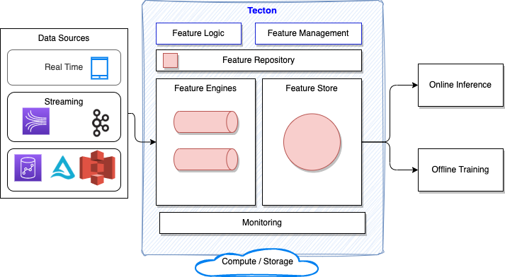
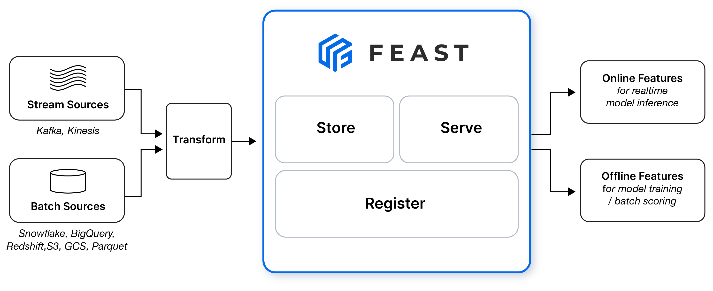

# Feature Store

## Tecton and Feature store

The following diagram illustrates the high level architecture of [Tecton.ai](https://www.tecton.ai/) feature platform.

The feature engines are the components to inject feature data to the Store. The second important element is the API to access those feature for offline training in classical Data Scientist notebook and online inference, think about model as a service. 

Feature pipelines are done in simple declarative language which looks like SQL, but it is also built in Python so can be integrated in any Python code. The feature engine can orchestrate batch, streaming, and real-time transformations, and re-uses existing processing infrastructure like AWS EME, Databricks, Spark and Snowflake to process the data.

The feature repository is an abstraction layer on top of storage like Amazon S3. Feature can be saved in source control and rollout to production with CI/CD tool. A Tecton Repository is a collection of Python files containing Tecton Object Definitions, which define feature pipelines and other dataflows within Tecton's framework. 

The source for the data can be mobile events and data, streaming events from Kafka, MSK, Kinesis data streams, or data at rest like in S3, Delta lake, DynamoDB, EMR, Athena, Redshift.

## Feast Open Source

[Feast](https://feast.dev/) (Feature Store) is an operational data system for managing and serving machine learning features to models in production. Feast is able to serve feature data to models from a low-latency online store (for real-time prediction) or from an offline store  

Tecton is the hosted SaaS feature platform. It includes a fork of the Feast feature store.

### Value propopositions

* Feature reuse via central respository, feature metadata, searchable.
* The ML systems built is coupled with data sources, so any change in data infrastructure impact those systems. Decoupling via a Feature store brings stability with a single data access layer. 
* Facilitate deployment of ML feature into production, with a centralized registry and a service layer to server the feature.
* Avoid data leakage by providing point-in-time correct feature retrieval when exporting feature datasets for model training

* Feast is not a ETL or ELT.

## [FeatureForm](https://www.featureform.com/product)

Featureform is another [open-source Feature Store](https://github.com/featureform/featureform) that transforms our existing infrastructure into a feature store, it is an abstraction on top of infrastructure. It can work on top of Spark.

A data scientist working in a notebook can push transformation, feature, and training set definitions to a centralized, local repository. Register a PySpark transformations and let Featureform orchestrate the data infrastructure from Spark to Redis, and monitor both the infrastructure and the data.

Native embeddings support. It supports vector databases as both inference and training stores. Featureform on Kubernetes can be used to connect to your existing cloud infrastructure and can also be run locally on Minikube. 

The figure below presents the FeatureForm components:

## Feature Store Deeper dive

* [Feast quickstart](https://docs.feast.dev/getting-started/quickstart)
* [Feature Stores Explained: The Three Common Architectures](https://www.featureform.com/post/feature-stores-explained-the-three-common-architectures)
* [Simple use of Feast with LLM]()
* [Learning Feast by examples.](https://docs.feast.dev/v/v0.21-branch/getting-started/feast-workshop)