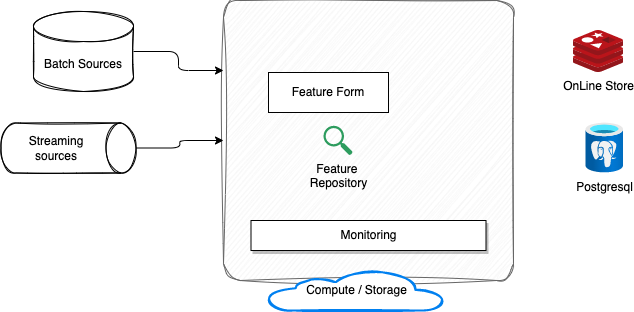

# Feature Store

## Tecton and Feature store

Features in Tecton are typically defined as transformation pipelines managed by [Tecton.ai](https://www.tecton.ai/). The following diagram illustrates the high level architecture of Tecton feature platform.

The feature engines are the components to inject feature data to the Store. The second important element is the API to access those feature for offline training in classical Data Scientist's notebook or online inference, think about ML model as a service. 

Tecton defines the `Feature Views` to link data sources as inputs, or in some cases other Feature Views, with transformation to compute one or more features. `Entity` is part of the domain and leads to one or more features. 

Feature pipelines are done in simple declarative language which looks like SQL, but it is also built in Python so can be integrated in any Python code. The feature engine can orchestrate batch, streaming, and real-time transformations, and re-uses existing processing infrastructure like AWS EME, Databricks, Spark and Snowflake to process the data.

The feature repository is an abstraction layer on top of storage like Amazon S3. Feature can be saved in source control and rollout to production with CI/CD tool. A Tecton Repository is a collection of Python files containing Tecton Object Definitions, which define feature pipelines and other dataflows within Tecton's framework. 

There are two types of Feature Store: offline, to be used by batch processing and notebooks, or online which is a distributed key-value store, used to keep the last value of a feature, and be used for online inference.

Finally, a `Feature Service` represents a set of features that power a model. Feature Services provide convenient endpoints for fetching training data through the Tecton SDK or fetching real-time feature vectors from Tecton's HTTP API.

The source for the data can be mobile events and data, streaming events from Kafka, MSK, Kinesis data streams, or data at rest like in S3, Delta lake, DynamoDB, EMR, Athena, Redshift.

Feature store can be added to a LLM prompt, so developer can extract powerful insights from customer events as they unfold in real time and pass those as signals to LLMs.

### A typical feature workflow

1. Create and validate a new feature definition in a notebook
1. Run the feature pipeline interactively to ensure correct feature data
1. Fetch a set of registered features from a workspace and create a new feature set
1. Generate training data to test the new feature in a model
1. Copy the new feature definition into your feature repo
1. Apply your changes to a live production workspace

## Feast Open Source

[Feast](https://feast.dev/) (Feature Store) is an operational data system for managing and serving machine learning features to models in production. Feast is able to serve feature data to models from a low-latency online store (for real-time prediction) or from offline store  

Tecton is the hosted SaaS feature platform with proprietary enhancements. It includes a fork of the Feast feature store.

### Value propositions

* Feature reuse via central repository, feature metadata, searchable.
* The ML systems built is coupled with data sources, so any change in data infrastructure impact those systems. Decoupling via a Feature store brings stability with a single data access layer. 
* Facilitate deployment of ML feature into production, with a centralized registry and a service layer to server the feature.
* Avoid data leakage by providing point-in-time correct feature retrieval when exporting feature datasets for model training

* Feast is not a ETL or ELT.

## [FeatureForm](https://www.featureform.com/product)

FeatureForm is another [open-source Feature Store](https://github.com/featureform/featureform) that transforms existing infrastructure into a feature store, it is an abstraction on top of infrastructure. It can work on top of Spark.

A data scientist working in a notebook can push transformation, feature, and training set definitions to a centralized, local repository. Register a PySpark transformations and let FeatureForm orchestrate the data infrastructure from Spark to Redis, and monitor both the infrastructure and the data.

It supports Native embeddings and vector databases as both for inference and training stores. FeatureForm on Kubernetes can be used to connect to your existing cloud infrastructure and can also be run locally on Minikube. 

The figure below presents the FeatureForm components:

## Feature Store Deeper dive

* [Feast quickstart](https://docs.feast.dev/getting-started/quickstart)
* [Feature Stores Explained: The Three Common Architectures](https://www.featureform.com/post/feature-stores-explained-the-three-common-architectures)
* [Simple use of Feast with LLM]()
* [Learning Feast by examples.](https://docs.feast.dev/v/v0.21-branch/getting-started/feast-workshop)