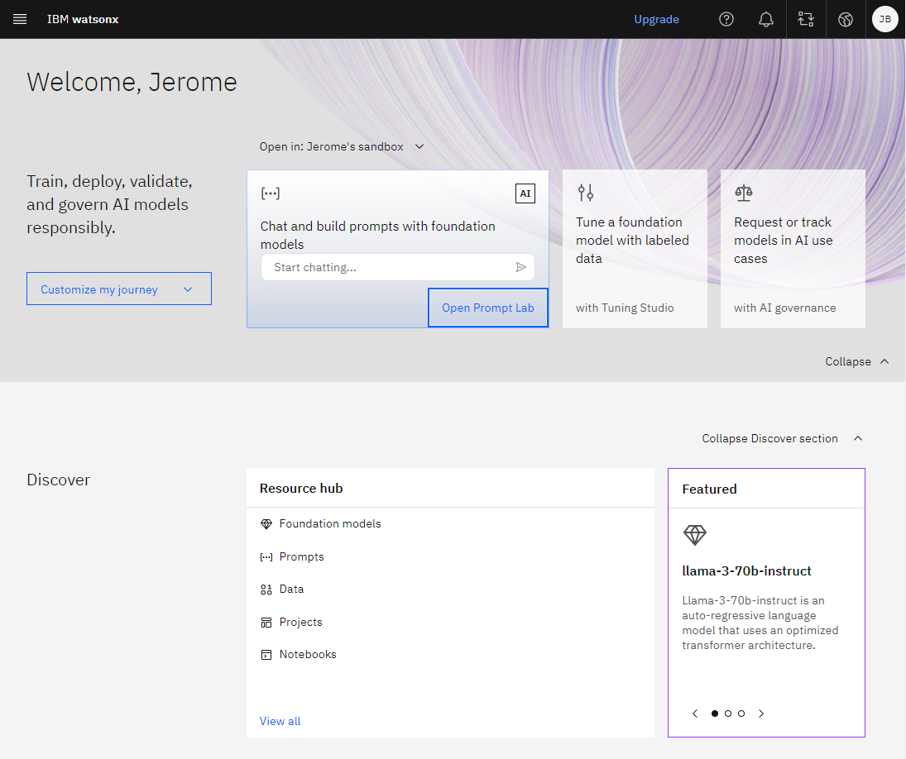
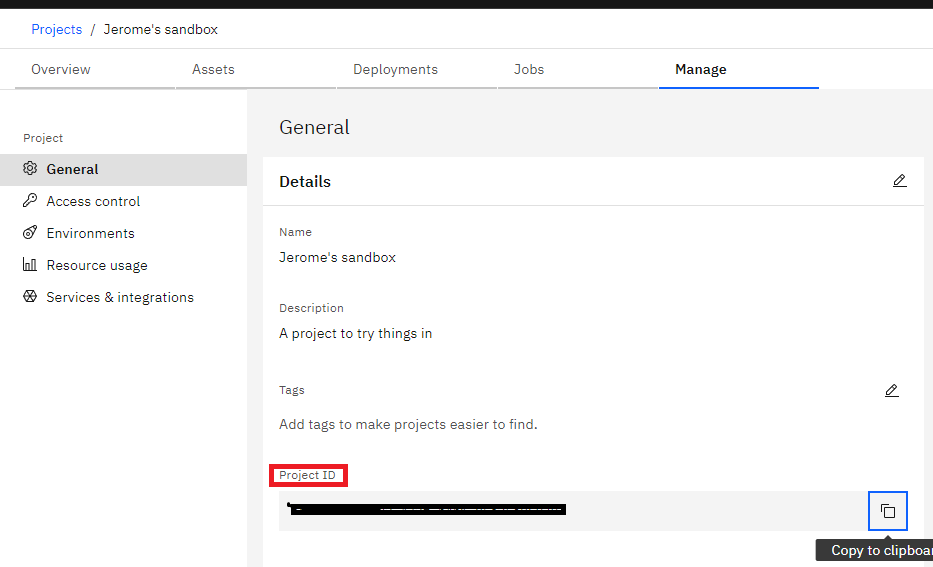
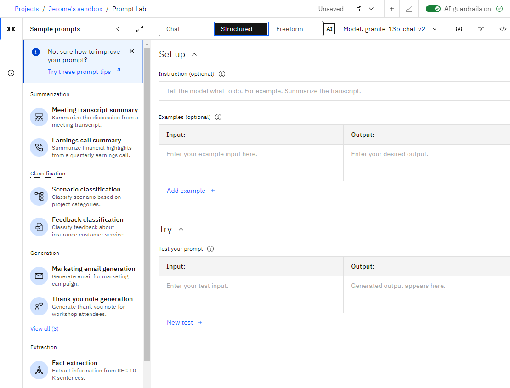
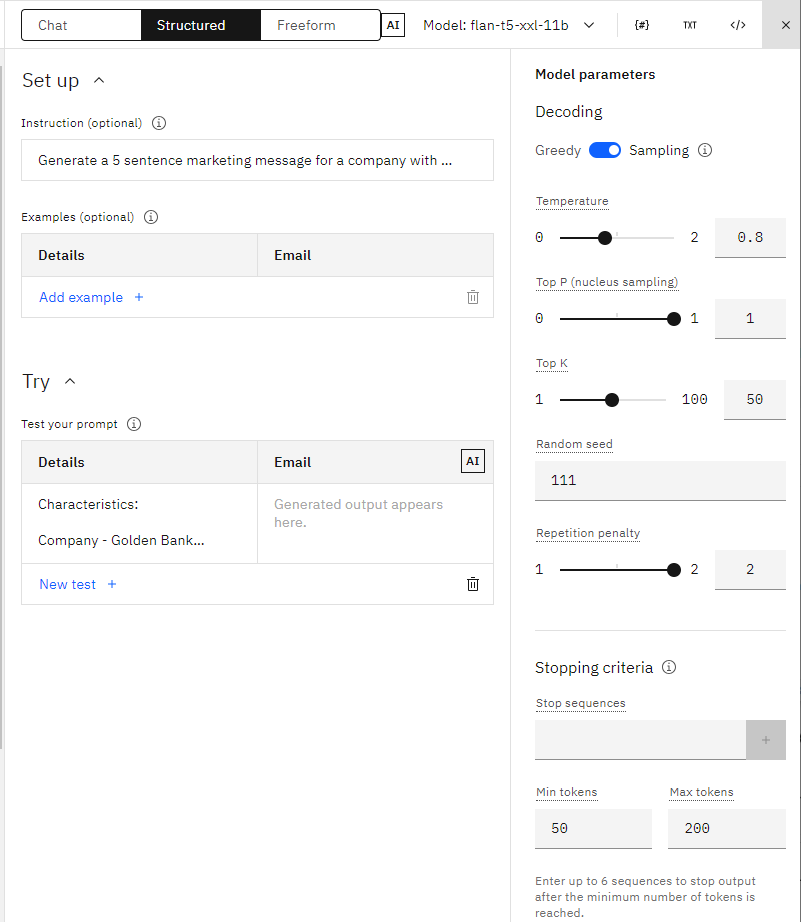
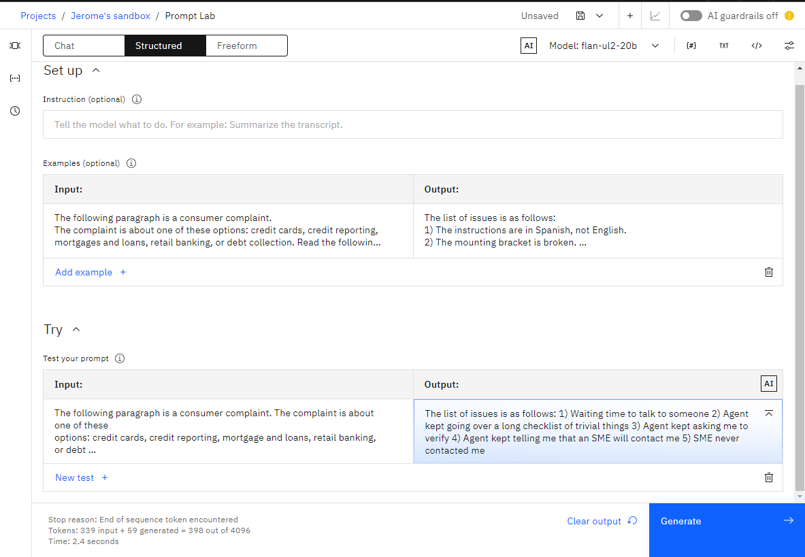
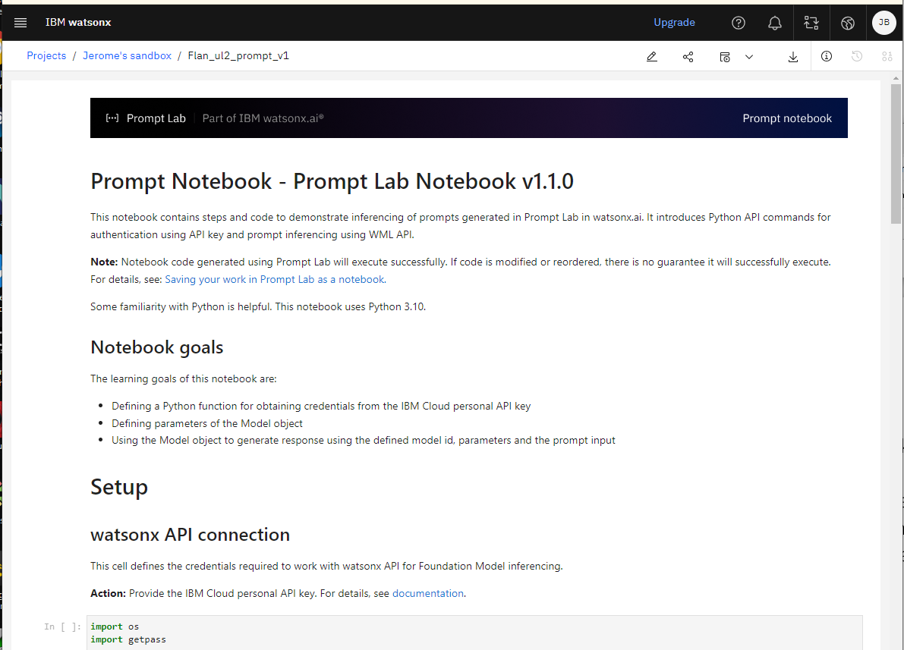

# WatsonX.ai

[WatsonX.ai](https://www.ibm.com/products/watsonx-ai) offers a set of features to use LLM as APIs or within WatsonX Studio so a Data scientist may train, validate, tune and deploy AI models or LLMs. 



## Value Propositions

* Studio environment to cover both traditional ML model development and tuning or work with LLMs
* Prompt Lab to build new LLM prompt or use existing ones, shareable between data scientists.
* Open sources LLMs from Mistral, LLama or IBM's Granite models.
* Support guardrail for model outcome control
* Fine tuning model on proprietary data
* Integrate AutoAI to create ML model in no-code environment
* Ability to create synthetic tabular data
* Open Data lake house architecture
* AI governance toolkit
* [Bring your own model](https://www.ibm.com/blog/announcement/bringing-your-own-custom-foundation-model-to-watsonx-ai/)


???- Info "Granite from IBM Research"
    Granite is IBM's flagship series of LLM foundation models based on decoder-only transformer architecture. Granite language models are trained on trusted enterprise data spanning internet, academic, code, legal and finance. The data sets that have been vigorously filtered to remove:

    * Hate, Abuse, and Profanity content 
    * Copyright and licensed materials 
    * Duplications 
    * Any other undesirable, blacklisted material, and blocked URLs 
    
    [See model documentation.](https://www.ibm.com/products/watsonx-ai/foundation-models#generative)

## Getting started

Once IBM Cloud account is created, we need to also sign-up to [WatsonX.ai](https://dataplatform.cloud.ibm.com/wx/).

Once done a sandbox project is created, we need to get the project ID using the Manage tab> Info menu in the project page.



* Using [IAM](https://cloud.ibm.com/iam/), create an IBM API KEY with Manage (in top menu bar) > Access (IAM) > API keys.
* Get the watsonx.ai endpoint URL to connect with (Fro dallas it should  be: https://us-south.ml.cloud.ibm.com). 

* Start using the [ ibm-watsonx-ai library for python](https://ibm.github.io/watsonx-ai-python-sdk/). We can also use LangChain and LlamaIndex.
* With the [Python library](https://dataplatform.cloud.ibm.com/docs/content/wsj/analyze-data/fm-python-lib.html?audience=wdp&context=wx), we can use an API key or an IAM token (with expiration time). For REST API using curl we need api key and IAM token. In python, once we pass the API key to the APIClient in the library, the client generates the IAM token and refreshes the token as needed.

* Set as environment variables with URL, API KEY and PROJECT ID in a .env file

```properties
IBM_WATSONX_APIKEY=Idx...
IBM_WATSONX_URL=https://us-south.ml.cloud.ibm.com
IBM_WATSON_PROJECT_ID=0b73....
```

* Client code

```python
from ibm_watsonx_ai.foundation_models import Model
from ibm_watsonx_ai import APIClient, Credentials
from ibm_watsonx_ai.foundation_models.utils.enums import ModelTypes

credentials = Credentials(
                   url = watsonx_url,
                   api_key =watson_api_key))

client = APIClient(credentials)

parameters = {
            "decoding_method": "greedy",
            "max_new_tokens": 255,
            "min_new_tokens": 1,
            "temperature": 0.5,
            "top_k": 50,
            "top_p": 1,
        }

model = Model(
    model_id=ModelTypes.FLAN_UL2,
    params=parameters,
    credentials=credentials,
    project_id=project_id
)

generated_response = model.generate(prompt=...)
print(generated_response['results'][0]['generated_text'])
```

For some Langchain sampe using Watson [see watson-machine-learning-samples - foundation_models](https://github.com/IBM/watson-machine-learning-samples/tree/master/cloud/notebooks/python_sdk/deployments/foundation_models) or the  [LangChain Watsonx.ai documentation.](https://python.langchain.com/docs/integrations/llms/ibm_watsonx).

* Get the list of current model for inference:

```python
from ibm_watsonx_ai.foundation_models.utils.enums import ModelTypes

print("--> existing models in WatsonX.ai:")
print(json.dumps( ModelTypes._member_names_, indent=2 ) )
```

* Python code to connect to WatsonX ai model using LangChain:

```python
from langchain_ibm import WatsonxLLM
llm = WatsonxLLM(
        model_id="ibm-mistralai/mixtral-8x7b-instruct-v01-q",
        url="https://us-south.ml.cloud.ibm.com",
        project_id=project_id,
        params=parameters,
    )
```

## Prompt Lab

* A shot represent prompt input and output, used to instruct the model on how to best respond to a query
* Prompts are tokenized before being passed into a model, and foundation model usage costs are calculated based on the number of tokens
* WatsonX.ai offers 3 sandbox in the Prompt Lab: chat, structured, freeform



* Watsonx.ai provides AI guardrails to prevent potential harmful input and output text
* Watsonx.ai provides sample prompts grouped into categories like: Summarization, Classification, Generation, 
Extraction, Question Answering, Code, Translation.
* It selects the model that is most likely to provide the best performance for the given use case.
* All models have the same inference parameters:



* In Greedy mode, the model selects the highest probability tokens at every step of decoding. It is less creative. With Sampling we can tune temperature (float), top k(int) and top P (float). Top P sampling chooses from the smallest possible set of "next" words whose cumulative probability exceeds the probability p. The higher the value of Top P, the larger the candidate list of words and so the more random the outcome would be. Top K is for the number of words to choose from to be the output.
* Repetition penalty (1 or 2) is used to counteract a model’s tendency to repeat the prompt text verbatim.

* In general, the **"instruct"** models are better at handling requests for structured output and following instructions.
* Model size does not guaranty better results. IBM's Granite models give excellent results on instruction, like generating, list, json output...

Here is an example of one-shot prompting with an input, output example pair to better guide the model.



* For better prompt engineering, WatsonX,ai offers save by session to keep a  history of the prompt 
session, recording each individual change, which can also being seen in a timeline. Saving a prompt is like taking a snapshot of the prompt text and its settings. It also support to go back to a previous version.
* A Prompt can be saved as a Jupyter notebook, and then code is generated to run into the notebook.



* The **codellama-34b-instruct-hf** is good with code translation and code generation tasks

Foundation models are not answering questions. Instead, they are calculating the best next tokens based on what data was used to train it.


## Prompt tuning

This is not the same as prompt engineering, the goal is to have a user providing a set of labeled data to tune the model. Watsonx.ai will tune the model using this data and create a "soft prompt", without changing the model's weights.

LLMs are generally not good enough where there are specific business languages and operational details, especially where terminologies and business requirements are constantly being updated. 

Prompt tuning may help to add classes to different query according to human labelled queries. Only certain all LLMs support this kind of tuning. A one-time tuning can outperform at a lower cost than multi-shot prompting. In addition, multi-shot prompting only works for a particular prompt, and it may not work for a different prompt.

It is important to pay attention to the content of the training data. New data should not bring bias because of bad value distribution. LLM could not learn business rules with training.

## Synthetic Data

Synthetic data can be used to augment or replace real data for improving AI models, protecting sensitive data, and mitigating bias. Developer starts from existing dataset, so generated data will conform to existing schema.

Use Project > Assets menu in WatsonX.

WatsonX can generate categorical value to string given a list of string with some occurrence numbers. For numerical, it can use standard distribution with specific mean and deviation. Some column can be anonymized. It uses different methods to generate data: Kolmogorov-Smirnov and Anderson-Darling. And developers can profile the datasets and build correlations between different columns to reflect real-world data.

The generated data can be saved in .xls format. 