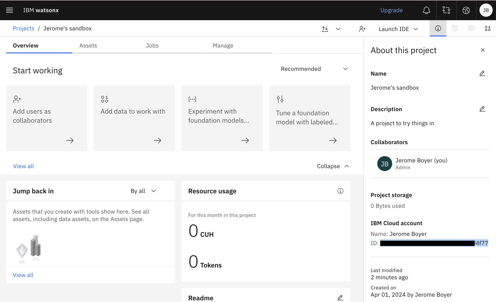

# WatsonX.ai

WatsonX.ai offers a set of features to use LLM as APIs. 

Once IBM Cloud account is created, we need to also sign-up to WatsonX.ai.

Once done a sandbox project is created, we need to get the project ID using the Info menu in the project page.



* Create an IBM API KEY with Manage (in top menu bar) > Access (IAM) > API keys.
* Get watson.ai the endpoint URL to connect with. Set as environment variables to start using Watson with [LangChain chain](https://python.langchain.com/docs/integrations/llms/ibm_watsonx).
* Get the list of current model for inference:

    ```python
    from ibm_watsonx_ai.foundation_models.utils.enums import ModelTypes

    print("--> existing models in WatsonX.ai:")
    print(json.dumps( ModelTypes._member_names_, indent=2 ) )
    ```

