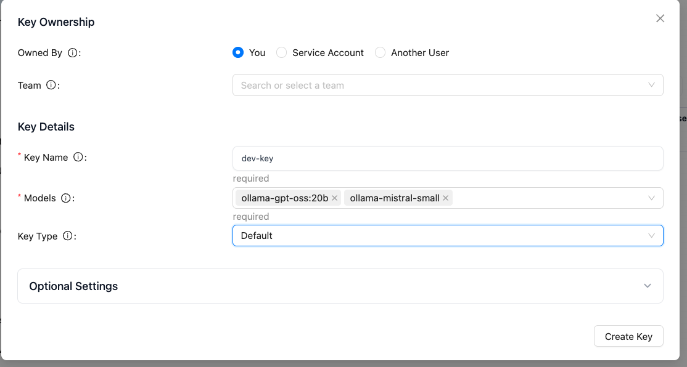

# A demonstration for integrating LiteLLM with Claude Code

[Based on this tutorial](https://docs.litellm.ai/docs/tutorials/claude_responses_api).

Need a lot of free memory to do this with gpt-oss

## Step to get LiteLLM proxy running


* Set .env with the needed keys. Get the salt key at [https://1password.com/password-generator](https://1password.com/password-generator)
    ```sh
    LITELLM_MASTER_KEY="sk-1234"  # Generate a secure key
    LITELLM_SALT_KEY="5.....A"
    ```
* Verify ollama server runs:
    ```sh
    curl http://localhost:11434/api/tags
    ```

* Use docker compose file [see tutorial](https://docs.litellm.ai/docs/proxy/docker_quick_start).
* Connect to the ui [http://localhost:4000/ui](http://localhost:4000/ui) with admin user and the content of $LITELLM_MASTER_KEY as password
* Create a key for the 
    
* source the export_env.sh before running claude cli
* Validate with a simple POST
    ```sh
    curl -X POST http://0.0.0.0:4000/v1/messages \
    -H "Authorization: Bearer $LITELLM_MASTER_KEY" \
    -H "Content-Type: application/json" \
    -d '{
        "model": "ollama-gpt-oss",      
        "max_tokens": 1000,
        "messages": [{"role": "user", "content": "What is the capital of France?"}]
    }'
    ```

### Alternate solution

But still need a DB

1. Create virtual env: `uv venv`
1. Activate the venv: `source .venv/bin/activate`
1. Install with uv: `uv add 'litellm[proxy]'`
1. Add `config.yaml` specify a model name and ollama setting
1. source the .env to export ANTHROPIC_API_KEY and LITELLM_MASTER_KEY: `source .env` 
1. Start the proxy: `litellm --config ./config.yaml`


## Configure Claude Code to use the proxy

1. Export new URL:
    ```sh
    export ANTHROPIC_BASE_URL="http://0.0.0.0:4000"
    export ANTHROPIC_AUTH_TOKEN="$LITELLM_MASTER_KEY"
    ```
1. Start claude with one of the model defined in the proxy
    ```sh
    claude --model ollama-mistral-small
    # OR
    claude --model ollama-gpt-oss
    ```


## Using Openrouter hoster models

[See product documentation.](https://openrouter.ai/docs/quickstart)