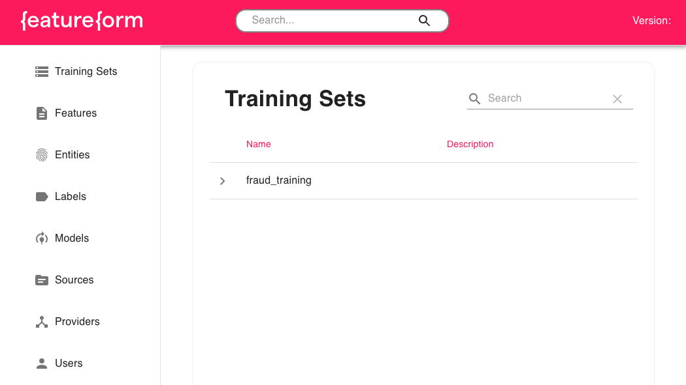

# FeatureForm examples

It uses FeatureForm tutorial to load the transactions data into online and offline storage. The demonstration is based on FeatureForm tutorial and LangChain prompt with feature store code.


To run it:

* Start the different dockers container with `docker-compose -f featureform-docker-compose.yaml`
* Then connect to the mypython env: `docker exec -ti mypython bash`
* `pip install -r requirements.txt` if not done before.
* `export FEATUREFORM_HOST=featureform:7878`
* Define the feature store for the Transactions entity: 

    ```sh
    featureform apply ./ff-definitions.py --insecure
    ```

    The output looks like

    ```sh
     Resource Type              Name (Variant)                                      Status      Error 
    Provider                   local-mode ()                                       CREATED           
    Provider                   postgres-quickstart ()                              CREATED           
    Provider                   redis-quickstart ()                                 CREATED           
    SourceVariant              average_user_transaction (default)                  READY             
    SourceVariant              transactions (default)                              READY             
    FeatureVariant             avg_transactions (default)                          READY             
    LabelVariant               fraudulent (default)                                READY     
    ```

* Look at the dashboard about the definition: http://localhost:8082



* [Optional:] We can serve a training dataset from Postgresql using: `python ff-training.py`, or get data from the on-line store with `python ff-serving.py`.
* Run a prompt to Bedrock with Claude LLM and feature retreived from FeatureForm.

```sh
python ff-langchain-prompt.py

#output

Given your average amount per transaction of $5000, I would definitely consider you a high roller!
No chicken jokes for you. 😎
```

## A RAG pipeline for Q&A

The code is based on the content from [this article](https://python.langchain.com/docs/use_cases/question_answering/), and the code is [qa-pipeline.py](./qa-pipeline.py).

* Install chromadb with: `pip install chromadb`
* Get a client to Bedrock using boto3.
* Use [WebBaseLoader](https://api.python.langchain.com/en/latest/document_loaders/langchain.document_loaders.web_base.WebBaseLoader.html) to load a website URL
* Split the document in smaller chunks
* Define Bedrock embeddings and use it to encode chunks to a vector store like chromaDB
* Build a prompt
* Use LLM with retriever in a question and answer chain

```python
qa_chain = RetrievalQA.from_chain_type(
    claude_llm,
    retriever=vectorstore.as_retriever(),
    chain_type_kwargs={"prompt": QA_CHAIN_PROMPT}
    )
result=qa_chain({"query": question})
```

## RAG on markdown files and opensearch

Same approach but it uses OpenSearch as vector store, and markdown files as source. See [this code](./qa-chat-md-os.py) which uses a chatbot interface.