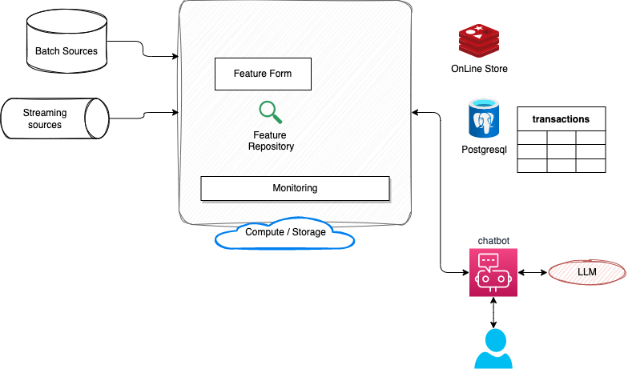
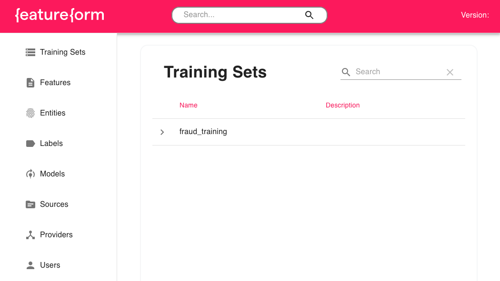

# Some examples of LLM and LangChain implementation

Use python docker image with the script `./startPythonDocker.s`, it includes not released yet AWS SDK.

In any code connected to AWS, if there is this kind of message: ` when calling the InvokeModel operation: The security token included in the request is invalid`, be sure to get the AWS_SESSION_TOKEN environment variable set.

## Getting started

See code of [langchain-1.py](./langchain-1.py) to get basic of creating a AWS Bedrock client and use AWS Titan LLM in different prompts.

The utils folder includes the code to interact with AWS Bedrock using last release of boto3.

## FeatureForm examples

It uses FeatureForm tutorial to load the transactions data into online and offline storage. The demonstration is based on FeatureForm tutorial and LangChain prompt with feature store code.



To run it:

* Start the different dockers container with `docker-compose -f featureform-docker-compose.yaml`
* Prepare the test data by 
* Then connect to the mypython env: `docker exec -ti mypython bash`
* `pip install featureform`
* `export FEATUREFORM_HOST=featureform:7878`
* Define the feature store for the Transactions: 

    ```sh
    featureform apply ./ff-definitions.py --insecure
    ```

    The output looks like

    ```sh
     Resource Type              Name (Variant)                                      Status      Error 
    Provider                   local-mode ()                                       CREATED           
    Provider                   postgres-quickstart ()                              CREATED           
    Provider                   redis-quickstart ()                                 CREATED           
    SourceVariant              average_user_transaction (default)                  READY             
    SourceVariant              transactions (default)                              READY             
    FeatureVariant             avg_transactions (default)                          READY             
    LabelVariant               fraudulent (default)                                READY     
    ```

* Look at the dashboard about the definition: http://localhost:8082



* We can serve a training dataset from Postgres: `python training.py`

